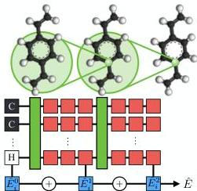
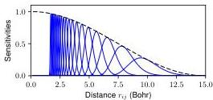
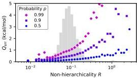

# Hierarchical modeling of molecular energies using a deep neural network

Nicholas Lubbers [ nlubbers@lanl.gov ] Justin S. Smith [ Department of Chemistry, University of Florida, Gainesville, Florida 32611, USA ] Kipton Barros [ Theoretical Division and CNLS, Los Alamos National Laboratory, Los Alamos, New Mexico 87545, USA Department of Chemistry, University of Florida, Gainesville, Florida 32611, USA ]

###### Abstract

We introduce the Hierarchically Interacting Particle Neural Network (HIP-NN) to model molecular properties from datasets of quantum calculations. Inspired by a many-body expansion, HIP-NN decomposes properties, such as energy, as a sum over hierarchical terms. These terms are generated from a neural network—a composition of many nonlinear transformations—acting on a representation of the molecule. HIP-NN achieves state-of-the-art performance on a dataset of 131k ground state organic molecules, and predicts energies with 0.26 kcal/mol mean absolute error. With minimal tuning, our model is also competitive on a dataset of molecular dynamics trajectories. In addition to enabling accurate energy predictions, the hierarchical structure of HIP-NN helps to identify regions of model uncertainty.

## I Introduction

Models of chemical properties have wide-ranging applications in fields such as materials science, chemistry, molecular biology, and drug design. Commonly, one treats the nuclei positions as fixed (the Born-Oppenheimer approximation), and molecular properties follow from the quantum-mechanical state of electrons. The many-body Schrödinger equation is extremely difficult to solve fully, and in practice computational quantum chemistry involves some level of approximation. Common choices are, e.g., Coupled Cluster (CC) [1; 2] and Density Functional Theory (DFT). [3; 4] Such ab initio methods typically exhibit cubic or worse scaling in the number of electrons. Faster calculations are crucial in contexts such as molecular dynamics (MD) simulation or high-throughput molecular screening.

To improve efficiency, one may sacrifice accuracy. For example, the effective interactions between nuclei may be modeled with local classical potentials of fixed form. Such potentials may be parameterized to match given experimental data or quantum calculations. Classical potentials are extremely fast, and enable MD simulations of systems with 10^{6}–10^{9} atoms. However, the parameterization process is empirical and the resulting potentials may not transfer to new systems or new dynamical processes. For example, it is notoriously difficult to model the energetic barriers of bond breaking in a transferrable way. [5; 6] Force fields are also known to lack transferability to chemical environments that differ from those used in the fitting process. [7] One may also compromise between ab initio and empirical methodologies; e.g., Density Functional Tight Binding [8; 9] enables MD simulations of 10^{3}–10^{5} atoms, [10] but brings its own challenges in parameterization and transferability.

Recently there has been tremendous interest in using machine learning (ML) to automatically construct potentials based upon large datasets of quantum calculations. [11; 12; 13; 14; 15; 16; 17; 18; 19; 20; 21; 22] This approach aims for the best of both worlds: the accuracy of full quantum calculations and efficiency comparable to empirical classical potentials. An especially promising direction builds upon recent advances in computer vision. [23; 24; 25; 26] Convolutional neural nets are designed for translation-invariant processing of an image plane via convolutional filters. Similar architectural principles allow us to design neural nets that process molecules while respecting translation, rotation, and permutation invariances. [27; 28; 29] Modern neural net architectures automatically learn representations of local atomic environments without requiring any feature engineering, and achieve state of the art performance in predictions of molecular properties. [30; 31; 32; 33] An advantage of neural nets (compared to, e.g., kernel ridge regression and Gaussian process regression [34; 35]) is that the training time scales linearly in the number of data points, making it practical to learn from databases of millions of quantum calculations. [36]

In this paper, we introduce the Hierarchically Interacting Particle Neural Network (HIP-NN), which takes inspiration from the many-body expansion (MBE). Following common practice, [34; 35; 37] we assume that the ab initio total energy $E$ of a molecule may be modeled as a sum over local contributions at each atom $i$,

$E\approx\hat{E}=\sum_{i=1}^{N_{\text{atom}}}\hat{E}_{i}.$ (1)

HIP-NN further decomposes the local energy model $\hat{E}_{i}$ in contributions over orders $n$,

$\hat{E}_{i}=\sum_{n=0}^{N_{\text{interaction}}}\hat{E}_{i}^{n}.$ (2)

The MBE, commonly employed in classical potentials, [38; 39] would use $\hat{E}^{n}$ to represent $(n+1)$-body contributions to the energy, i.e., interactions between atom $i$ and up to $n$ of its neighbors. Integration of the MBE into ML models of molecular energies has been suggested in Refs. [35] and [40]. This prior work employed separate ML models for each expansion order $n$. A key aspect of

Figure 1: HIP-NN processes a molecule from left to right, building successive atomic features to describe the local chemical environments. This processing occurs through interaction and on-site layers (green and red boxes, respectively). Interaction layers collect information from a local neighborhood (green circles). The total molecular energy $\tilde{E}$ includes contributions $\tilde{E}_{i}^{n}$ at all sites $i$ and hierarchical levels $n$.

HIP-NN is that a single network produces $\tilde{E}_{i}^{n}$ at all orders, allowing these terms to be simultaneously learned in coherent way. Furthermore, the HIP-NN ansatz is more general than the MBE, in that the terms $E_{i}^{n}$ may incorporate many-body interactions at higher order than $n$. The decomposition is non-unique, but should be designed such that $\tilde{E}_{i}^{n}$ rapidly vanishes with increasing order $n$. To pursue this, our training procedure utilizes a hierarchical regularization term to encourage the outputs $\tilde{E}_{i}^{n}$ to decay with $n$. After training, if decay with $n$ is not observed for a given input molecule, then the HIP-NN energy prediction is less likely to be accurate. That is, HIP-NN can estimate the reliability of its own energy predictions.

We detail the HIP-NN architecture and training procedure in the next section. Section III demonstrates that HIP-NN effectively learns molecular energies for various benchmark datasets. On the QM9 dataset of organic molecules, [41] HIP-NN predicts energies with a groundbreaking mean absolute error of 0.26 kcal/mol. HIP-NN also performs well on datasets of MD trajectories with minimal tuning. Variants of HIP-NN achieve good performance with parameter counts ranging from $\sim 10^{3}$ to $10^{5}$. In addition to enabling robust predictions, the hierarchical structure of HIP-NN provides a built-in measure of model uncertainty. In Sec. IV we further discuss and interpret our numerical results, and we conclude in Sec. V.

## II HIP-NN Methodology

Figure 1 illustrates HIP-NN, our neural network for predicting molecular properties and energies. The molecular configuration is input on the left using a simple representation, discussed below, that is symmetric with respect to translation, rotation, and permutation of atoms. As the molecule is processed from left to right, HIP-NN builds consecutive sets of atomic features to characterize the chemical environment of each atom. Blue boxes denote hierarchical contributions to the total energy—the final output of HIP-NN. Green boxes denote interaction layers, which mix information between pairs of atoms within some radius (illustrated for a single carbon atom using green circles). Red boxes denote on-site layers, which process the atomic features of a single atom. These components are described mathematically in the subsections below.

### II.1 Molecular representation

A molecular configuration $\mathcal{C}=\{(Z_{i},\mathbf{r}_{i})\}$ is defined by the atomic numbers $Z_{i}$ and coordinates $\mathbf{r}_{i}$ of atoms $i=1\ldots N_{\text{atom}}$. We seek a representation of $\mathcal{C}$ suitable for input to HIP-NN.

To achieve a representation of the molecular geometry that is invariant under rigid transformations (i.e., translations, rotations, and reflections) we work with pairwise distances $r_{ij}=|\mathbf{r}_{i}-\mathbf{r}_{j}|$ rather than coordinates $\mathbf{r}_{i}$. Furthermore, we keep only distances satisfying $r_{ij}&lt;R_{\text{cut}}$. In our energy model, we apply a smooth radial cutoff to ensure smoothness with respect to atomic positions.

We represent the atomic numbers $Z_{i}$ using a one-hot encoding,

$z_{i,a}^{0}=\delta_{Z_{i},\mathcal{Z}(a)},$ (3)

where $\delta_{ij}$ is the Kronecker delta and $\mathcal{Z}$ enumerates the atomic numbers under consideration. We benchmark on datasets of organic molecules containing atomic species [H, C, N, O, F] for which $\mathcal{Z}=[1,6,7,8,9]$. By construction, HIP-NN will sum over atomic and feature indices ($i$ and $a$), and is thus invariant to their permutation.

### II.2 Atomic features and energies

HIP-NN generalizes $z_{i,a}^{0}$ to real-valued, dimensionless atomic features $z_{i,a}^{\ell}$ (i.e., neural network activations) over layers indexed by $\ell=0\ldots N_{\text{layer}}$. [27] Suppressing the feature index $a=1\ldots N_{\text{feature}}^{\ell}$, we call $z_{i}^{\ell}$ the feature vector. The input feature vector $z_{i}^{0}$ represents the species of atom $i$. At subsequent layers, HIP-NN generates successively more abstract, “dressed” representations $z_{i}^{\ell+1}$ of the chemical environment of atom $i$ based upon information $(z_{j}^{\ell},r_{ij})$ from neighboring atoms $j$.

The key challenge in HIP-NN is to learn good features $z_{i,a}^{\ell}$ that faithfully capture the chemical environment of atom $i$. Once known, HIP-NN uses linear regression (blue boxes in Fig. 1) on the atomic features to model the local hierarchical energies,

$\hat{E}_{i}^{n}=\sum_{a=1}^{N_{\text{feature}}}w_{a}^{n}z_{i,a}^{\ell_{n}}+b^{n},$ (4)

where $w_{a}^{n}$ and $b^{n}$ are learned parameters with dimensions of energy. The total HIP-NN energy $\hat{E}$ is then given by Eqs. (1) and (2). Note that only certain network layers $\ell_{n}$ contribute to the energy.

### II.3 On-site layers

The on-site layers (red squares in Fig. 1) operate on the features $z_{i,a}^{\ell}$ of a single atom,

$\hat{z}_{i,a}^{\ell+1}$ $=$ $\!\!{}_{\text{on-site}}f\left(\sum_{b}W_{ab}^{\ell}z_{i,b}^{\ell}+B_{a}^{\ell}\right),$ (5)

where $W_{a,b}^{\ell}$ and $B_{a}^{\ell}$ are learned parameters. Various choices of activation function $f(x)$ are possible. Rectifiers (i.e., functions saturating for $x\rightarrow-\infty$ and increasing indefinitely when $x\rightarrow\infty$) are often preferred because they help mitigate the so-called vanishing gradient problem. [42; 43] For HIP-NN, we select the softplus activation function, [33; 44]

$f(x)=\log(1+e^{x}).$ (6)

To obtain the final atomic features at layer $\ell+1$, we apply a residual network (ResNet) transformation, [26]

$z_{i,a}^{\ell+1}=\sum_{b}\left(\tilde{W}_{ab}^{\ell}\hat{z}_{b}^{\ell+1}+\tilde{M}_{ab}^{\ell}z_{i,b}^{\ell}\right)+\tilde{B}_{a}^{\ell},$ (7)

where $\tilde{W}_{ab}^{\ell}$, $\tilde{M}_{ab}^{\ell}$, and $\tilde{B}_{a}^{\ell}$ are again learned parameters. Following the suggestion of the ResNet authors, if layers $\ell$ and $\ell+1$ have the same number of features, we instead make $\tilde{M}_{ab}$ unlearnable, and fix $\tilde{M}_{ab}^{\ell}=\delta_{ab}$. Empirically, the ResNet architecture further mitigates the vanishing gradients problem, allowing training of deeper networks.

### II.4 Interaction layers

The interaction layers (green boxes in Fig. 1) operate similarly to on-site layers, Eq. (5), and additionally transmit information between atoms. The transformation rule for interaction layers is

$\hat{z}_{i,a}^{\ell+1}$ $=$ $\!\!{}_{\text{inter.}}f\left(\sum_{j,b}v_{ab}^{\ell}(r_{ij})z_{j,b}^{\ell}+\sum_{b}W_{ab}^{\ell}z_{i,b}^{\ell}+B_{a}^{\ell}\right),$ (8)

Figure 2: Within an interaction layer, the spatial sensitivity functions $s_{\nu}(r_{ij})$ modulate communication between pairs of atoms separated by distance $r_{ij}$. Blue curves: The initial sensitivities $s_{\nu}(r_{ij})$ for $\nu=1\ldots 20$. Dashed black curve: All sensitivities are scaled by the factor $\varphi_{\text{cut}}(r_{ij})$, which introduces a hard spatial cutoff of 15 Bohr.

where $v_{ab}^{\ell}(r_{ij})$ collects information from neighboring atoms $j$ that are sufficiently close to $i$, i.e., that satisfy $r_{ij}<r_{\text{cut}}$. $\mu_{\nu,\ell}$="" $\mu_{\nu,\ell}$="" $\sigma_{\nu,\ell}$="" $\sigma_{\nu,\ell}^{\ell}$.="" $i$,="" $v_{ab}^{\ell}(r_{ij})="\sum_{\nu}V_{\nu,ab}^{\ell}s_{\nu}^{\ell}(r_{ij}),$" $v_{ab}^{\ell}(r_{ij})$="" $z_{i,a}^{\ell}$="" $z_{i,b}^{\ell}$="" (10)="" (9)="" (9)}$.="" a="" and="" are="" as="" at="" be="" basis="" by="" c}.$="" d}.$="" distance,="" distances="" expansion="" f}$.="" f}_{\text{cut}}.$="" f}_{\text{cut}}.$="" f}_{\text{cut}}.$="" f}_{\text{cut}}.$="" f}_{\text{cut}}.$="" f}_{\text{cut}}.$="" f}_{\text{cut}}.$="" f}_{\text{cut}}.$="" f}_{\text{cut}}.$="" f}_{\text{cut}}.$="" f}_{\text{cut}}.$="" f}_{\text{cut}}.$="" f}_{\text{cut}}.$="" f}_{\text{cut}}.$="" f}_{\text{cut}}.$="" f}_{\text{cut}}.$="" f}_{\text{cut}}.$="" f}_{\text{cut}}.$="" f}_{\text{cut}}.$="" f}_{\text{cut}}.$="" f}_{\text{cut}}.$="" f}_{\text{cut}}.$="" f}_{\text{cut}}.$="" f}_{\text{cut}}.$="" f}_{\text{cut}}.$="" f}_{\text{cut}}.$="" f}_{\text{cut}}.$="" f}_{\text{cut}}.$="" f}_{\text{cut}}.$="" f}_{\text{cut}}.$

The brackets $\langle\cdot\rangle_{D}$ denote an average over molecules within a dataset $D$, $\hat{E}$ is the molecular energy predicted in Eq. (1), and $E$ is the true *ab initio* energy.

We optimize the HIP-NN model parameters to minimize both MAE and RMSE. That is, we wish to minimize a loss function,

$\mathcal{L}=\frac{1}{\sigma_{E}}(\text{MAE}+\text{RMSE})+\mathcal{L}_{L2}+\mathcal{L}_{R}.$ (14)

In this context, we select $D=D_{\text{train}}$ to be the training dataset. The natural energy scale for MAE and RMSE is the standard deviation of molecular energies,

$\sigma_{E}=\sqrt{\langle(E-\langle E\rangle)^{2}\rangle_{D}}.$ (15)

Importantly, the loss function includes two regularization terms. The first is a $L_{2}$ regularization on weight tensors appearing in the equations for energy regression (4), on-site layers (5), interaction layers (8), (9), and ResNet transformation (7):

$\mathcal{L}_{L2}=\lambda_{L2}\left(\frac{||w||_{2}^{2}}{\sigma_{E}^{2}}+||W||_{2}^{2}+||V||_{2}^{2}+||\hat{W}||_{2}^{2}+||\hat{M}||_{2}^{2}\right).$ (16)

We find that a sufficiently small hyperparameter $\lambda_{L2}$ is effective at reducing outlier HIP-NN predictions while introducing minimal bias to the model.

To encourage hierarchality of the energy terms, we include a second regularization term,

$\mathcal{L}_{R}=\lambda_{R}\langle R\rangle_{D},$ (17)

that penalizes the *non-hierarchicality* $R$ of energy contributions,

$R=\sum_{n=1}^{N_{\text{interaction}}}\sum_{i=1}^{N_{\text{atom}}}\frac{(\hat{E}_{i}^{n})^{2}}{(\hat{E}_{i}^{n})^{2}+(\hat{E}_{i}^{n-1})^{2}}.$ (18)

When HIP-NN is functioning properly, we commonly observe that $\hat{E}_{i}^{n}$ decays rapidly in $n$. A large value of $R$ thus indicates malfunction of HIP-NN for the given molecular input.

#### II.2.2 Stochastic optimization

We use the Adaptive Moment Estimation (Adam) algorithm, [45] a variant of stochastic gradient descent (SGD), to train HIP-NN. Let $U=\{w,b,W,B,V,\sigma,\mu,\hat{W},\hat{B},\hat{M}\}$ denote the full set of model parameters, Eqs. (4)–(10). The goal, then, is to evolve $U$ to minimize the loss $\mathcal{L}\big{|}_{D}$, Eq. (14), evaluated on the dataset $D=D_{\text{train}}$ of training molecules.

In SGD, one partitions the training data into random disjoint sets of *mini-batches*, $D=\hat{D}_{1}\cup\hat{D}_{2}\cdots\cup\hat{D}_{N}$. For each mini-batch $\hat{D}$, one evolves $U$ in the direction of the negative gradient $-\nabla_{U}\mathcal{L}\big{|}_{\hat{D}}$, which is a stochastic approximation to $\nabla_{U}\mathcal{L}\big{|}_{D}$, the gradient evaluated on the full dataset. Training time is measured in *epochs*. Each epoch corresponds to a pass through all mini-batches $\hat{D}_{i}$. After each epoch, the mini-batch partition is re-randomized. Compared to plain SGD, Adam speeds convergence by selecting its updates as a function of a decaying average of previous gradients. The Adam parameters are its learning rate $\eta$ and exponential decay factors $\beta_{1}$ and $\beta_{2}$.

To reduce overfitting, we use an *early stopping* procedure to terminate the learning process when the MAE on a *validation* dataset $D_{\text{validate}}$ (separate from the training data $D_{\text{train}}$) stops improving. [46] The Adam learning rate $\eta$ is initialized to $\eta_{\text{init}}$ and annealed as follows. We train the network while tracking best_score, the best validation MAE yet observed, and corresponding model parameters $U$. The learning rate is fixed to $\eta_{\text{init}}$ for the first $t_{\text{init}}$ epochs. Afterwards, if best_score plateaus (does not drop for a period of $t_{\text{patience}}$ epochs) then the learning rate $\eta$ is multiplied by $\alpha_{\text{decay}}$, causing the gradient descent procedure to take finer steps. Training is terminated if $\eta$ decreases twice without any improvement to best_score. Training is forcefully terminated if $t_{\text{max}}$ epochs elapse. The final parameter set $U$ is taken to be the one which produced the lowest validation error.

### II.6 Implementation details

Here we discuss hyperparameters, initialization of model parameters, and our numerical implementation.

As illustrated in Fig. (1) we use $n=0\ldots N_{\text{interaction}}$ hierarchical contributions to the energy model. We choose $N_{\text{interaction}}=2$ interaction layers, a number comparable to previous studies. [31; 32; 33; 28; 34] Each interaction layer is followed by $N_{\text{on-site}}$ on-site layers. Thus the total number of nonlinear layers is $N_{\text{interaction}}\times(1+N_{\text{on-site}})$. We fix the feature vector size to a constant $N_{\text{feature}}=|z_{i}^{\ell}|$ for all layers $\ell>0$. Recall that the input feature vector $z_{i}^{0}$ is a one-hot encoding of the atomic species. In our numerical studies, we consider models with varying $N_{\text{on-site}}$ and $N_{\text{feature}}$ hyperparameters.

The initial network weights $w$, $W$, $V$, $\hat{W}$, and $\hat{M}$ from Eqs. (4)–(9) are drawn from a uniform distribution according to the Glorot initialization scheme. [47] We initialize the network biases $b$, $B$, and $\hat{B}$ to zero. Next, we set the zeroth-order energy model $\hat{E}^{n=0}$ to minimize the least squares error on the training data. The corresponding linear regression parameters $w_{a}^{0}$ and $b^{0}$ are held fixed for the duration of training. For subsequent orders $n>0$ we rescale the Glorot initialized weights $w_{a}^{n}$ by a factor $\sigma_{E}/10^{-2n}$ to impose the expected energy scale and hierarchical decay. During training, we factorize $w_{a}^{n}=\sigma_{E}\tilde{w}_{a}^{n}$ and treat $\tilde{w}_{a}^{n}$ as the learnable, dimensionless parameters.

We employ $N_{\text{sensitivity}}=20$ sensitivity functions $s_{\nu}^{\ell}(r)$ as given by Eq. (10). Initially, the sensitivities are independent of layer $\ell$. We select initial inverse distances $\mu_{\nu,\ell}^{-1}$ with uniform separation between $R_{\text{low}}^{-1}$ and $R_{\text{high}}^{-1}$ for $\nu=1\ldots N_{\text{sensitivity}}$. The lower and upper distances are $R_{\text{low}}=1.7$ Bohr and $R_{\text{high}}=10$ Bohr. The

width parameters  $\sigma_{\nu,\ell}$  are initialized to the constant value  $2N_{\mathrm{sensitivity}}R_{\mathrm{low}}$ , which allows moderate overlap between adjacent sensitivity functions, as shown in Fig. 2. The sensitivities are modulated by a cutoff  $R_{\mathrm{cutoff}} = 15$  Bohr.

The loss function regularization terms are weighted by  $\lambda_{L2} = 10^{-6}$  and  $\lambda_R = 10^{-2}$ . The training data minibatches each contain 30 molecules. An additional validation dataset of 1000 molecules (separate from both training and test data) is used to determine the early stopping time. The Adam decay hyperparameters are  $\beta_{1} = 0.9$ ,  $\beta_{2} = 0.999$ , and the initial learning rate is  $\eta_{\mathrm{init}} = 10^{-3}$ . The learning rate decay factor is  $\alpha_{\mathrm{decay}} = 0.5$ . The patience is  $t_{\mathrm{patience}} = 50$  epochs, the initial training time before annealing is  $t_{\mathrm{init}} = 100$ , and the maximum training time is  $t_{\mathrm{max}} = 2000$ .

We implemented HIP-NN using the Theano framework $^{48}$  and Lasagne neural network library $^{49}$  with custom layers. Theano calculates gradients of the loss function using backpropagation (also known as reverse-mode automatic differentiation $^{50}$ ). Theano also compiles the model for high performance execution on GPU hardware. A single Nvidia Tesla P100 GPU requires about 1 minute to complete one training epoch for the full QM9 dataset (discussed below) with  $N_{\mathrm{on-site}} = 3$  and  $N_{\mathrm{feature}} = 80$ . The full training procedure typically completes in 1000 to 2000 epochs.

# III. RESULTS

# A. QM9 dataset

The QM9 dataset $^{41,51}$  is comprised of about 134k organic molecules containing H and nine or fewer C, N, O, and F atoms. Properties were calculated at the B3LYP/6-31G(2df,p) level of quantum chemistry. About 3k molecules within QM9 fail a geometric consistency check $^{41}$  and are commonly removed from the dataset. $^{20,31,33}$  The authors of QM9 had difficulty in the energy-minimization procedure for 11 more molecules, $^{41}$  which we also remove. Our pruned dataset thus contains about 131k molecules. This dataset is then randomly partitioned into training, validation, and testing datasets,  $D_{\mathrm{all}} = D_{\mathrm{train}} \cup D_{\mathrm{validate}} \cup D_{\mathrm{test}}$ . We benchmark on varying amounts of training data,  $|D_{\mathrm{train}}| = N_{\mathrm{train}}$ . The validation dataset controls early stopping and has fixed size  $|D_{\mathrm{validate}}| = 1000$ . All remaining molecules are included in the testing dataset  $D_{\mathrm{test}}$ . Every HIP-NN error statistic  $S$  reported below (e.g., MAE and RMSE over  $D_{\mathrm{test}}$ ) is actually a sample average  $\mu_S$  over  $N_{\mathrm{model}} = 8$  models, each with a differently randomized split of the training/validation/testing data. We calculate error bars as  $\sigma_S / \sqrt{N_{\mathrm{model}}}$ , where  $\sigma_S$  is the sample standard deviation over the  $N_{\mathrm{model}}$  models.

Table I benchmarks HIP-NN against recent state-of-the-art models reported in the literature. The HIP-NN models contain  $N_{\mathrm{on-site}} = 3$  on-site layers and  $N_{\mathrm{feature}} = 80$  atomic features per layer. Following previous work,

Figure 3. Larger non-hierarchicality  $R$ , Eq. (18), indicates a breakdown of the energy hierarchy assumption, Eq. (2), and correlates with larger error in the HIP-NN predictions, as observed in quantile functions  $Q_{\mathrm{err}}(p,R)$  from Eq. (19). The gray background shows the rescaled probability distribution of  $\log R$ . The scatter of  $Q_{\mathrm{err}}$  at very small and large values of  $R$  is likely due to a lack of data.

we report the mean absolute error (MAE) using training sets of three different sizes. HIP-NN achieves an MAE of 0.26 kcal/mol when trained on the largest datasets and, to our knowledge, outperforms all existing models.

Table II shows HIP-NN performance as a function of model complexity. We fix  $N_{\mathrm{on-site}} = 3$  on-site layers and allow the number of atomic features  $N_{\mathrm{feature}}$  to vary between 5 and 80. The HIP-NN parameter count grows roughly as  $N_{\mathrm{feature}}^2$ . For each complexity level we calculate three error statistics: (1) MAE, (2) RMSE, and (3) the percentage of molecules in the testing set whose predicted energy has an absolute error that exceeds 1 kcal/mol (a common standard of chemical accuracy). In the last two rows we report the performance of HIP-NN trained without hierarchical energy contributions [i.e., fixing  $w^n = b^n = 0$  for  $n = \{0,1\}$  in Eq. (4), so that only  $\hat{E}^{n=2}$  contributes to  $\hat{E}$ ], and without hierarchical regularization, Eq. (17). With these limitations, the MAE performance degrades by  $\approx 9\%$ , the fraction of errors above 1 kcal/mol increases by  $\approx 22\%$ , but the RMSE values are comparable.

Note that with only 5 atomic features (corresponding to  $1.6\mathrm{k}$  parameters) the MAE of  $1.2\mathrm{kcal / mol}$  already approaches chemical accuracy. This performance is remarkable, given that the parameter count is roughly two orders of magnitude smaller than the QM9 dataset size. For reference, the standard deviation of energies in QM9 is  $\sigma_{E}\approx 238~\mathrm{kcal / mol}$ . We observe that the HIP-NN error tends to decrease with increasing  $N_{\mathrm{feature}}$ , but the non-hierarchical HIP-NN model with  $N_{\mathrm{feature}} = 80$  performs worse than that with  $N_{\mathrm{feature}} = 60$ , possibly due to overfitting.

Even though our best MAE of  $0.26\mathrm{kcal / mol}$  is well under  $1\mathrm{kcal / mol}$ , approximately  $2.3\%$  of the predicted molecular energies have an error that exceeds  $1\mathrm{kcal / mol}$ ; there is still room for improved ML models with fewer outliers in the energy predictions.

Table I. QM9 performance (MAE in kcal/mol) for various models reported in the literature.

|  Ntrain + Nvalidate | HIP-NN | MTM22 | SchNet33 | MPNN31 | HDAD+KRR20 | DTNN32  |
| --- | --- | --- | --- | --- | --- | --- |
|  110426 | 0.256 ± 0.003 | - | 0.31 | 0.42 | 0.58 | -  |
|  100000 | 0.261 ± 0.002 | - | 0.34 | - | - | 0.84  |
|  50000 | 0.354 ± 0.004 | 0.41 | 0.49 | - | - | 0.94  |

Table II. QM9 performance for HIP-NN models with varying complexity.

|  Nfeature | Parameter count | MAE (kcal/mol) | RMSE (kcal/mol) | Errors above 1 kcal/mol (%)  |
| --- | --- | --- | --- | --- |
|  5 | 1.6k | 1.177 ± 0.014 | 1.851 ± 0.019 | 42.18 ± 0.58  |
|  10 | 4.9k | 0.653 ± 0.007 | 1.077 ± 0.015 | 18.95 ± 0.37  |
|  20 | 17k | 0.398 ± 0.005 | 0.706 ± 0.025 | 6.60 ± 0.16  |
|  40 | 61k | 0.274 ± 0.003 | 0.539 ± 0.014 | 2.65 ± 0.06  |
|  60 | 134k | 0.261 ± 0.004 | 0.552 ± 0.024 | 2.37 ± 0.09  |
|  80 | 234k | 0.256 ± 0.003 | 0.527 ± 0.020 | 2.26 ± 0.07  |
|  60 (no hierarchy) | 134k | 0.278 ± 0.008 | 0.522 ± 0.013 | 2.75 ± 0.21  |
|  80 (no hierarchy) | 234k | 0.293 ± 0.008 | 0.539 ± 0.013 | 3.10 ± 0.21  |

Figure 3 shows that the non-hierarchicality  $R$  is an indicator of inaccurate HIP-NN energy predictions. This is reasonable because large  $R$  indicates breakdown of the energy hierarchy assumption, i.e., non-decaying contributions  $\hat{E}_i^n$  in Eq. (2). We quantify this correspondence by considering the distribution of absolute error  $|\hat{E} - E|$  over the testing dataset  $D_{\mathrm{test}}$ . In Fig. 3 we visualize the quantile function  $Q_{\mathrm{err}}(p, R)$  defined to satisfy

$$
P \left(\left| \hat {E} - E \right| &lt;   Q _ {\text {e r r}} | R\right) = p, \tag {19}
$$

for various cumulative probabilities  $p$  and non-hierarchicalities  $R$ , combined over 8 random splits of the QM9 data using HIP-NN with  $N_{\mathrm{feature}} = 80$ . In the background of the plot, we show the distribution of molecules using a histogram in  $\log R$ . The bin width is  $\Delta \log_{10} R = 0.066$ . The error of a random molecule, drawn from a given bin of  $R$ , falls below the quantile  $Q_{\mathrm{err}}(p, R)$  with probability  $p$ ; thus  $1 - p$  gives the empirical probability that a molecular error will exceed  $Q_{\mathrm{err}}$ .

We observe that, among the vast majority of the dataset  $(R\gtrsim 3\times 10^{-2})$  , increasing  $R$  corresponds to larger error quantiles. In other words, if the energy contributions  $\hat{E}_i^n$  are more hierarchical in  $n$  for a given molecule, then HIP-NN is more likely to be accurate. This is true both for the typical  $(p = 0.5)$  and outlier  $(p = 0.99)$  quantiles  $Q_{\mathrm{err}}$

# B. MD Trajectories

Here, we demonstrate that HIP-NN also performs well when trained on energies obtained from molecular dynamics (MD) trajectories. We use datasets generated by Schütt et. al $^{32}$  consisting of MD trajectories for four molecules in vacuum: benzene, malonaldehyde, salicylic acid, and toluene. The temperature is  $T = 500 \mathrm{~K}$ . Energies and forces were calculated using density-functional theory with the PBE exchange-correlation potential. $^{52}$

Previous studies on the Gradient Domain Machine Learning (GDML) $^{53}$  and SchNet $^{33}$  models have also benchmarked on this dataset.

We use training datasets of two sizes,  $N_{\mathrm{train}} = 1\mathrm{k}$  and  $50\mathrm{k}$ , randomly sampled from the full MD trajectory data. We use an additional  $N_{\mathrm{validate}} = 1\mathrm{k}$  random conformations for early stopping. The remaining conformations from each MD trajectory comprise the test data. For the case with  $N_{\mathrm{train}} = 1\mathrm{k}$  conformers, we use a very simple HIP-NN model with  $N_{\mathrm{on-site}} = 0$  and  $N_{\mathrm{feature}} = 20$ , which corresponds to about  $10\mathrm{k}$  model parameters. When training on  $N_{\mathrm{train}} = 50\mathrm{k}$  conformers, we instead use  $N_{\mathrm{on-site}} = 3$  and  $N_{\mathrm{feature}} = 40$ , which corresponds to about  $59\mathrm{k}$  model parameters. The resulting MAE benchmarks are shown in Table III. When restricted to training on only energies, HIP-NN is comparable to or better than the other models included in this benchmark. However, our current implementation of HIP-NN does not train on forces. When SchNet and GDML are trained with force data, they outperform HIP-NN. Extending our model to force training is straightforward and will be reported in future work.

Finally, we note that the energies in this dataset are only expressed with a precision of  $0.1\mathrm{kcal / mol}$ ,[54] which is comparable to many MAEs in Table III. This suggests that lower MAEs may be possible with a more precise dataset, especially with training set size  $N_{\mathrm{train}} = 50\mathrm{k}$ .

# IV. DISCUSSION

HIP-NN achieves state-of-the-art performance on both QM9 and MD trajectory datasets, with MAEs well under 1 kcal/mol. We show that HIP-NN continues to perform well even when the parameter count is drastically reduced. We attribute the success of HIP-NN to a combination of design decisions. One is the use of sensitivity functions[28,32,33] with an inverse-distance parameterization.[12,15,30,53] Thus we achieve finer sensitivity at shorter

Table III. Accuracy of energy predictions for finite temperature molecular conformers. We report the MAE in units of kcal/mol for various training set sizes, model types, and molecule types. Including forces in the training data significantly improves the predictions. Best results for each training category are shown in bold.

|   | Ntrain = 1k |   |   |   | Ntrain = 50k  |   |   |   |
| --- | --- | --- | --- | --- | --- | --- | --- | --- |
|   |  Training on energy |   | On energy & forces |   | Training on energy |   | On energy & forces  |   |
|   |  HIP-NN | SchNet33 | SchNet | GDML53 | HIP-NN | SchNet | DTNN | SchNet  |
|  Benzene | 0.162 ± 0.002 | 1.19 | 0.08 | 0.07 | 0.064 ± 0.002 | 0.08 | 0.04 | 0.07  |
|  Malonaldehyde | 0.970 ± 0.019 | 2.03 | 0.13 | 0.16 | 0.094 ± 0.001 | 0.13 | 0.19 | 0.08  |
|  Salicylic acid | 1.444 ± 0.024 | 3.27 | 0.20 | 0.12 | 0.195 ± 0.002 | 0.25 | 0.41 | 0.10  |
|  Toluene | 0.880 ± 0.019 | 2.95 | 0.12 | 0.12 | 0.144 ± 0.004 | 0.16 | 0.18 | 0.09  |

ranges and coarser sensitivity at longer ranges. Another effective design decision is the use of the ResNet transformation, Eq. (7), a now-common technique to improve deep neural networks.[26,33] A small amount of  $L_{2}$  regularization, Eq. (16), is very helpful for stabilizing the root-mean-squared error, but has little effect on the MAE. Annealing the learning rate when the validation score plateaus improves optimization of the model parameters.

The physically motivated hierarchical energy decomposition, Eq. (2), and corresponding regularization, Eq. (17), noticeably improve HIP-NN performance. Without this decomposition, the MAE increases by  $9\%$  and the fraction of errors under 1 kcal/mol increases by  $22\%$ . This improvement is intriguing, given that the energy decomposition negligibly increases the total parameter count. Also, the lower order energy contributions are formally redundant given that the linear pass-throughs  $(\hat{M}_{el}^{I} = \delta_{ab})$  of the ResNet transformation, Eq. (7), could allow features to propagate unchanged through the network.

We interpret the hierarchical energy terms as follows. At zeroth order,  $\hat{E}_i^{n = 0}$  corresponds to the dressed atom approximation. $^{15}$  Next,  $\hat{E}_i^{n = 1}$  captures information about distances between atom  $i$  and its local neighbors, but goes beyond traditional pairwise-interactions by combining local pairwise information. The final term,  $\hat{E}_i^{n = 2}$ , captures more detailed geometric information such as angles between atom triples. For our best performing models with fixed  $N_{\mathrm{interaction}} = 3$ , we find that the truncated model energy  $\hat{E}_{\mathrm{trunc}}^k = \sum_i\sum_{n = 0}^k\hat{E}_i^n$  has an MAE that decays exponentially with  $k$ .

Despite achieving state-of-the-art MAEs, we still find that the HIP-NN energy predictions on QM9 have an error exceeding 1 kcal/mol about  $2.3\%$  of the time. For certain applications this error rate may not be acceptable. Future work may focus on developing models that have a lower failure rate. Another important research direction is to develop methods for inferring when the model prediction is unreliable. We provide a step in this direction by showing that large  $R$  (which indicates failure of the hierarchical energy decomposition) implies that the HIP-NN energy prediction is less reliable.

As methodology improves, the machine learning community has room to study increasingly challenging and varied datasets (e.g. Refs. 33 and 55) in pursuit of improved accuracy and transferability. Other interest-

ing research directions include using active learning to construct diverse datasets that cover unusual corners of chemical space,[22,56-58] and using machine learning to glean chemical and physical insight.[59]

# V. CONCLUSION

This paper introduces and pedagogically describes HIP-NN, a machine learning technique for modeling molecular energies. By using an appropriate molecular representation, HIP-NN naturally encodes permutation, rotation and translation invariances. Inspired by the many-body expansion, HIP-NN also encodes locality and hierarchical properties that one would expect of molecular energies from physical principles. HIP-NN improves significantly upon the state-of-the-art in predicting energies on the QM9 dataset, a standard benchmark of organic molecules. HIP-NN also shows promise on datasets of finite-temperature molecular trajectories. The HIP-NN energy function is smooth, and thus can potentially drive MD simulations. In addition to enhancing performance, the hierarchical decomposition of energy yields an empirical measure of model uncertainty: If the energy hierarchy produced by HIP-NN does not decay sufficiently fast, the corresponding molecular energy prediction is less likely to be accurate.

# ACKNOWLEDGMENTS

The authors thank Benjamin Nebgen, Adrian Roitberg, and Sergei Tretiak for valuable discussions and feedback. Our work was supported by the Laboratory Directed Research and Development (LDRD) program, the Advanced Simulation and Computing (ASC) program, and the Center for Nonlinear Studies (CNLS) at Los Alamos National Laboratory (LANL). Computations were performed using the CCS-7 Darwin cluster at LANL.

# REFERENCES

$^{1}$ J. Čižek, J. Chem. Phys. 45, 4256 (1966).
$^{2}$ R. J. Bartlett and M. Musial, Rev. Mod. Phys. 79, 291 (2007).

3) W. Kohn and L. J. Sham, Phys. Rev. 140, A1133 (1965).
- (4) E. Engel and R. M. Dreizler, Density Functional Theory, Theoretical and Mathematical Physics (Springer, Berlin, Heidelberg, 2011).
- (5) A. C. van Duin, S. Dasgupta, F. Lorant, and W. A. Goddard, J. Phys. Chem. A. 105, 9396 (2001).
- (6) T. P. Senftle, S. Hong, M. M. Islam, S. B. Kylasa, Y. Zheng, Y. K. Shin, C. Junkermeier, R. Engel-Herbert, M. J. Janik, H. M. Aktulga, T. Verstraelen, A. Grama, and A. C. van Duin, NPJ Comput. Mater. 2, 15011 (2016).
- (7) S. Rauscher, V. Gapsys, M. J. Gajda, M. Zweckstetter, B. L. de Groot, and H. Grubmüller, J. Chem. Theory Comput. 11, 5513 (2015).
- (8) M. Elstner, D. Porezag, G. Jungnickel, J. Elsner, M. Haugk, T. Frauenheim, S. Suhai, and G. Seifert, Phys. Rev. B 58, 7260 (1998).
- (9) M. Elstner and G. Seifert, Phil. Trans. R. Soc. A 372 (2014).
- (10) S. M. Mniszewski, M. J. Cawkwell, M. E. Wall, J. Mohd-Yusof, N. Bock, T. C. Germann, and A. M. N. Niklasson, J. Chem. Theory Comput. 11, 4644 (2015).
- (11) M. Rupp, A. Tkatchenko, K.-R. Müller, and O. A. von Lilienfeld, Phys. Rev. Lett. 108, 058301 (2012).
- (12) G. Montavon, K. Hansen, S. Fazli, M. Rupp, F. Biegler, A. Ziehe, A. Tkatchenko, A. V. Lilienfeld, and K.-R. Müller, in Advances in Neural Information Processing Systems 25 (2012) pp. 440–448.
- (13) A. P. Bartók, R. Kondor, and G. Csányi, Phys. Rev. B 87, 184115 (2013).
- (14) O. A. von Lilienfeld, R. Ramakrishnan, M. Rupp, and A. Knoll, Int. J. Quantum Chem. 115, 1084 (2015).
- (15) K. Hansen, F. Biegler, R. Ramakrishnan, W. Pronobis, O. A. von Lilienfeld, K.-R. Müller, and A. Tkatchenko, J. Phys. Chem. Lett. 6, 2326 (2015).
- (16) A. V. Shapeev, ArXiv e-prints (2015), arXiv:1512.06054 [physics.comp-ph].
- (17) G. Ferré, T. Haut, and K. Barros, ArXiv e-prints (2016), arXiv:1612.00193 [physics.comp-ph].
- (18) S. De, A. P. Bartok, G. Csanyi, and M. Ceriotti, Phys. Chem. Chem. Phys. 18, 13754 (2016).
- (19) H. Huo and M. Rupp, ArXiv e-prints (2017), arXiv:1704.06439 [physics.chem-ph].
- (20) F. A. Faber, L. Hutchison, B. Huang, J. Gilmer, S. S. Schoenholz, G. E. Dahl, O. Vinyals, S. Kearnes, P. F. Riley, and O. Anatole von Lilienfeld, ArXiv e-prints (2017), arXiv:1702.05532 [physics.chem-ph].
- (21) N. Artrith, A. Urban, and G. Ceder, Phys. Rev. B 96, 014112 (2017).
- (22) K. Gubaev, E. V. Podryabinkin, and A. V. Shapeev, ArXiv e-prints (2017), arXiv:1709.07082 [physics.chem-ph].
- (23) A. Krizhevsky, I. Sutskever, and G. E. Hinton, in Advances in Neural Information Processing Systems 25 (2012) pp. 1097–1105.
- (24) K. Simonyan and A. Zisserman, ArXiv e-prints (2014), arXiv:1409.1556 [cs.CV].
- (25) Y. LeCun, Y. Bengio, and G. E. Hinton, Nature 521, 436 (2015).
- (26) K. He, X. Zhang, S. Ren, and J. Sun, in The IEEE Conference on Computer Vision and Pattern Recognition (2016) pp. 770–778.
- (27) J. Behler and M. Parrinello, Phys. Rev. Lett. 98, 146401 (2007).
- (28) D. K. Duvenaud, D. Maclaurin, J. Iparraguirre, R. Bombarell, T. Hirzel, A. Aspuru-Guzik, and R. P. Adams, in Advances in Neural Information Processing Systems 28 (2015) pp. 2224–2232.
- (29) S. Kearnes, K. McCloskey, M. Berndl, V. Pande, and P. Riley, J. Comput.-Aided Mol. Des. 30, 595 (2016).
- (30) J. Han, L. Zhang, R. Car, and W. E, ArXiv e-prints (2017), arXiv:1707.01478 [physics.comp-ph].
- (31) J. Gilmer, S. S. Schoenholz, P. F. Riley, O. Vinyals, and G. E. Dahl, ArXiv e-prints (2017), arXiv:1704.01212 [cs.LG].
- (32) K. T. Schütt, F. Arbabzadah, S. Chmiela, K. R. Müller, and A. Tkatchenko, Nat. Commun. 8, 13890 (2017).
- (33) K. T. Schütt, P.-J. Kindermans, H. E. Sauceda, S. Chmiela, A. Tkatchenko, and K.-R. Müller, ArXiv e-prints (2017), arXiv:1706.08566 [stat.ML].
- (34) M. Rupp, R. Ramakrishnan, and O. A. von Lilienfeld, J. Phys Chem. Lett. 6, 3309 (2015).
- (35) A. P. Bartók and G. Csányi, Int. J. Quantum Chem. 115, 1051 (2015).
- (36) J. S. Smith, O. Isayev, and A. E. Roitberg, Chem. Sci. 8, 3192 (2017).
- (37) J. Behler, Int. J. Quantum Chem. 115, 1032 (2015).
- (38) F. H. Stillinger and T. A. Weber, Phys. Rev. B 31, 5262 (1985).
- (39) M. J. Elrod and R. J. Saykally, Chem. Rev. 94, 1975 (1994).
- (40) K. Yao, J. E. Herr, and J. Parkhill, J. Chem. Phys. 146, 014106 (2017).
- (41) R. Ramakrishnan, P. O. Dral, M. Rupp, and O. A. von Lilienfeld, Sci. Data 1, 140022 (2014).
- (42) S. Hochreiter, Y. Bengio, P. Frasconi, and J. Schmidhuber, in A Field Guide to Dynamical Recurrent Neural Networks., edited by S. C. Kremer and J. F. Kolen (IEEE Press, 2001).
- (43) X. Glorot, A. Bordes, and Y. Bengio, in Proceedings of the Fourteenth International Conference on Artificial Intelligence and Statistics, Proceedings of Machine Learning Research, Vol. 15, edited by G. Gordon, D. Dunson, and M. Dudík (PMLR, 2011) pp. 315–323.
- (44) C. Dugas, Y. Bengio, F. Bélisle, C. Nadeau, and R. Garcia, in Advances in Neural Information Processing Systems 13 (2001) pp. 472–478.
- (45) D. P. Kingma and J. Ba, ArXiv e-prints (2014), arXiv:1412.6980 [cs.LG].
- (46) N. Morgan and H. Bourlard, in Advances in Neural Information Processing Systems 2, edited by D. S. Touretzky (Morgan-Kaufmann, 1990) pp. 630–637.
- (47) X. Glorot and Y. Bengio, in Proceedings of the Thirteenth International Conference on Artificial Intelligence and Statistics, Proceedings of Machine Learning Research, Vol. 9, edited by Y. W. Teh and M. Titterington (PMLR, 2010) pp. 249–256.
- (48) The Theano Development Team, ArXiv e-prints (2016), arXiv:1605.02688 [cs.SC].
- (49) S. Dieleman, J. Schlüter, C. Raffel, E. Olson, S. K. Sønderby, D. Nouri, D. Maturana, M. Thoma, E. Battenberg, J. Kelly, et al., “Lasagne: First release.” (2015).
- (50) A. Griewank, in Mathematical Programming: Recent Developments and Applications, edited by M. Iri and K. Tanabe (Kluwer Academic, Dordrecht, The Netherlands, 1989) pp. 83–108.
- (51) L. Ruddigkeit, R. van Deursen, L. C. Blum, and J.-L. Reymond, J. Chem. Inf. Model. 52, 2864 (2012).
- (52) J. P. Perdew, K. Burke, and M. Ernzerhof, Phys. Rev. Lett. 77, 3865 (1996).
- (53) S. Chmiela, A. Tkatchenko, H. E. Sauceda, I. Poltavsky, K. T. Schütt, and K.-R. Müller, Sci. Adv. 3 (2017), 10.1126/sciadv.1603015.
- (54) Retrieved from http://quantum-machine.org/datasets/rmd-datasets.
- (55) J. S. Smith, O. Isayev, and A. E. Roitberg, ArXiv e-prints (2017), arXiv:1708.04987 [physics.chem-ph].
- (56) Z. Li, J. R. Kermode, and A. De Vita, Phys. Rev. Lett. 114, 096405 (2015).
- (57) B. Huang and O. Anatole von Lilienfeld, ArXiv e-prints (2017), arXiv:1707.04146 [physics.chem-ph].
- (58) E. V. Podryabinkin and A. V. Shapeev, Comput. Mater. Sci. 140, 171 (2017).
- (59) K. Yao, J. E. Herr, S. N. Brown, and J. Parkhill, J. Phys. Chem. Lett. 8, 2689 (2017).