# Beyond Classical Molecular Dynamics with Layered Interatomic Potentials

M. A. Wood,^{1} G. A. Koknat,^{1} and A. P. Thompson^{1} [ Center for Computing Research, Sandia National Laboratories, Albuquerque, New Mexico 87185, USA ]

###### Abstract

Any prediction that classical molecular dynamics simulations offer is, strictly speaking, a function of the specific Born-Oppenheimer potential used. These are reduced order models of the full electronic-ionic Hamiltonian and leave out important electronic effects that modify the potential energy surface that ions evolve on for the purpose of computational efficiency. Adaptations to the training protocol of machine learned interatomic potentials offer a unique solution to recover these lost degrees of freedom. Sommerfeld (temperature-dependent) potentials are generated that accurately capture high energy neutron damage events in plasma facing materials, a simulation capability that is only possible if efficient interatomic potentials are available. It is found that inclusion of the temperature-dependent potentials yields less peak and residual damage in Tungsten which is attributed to the inelastic scattering of ions that these new potentials capture.

## I Introduction

All modeling and simulation tools make approximations, and thus cannot be equated to reality [1]. However, these approximations baked into our predictive codes are also the reason that real problems can be addressed with reasonable compute resources. The focus of this work are the approximations used in classical molecular dynamics (MD), namely the interatomic potential that substitutes the long-ranged and many-body atomic bonding. The first interatomic potentials (IAP) used in MD simulations are those that predate computers all together which are analytical models of atomic bonds for gasses (Lennard-Jones), charged ions (Coulomb), and bead-spring covalent bonds [2; 3; 4]. All of these first-generation IAP are still in use today many decades later, a testament to the predictive capability of simple model forms.

A full recap of the history of interatomic potentials has been captured by other authors periodically through the years [5; 6; 7], and thus is beyond the scope of this paper. Suffice to say that progress in MD development can be summarized as a many decades push for more intricate and accurate model forms, and most recently a surge of data-driven methods that have now become the new standard practice [8]. In fact, Thompson and Plimpton [9] were able to quantify these themes in data, showing that IAP deployed in LAMMPS have been becoming more computationally complex at a rate near Moores law. The model forms (equations defining energy and force on atoms) of these more computationally expensive potentials adapt to changes in local density or bond topology, resulting new classes of simulations being possible. For example, the ReaxFF IAPs spurred numerous simulation efforts in catalysis, energy storage, and chemical dynamics that are impossible from simpler model forms [10; 11]. Similarly, adaptations to IAP in recent years has brought about the capability to accurately simulate polarizable [12] and magnetic materials [13; 14], further expanding the role of MD as a research tool. Machine learned interatomic potentials (MLIAP) followed this trend of increasing computing cost as well, now replacing physically motivated model forms with universal function approximators. MLIAP have rapidly become standard use for practitioners of MD, giving users electronic structure level accuracy for any material/chemical system where a ML model can be trained. [15]

The central tenet of this work is to discuss where the frontiers of MD are, and if new (efficient) IAP model forms can be introduced that would open new research directions. Even with MLIAP solving the accuracy versus cost tradeoff that electronic structure methods posed, there are still physical/chemical shortcomings of these models. These remaining accuracy shortcomings are rooted in the two core approximations of MD, locality of interaction, and the fact that IAPs are Born-Oppenheimer (BO) potential energy surfaces. The first of these approximations is not a severe limitation, as computationally efficient implementations of long-ranged dispersion and electrostatic interactions are available in codes like LAMMPS [16] and AMBER [17]. Moreover, several groups have introduced MLIAP that utilize long-range feature sets or message passing networks that effectively capture non-local interactions of atoms [18; 19]. The latter approximation stems from the separation of timescales between the ion and electron dynamics and thus an IAP can reasonably be constructed on the electronic groundstate. Removing the electronic degrees of freedom from classical MD is computationally efficient, but this does restrict access to some applications. Take for example any dynamically evolving ionic system where electronic excitations are present such as photochemistry, charge carrier dynamics, multiferriocs, and a host of matter in extreme environments use cases. These cannot be represented on the BO IAP and thus properties of the ions calculated from MD (i.e. thermal conductivity, reaction kinetics) will not be equivalent to the ground truth observed by experiments.

Solving the time-dependent Schrodinger equation that fully resolves the inter-dependent dynamics of ions and electrons is extremely computationally expensive, even for simple systems with few electrons. Non-adiabatic reactions of small molecules [20], light absorption/emission [21], and molecular electronics [22] are all applications that de

mand this high level of theory for accurate predictions. Given the large computational cost of solving the time-dependent Schrodinger equation ($\mathcal{O}(N_{atoms}^{4})$), numerous approximations denoted as mixed quantum-classical (MQC) methods have been put forth that reduce the complexity of this problem [23]. Two particular MQC methods stand out as relevant for solid-state applications: Trajectory Surface Hopping (TSH) [24] and Ehrenfest Dynamics Method (EDM) [25; 26]. The former is popular for molecular systems as distinct IAP for each excitation state are constructed and sampled as part of an AIMD simulation, but couplings between excitation and ground state IAP are needed. On the other hand, EDM samples from a PES that is averaged over both ground and excited states, and has been demonstrated for much larger atom counts [27]. A criticism of EDM (and MQC in general) is that discrete integration time steps should reflect the electronic evolution, which would significantly hinder the simulated time for MD. Additionally, ML methods have been proposed to reduce MQC cost while preserving the underlying quantum chemical accuracy [28; 29; 30; 31], but note assembling the training set still incurs a high computational cost.

The construction of TSH and EDM relies on distinguishable IAP that the ions evolve on, which is a powerful approach to studying the limiting (excited- and ground-state) behavior of the system. We hypothesize that layering of discrete potential energy surfaces provides a window into physical processes not currently available to classical MD, and can be efficiently implemented in linear scaling compute cost. We will demonstrate this by constructing a pair of discrete potentials linked through an auxiliary variable to reconstruct the continuous potential energy surface that captures electronic excitations. Specifically, temperature-dependent IAP are constructed that represent a true Sommerfeld potential [32] without the need to parametrize the electron entropy in the expression of total free energy. The auxiliary variable, which captures the lost degrees of freedom moving from a quantum to classical simulation method, is thus a measure of the electronic temperature in the material. As an additional demonstration, we also show this approach for mitigating poor extrapolations in MLIAP by bounding the known training set with a simpler IAP. The auxiliary variable is not physically derived, but rather a parameter capturing uncertainty in the model form. The paper is organized as follows; Methods and code implementation into LAMMPS to construct IAP that recover electronic degrees of freedom is given in Section II. Application of developed Sommerfeld MLIAP to neutron damage simulations quantifying the effect of excited state dynamics is given in Section III, which also includes a discussion of extrapolation mitigation and tempering unstable dynamics of MLIAP. A discussion of tangential applications of layered IAP for previously inaccessible problems to classical MD is given in Section IV.

## II Methods

At the core of the methods on display here is the addition of auxiliary dependent variables that are used to calculate the potential energy of atoms, which can be done without breaking the desirable linear scaling compute cost with respect to the number of atoms that classical MD promises. These auxiliary variables can be physically derived, as will be shown for MLIAP that capture temperature-dependent dynamics (Sommerfeld interatomic potentials), but also can be parametrically defined to capture any physical process users are interested in. We will begin with the physically motivated case first, showing a strong connection to its use in prediction of radiation damage from MD before discussing more esoteric uses of the developed methods.

### II.1 Sommerfeld Potentials

The ground-state potential energy of strictly the electronic subsystem (Equation 1) is given as an integral over the density of states(DoS, $D(\epsilon,\{R\})$), of occupied states given Fermi-Dirac statistics, $f_{FD}$. Coupling to the ionic subsystem is implicit given the set of atomic positions, $\{R\}$ that defines the DoS. The temperature of the ions that produces these positions need not be the same as the electron temperature in $f_{FD}$. Said another way, any dynamic process such as photo-chemistry [33], laser ablation of metals [34], and deceleration of swift heavy ions (SHI) in solids [35] would result in an imbalance of energy among electron and ionic degrees of freedom.

$E=\int f_{FD}(\epsilon,T_{e})D(\epsilon,\{R\})d\epsilon\leavevmode\nobreak\ ;\leavevmode\nobreak\ f_{FD}=\frac{1}{e^{\epsilon/k_{b}T_{e}}+1}$ (1)

Continuing this logic further, the potential energy of the same atomic positions will be modulated by progressively higher $T_{e}$ simply due to previously unoccupied states being accessed. Hellman-Feynman forces on the ions are produced via partial derivative of the total free energy with respect to ion positions, this is what is done to move atoms and integrate time in ab initio MD (AIMD). By contrast, classical MD utilizing an interatomic potential (IAP) has no information of electronic states or $T_{e}$, most often the forces on atoms are taken at $T_{e}=0$. Modern IAP are trained directly to DFT forces where the total free energy is expressed as a single electron wavefunction, and the total energy is written as a functional of the electron density $\rho$, Equation 2. The first three terms of Eq. 2, corresponding to kinetic, electron-electron, and exchange/correlation can be neglected as they do not depend on ion positions as the electron-phonon($\frac{1}{|R_{i}-\mathbf{r}^{i}|}$) and ion-ion ($\frac{1}{|R_{i}-R_{j}|}$) terms do.

$E(\rho)=T[\rho]+\frac{1}{2}\int\frac{\rho(\mathbf{r})\rho(\mathbf{r}^{\prime})}{4\pi\epsilon_{0}|\mathbf{r}-\mathbf{r}^{\prime}|}d^{3}\mathbf{r}d^{3}\mathbf{r}^{\prime}+E_{xc}[\rho]+$
$\sum_{i}\int\frac{Z_{i}e\rho(\mathbf{r}^{\prime})}{4\pi\epsilon_{0}|R_{i}-\mathbf{r}^{\prime}|}d^{3}\mathbf{r}^{\prime}+\sum_{ij}\frac{Z_{i}Z_{j}e^{2}}{4\pi\epsilon_{0}|R_{i}-R_{j}|}$

BO-IAPs reflect no dependence on $T_{e}$, but in principle can be constructed for a fixed $T_{e}$ as in Ref. [36].

Adaptations to classical MD have produced the so-called two-temperature model (TTM) where $T_{e}$ is tracked on a grid through the simulation cell [37]. Atoms local to each grid exchange energy with the ’electrons’ on the grid via parametrized electron-phonon coupling terms and electron heat conduction through the grid is solved at each timestep. Seminal work by Duffy and Rutherford showed how a TTM could be utilized for radiation damage simulations [32] while Dongare and collaborators utilized a TTM for laser-driven shock waves in metals [38]. However, the previous discussion highlighted the fact that the forces on atoms will depend directly on electron occupations, which is not accounted for in these prior works. Sommerfeld theory posits that for low temperatures (not a strict requirement) the total free energy in Eq. 1 can be Taylor expanded, resulting in a moment expansion evaluated at the Fermi energy plus the Hamiltonian of occupied states ($\mathcal{H}(\epsilon)$).

$E=\int_{-\infty}^{\epsilon_{f}}\mathcal{H}(\epsilon)d\epsilon+\sum_{n}^{\infty}(k_{b}T)^{2n}a_{n}\frac{\partial^{2n-1}}{\partial\epsilon^{2n-1}}\mathcal{H}(\epsilon_{f})$ (3)

The series expanded term of Eq. 3 has a complex form that depends on the specific band structure of the material. Ackland [39] showed that the BCC to HCP transition and melting point in Titanium are sensitive to $T_{e}$, and motivated an adaptation to IAP via Sommerfeld theory of the free energy. The Ackland simplification of Eq. 3 is expressed in Eq. 4 which adds an additional term in the potential energy which captures a proxy of the electron entropy which goes as the leading order $T^{2}$ and the DoS at the Fermi energy, which was given an arbitrary pairwise function, $g$.

$\mathcal{U}_{Som}(R_{i})=\sum_{j}\mathcal{U}_{BO}(R_{j},R_{i})+T_{e}^{2}\sum_{j}g_{\epsilon_{f}}(|R_{i}-R_{j}|)$ (4)

We introduce an efficient adaptation of the Ackland expression of free energy that takes advantage of the model form and training protocol of MLIAP. Rather than making an assumption on the functional dependence of, and then parameterizing the electron entropy as Ackland did, one could construct a pair of MLIAP that capture the ground state(gs) ($T_{e}=0$) and high-temperature(ht) limit ($T_{e}>0$) and smoothly interpolate as needed through these during a MD simulation. A switching parameter $\lambda$ is used to smoothly move from the ground state potential ($\lambda=0$) to the high temperature potential ($\lambda=1$), where $\mathcal{U}_{tot}=\lambda\mathcal{U}_{ht}+(1-\lambda)\mathcal{U}_{gs}$, and as a result the physical process of interest would then be parametrically mapped to $\lambda$. For example, radiative decay is then mapped onto $\lambda=e^{-(t-t_{0})/\tau}$, or one can prescribe the ion temperature ($T_{i}$) as the means to switch between IAP as $\lambda=1/(1+e^{-(T_{i}-T^{*})/\sigma})$. We define the switching parameter $\lambda$ as the auxiliary variable for the quantum behavior we want to re-introduce into the dynamics of the ions. $\mathcal{U}_{gs}$ and $\mathcal{U}_{ht}$ can be produced in numerous ways, most commonly MLIAP are based on DFT using the total energy and atomic forces as training. Proper finite temperature DFT calculations are preferred when constructing a training set for $\mathcal{U}_{ht}$, but to first order standard DFT at higher electronic smearing temperatures and AIMD trajectories will suffice to demonstrate this method. The chosen functional form of $\lambda$ here reflects the physics of electronic stopping power in solids [40], which is commonly implemented as a velocity threshold to apply anti-parallel forces to the fast moving ions(see Supplemental Figure 17). As with the electronic stopping implemented in LAMMPS based on binary collision data from SRIM [41], rules of thumb around a velocity threshold of twice the cohesive energy [42] should be treated as parametric value that directly influences observables, as is done here with simplifying choices of the sigmoid width ($\sigma=T^{*}/14$) and switching temperature ($T^{*}$). A full sweep of $\sigma$ is not carried out as this width is approximately the FWHM of the atomic temperature distribution, Supplemental Figure 10, representing the nominal fluctuations in the system at a given temperature. Minimum $T^{*}$ values are chosen such that a system held at 1000K, our chosen thermal equilibrium, will have no atoms sampling $\mathcal{U}_{ht}$.

### II.2 Training of ML-IAP

Atomic structures for the training set are taken from Wood et al. [43] and recomputed with VASP with consistent plane wave cutoff (700eV) and k-point mesh (0.0268 Å^{-1}). A spin-polarized generalized gradient (GGA) exchange-correlation functional was used with the Perdew–Burke–Ernzerhof (PBE) formulation. Importantly plane-wave basis sets utilizing projector-augmented wave (PAW) and GW corrected pseudo-potentials with 14 semi-core and valence electrons were used (W_sv_GW) [44; 45; 46; 47]. Additional bands ($+N_{ions}/2$) were added to all calculations to allow occupation of higher lying bands at elevated values of thermal smearing. A total of 9,200 individual structures were added as training per smearing temperature, which approximates the thermal softening of metallic bonds on $\mathcal{U}_{ht}$. For demonstration of the proposed dynamic IAP switching method, training data for $\mathcal{U}_{gs}$ is taken at $T_{e}=0.001$eV and $\mathcal{U}_{ht}$ at $T_{e}=0.5$eV.

Details of the ACE descriptors used here are available in Goff et. al. [48] and for simplicity, we use a linear

model form. A basis set of ACE descriptors is defined by the body order limit  $(N_{max})$ , angular moment limits per body order  $(l_{max}^{N})$ , and number of radial basis functions per body order  $(r_{max}^{N})$ . Once the training sets of energies and forces were formed, a set of material properties (elastic constants, defect formation energies, and relative stability of phases) form a set of objective functions for our fits to optimize on. These specific material properties were chosen because they are directly obtainable from DFT using the specified settings where each candidate potential is evaluated with short LAMMPS runs and the percent error on each property is summed and reported back to the optimizer[49]. Free parameters in this regression step are the radial cutoff  $(r_{cut})$ , radial screening  $(\lambda_s)$ , and weights per training group. These training groups are assigned by the physical significance of training[43,50], for example defect structures are differentiated from volumetric expansion/contraction structures. Groups defined here fill the same role as importance sampling methods used in neural network training[51]. Ridge regression (sparsity penalty  $\alpha = 10^{-6}$ ) is used with weights on the 13 independent groups which also has unique weights for energy and force training points. Reported weights in Appendix Table 1 are normalized by the size of each group, factors of  $1 / N_E$  and  $1 / N_F$  for the number of energy and force points are applied by the MLIAP development software FitSNAP[52]. Rather than optimize over all free parameters (28 in total) and all possible basis set combinations, we initially constrain  $r_{cut} = 5.5\AA$ ,  $\lambda_s = 0.45$ , and group weights to 1 and 10 for energies and forces. Sampling different combinations of  $N_{max}, l_{max}^{N}, r_{max}^{N}$  we construct a Pareto front between objective function accuracy and compute speed in LAMMPS; data is displayed in Figure 1. A fully optimized potential increases in accuracy significantly, as shown with arrow connection from a  $N_{max} = 4$  point to the lone black marker. Timing data was carried out on a single Intel Broadwell CPU node with 36 physical cores on a small system of 250 BCC W atoms. From this data we select the basis set parameters of  $N_{max} = 4$ ,  $l_{max}^{\{1..4\}} = \{0,4,4,1\}$  and  $r_{max}^{\{1..4\}} = \{8,8,2,1\}$  for further optimization of  $r_{cut}$ ,  $\lambda_s$ , and group weights.

Efficient development of the ACE Sommerfeld potentials is achieved through a combination of FitSNAP $^{52}$  and DAKOTA $^{49}$ . Construction of the ACE basis set is parallelized within FitSNAP, which lowers the compute time needed for large training set sizes and asynchronous evaluation of candidates is enabled with DAKOTA. As a result  $\simeq 10^{3}$  potentials are generated per day for node distributed workloads on a modern supercomputing cluster. Searching through high-dimensional parameter space is tedious and has no guarantee to find a global minima, we mitigate this by a two staged search on the remaining free parameters. First a gaussian process surrogate model is constructed to rapidly find regions of interest, more details are given in the 'Efficient Global Optimizer' (EGO) portion of the DAKOTA documentation $^{53}$ . Continuing from this initial EGO

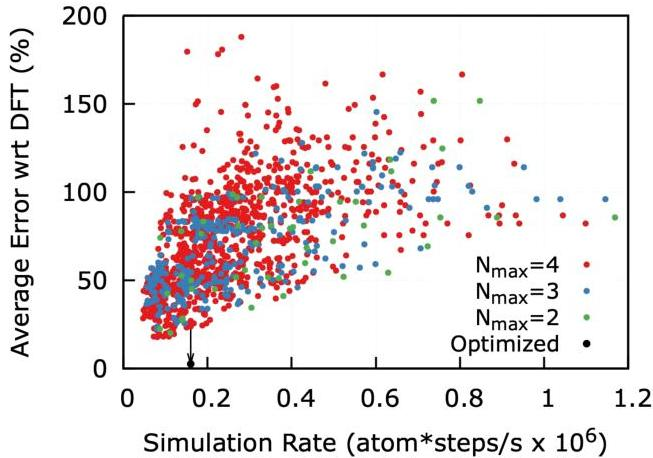
Figure 1. Pareto tradeoff between accuracy of ACE MLIAP on W material properties and simulation throughput in LAMMPS. Accuracy measure is an average over properties listed in Table I, and is shown for un-optimized potentials, as demonstrated by arrow indicating the refining of a single potential from  $\sim 25\%$  to  $&lt; 2\%$  error with respect to DFT.

parameter sweep a single objective genetic algorithm (SOGA) proceeds until errors cease to decrease, this usually occurs within a few thousand candidates for a single element potential. A generation for this genetic algorithm contains 200 candidate potentials, and the unweighted sum of all objective functions (percent errors w.r.t. DFT), energy RMSE (eV/atom), and force RMSE (eV/Å) forms the metric for optimization.

# C. LAMMPS Implementation

Consider now the larger set of possibilities that dynamically changing the IAP can offer. In addition to the application to excited state dynamics in a linear scaling MD simulation, we see use cases in the addition of nonlocal forces, and in the mitigation of poor extrapolative conditions of MLIAP. While a more accurate means to study these applications would be to include these auxiliary degrees of freedom into the equations of motion propagated by time integration in  $\mathrm{MD}^{54}$ , we stress the value in adopting new approximations to discover general trends and scaling laws of their effects on properties of interest. Future developments will refine these simplified dynamic potential methods with more accurate and unified models that are usable to the MD community at large.

In the current work, we introduced a modification to the LAMMPS code permitting  $\lambda$  to be calculated separately for each atom and also change dynamically as the simulation progresses. This is implemented by extending the pair_style hybrid/scaled command to take scale factors that are atom-style variables.[55] For example, given a suitable definition of local temperature

for each atom $T_{i}$, we can define a switching parameter $\lambda_{i}=1/(1+e^{-(T_{i}-T^{*})/\sigma})$, where $T^{*}$ and $\sigma$ are constants. The force on each atom is then defined to be a linear combination of contributions from the ground state and excited state potentials

$-F_{i}=\lambda\nabla_{i}\mathcal{U}_{ht}+(1-\lambda_{i})\nabla_{i}\mathcal{U}_{gs}.$ (5)

The corresponding LAMMPs commands are

```
variable w2 atom 1/(1+exp(-(v_Ti-${Ts})/$d))
variable w1 atom 1-v_w2
pair_style hybrid/scaled v_w1 pace v_w2 pace
```

This implementation has the merit of being very general. It works in parallel via forward communication of the atom-style variables. It is also supported by the KOKKOS package in LAMMPS, allowing it to be used on larger GPU clusters. [56] It can be used with any interatomic potential that is implemented as a LAMMPS pair_style. Because the $\lambda$ switching is applied to the forces, rather than the potentials, the combined force on each atom is not strictly conservative. A fully conservative implementation could be achieved using the adaptive-precision interatomic potential (APIP), but this would require extensive code modification for each new class of interatomic potential and would not be supported by KOKKOS. [54; 57]

### II.4 Neutron Damage Cascade

Neutron damage to a materials is simulated in classical MD simulations by varying the kinetic energy imparted to a single atom and observing the defects generated after the thermal spike dissipates. Simulation domain sizes needed to accurately capture these events is far beyond DFT capability. The protocol follows previous work from of Cusentino et. al. [58] where a single crystal of tungsten is first equilibrated to 1000K and 1atm of hydrostatic pressure. This step utilizes a Nose-Hoover [59; 60] thermo-/baro- stat to reach the desired temperature and volume, total simulated time in these two ensembles is 100ps with a 0.5fs timestep. To cover as much of the neutron recoil energy spectrum [61; 62] as possible, the primary knock-on atom (PKA) is assigned a velocity equating to a minimum of 1keV up to 200keV. To avoid thermal spike interactions through periodic boundaries, larger volumes of material are needed to contain the thermal spike and subsequent damage. For each PKA energy the following volumes were assigned; [1-10]keV : 4,096 nm^{3}, [10-45]keV : 32,768 nm^{3}, [50-100]keV : 110,592 nm^{3}, [150-200] : 262,144 nm^{3}. The smallest volume contains 2.5$\cdot$10^{5} atoms, while the largest contains 1.6 $\cdot$ 10^{7} atoms and required leadership computing platforms such as Frontier to run. LAMMPS KOKKOS implementations of ACE MLIAP [63] allow for seamless execution on any CPU and NVIDIA/AMD/Intel GPU hardware.

Following the equilibration, regions are defined at the faces of each of the cube (even though it is triply periodic) to apply a thermostat to approximate thermal conduction away from the damage region. Atoms with distance less than 2.5% the cell length from any cube face are held at a constant 1000K with a Nose-Hoover thermostat during the cascade. All other atoms outside these regions are propagated in time in the microcanonical ensemble. Adaptive time stepping (LAMMPS fix dt/reset) between 1.0 $\cdot$ 10^{-6}fs and 5.0 $\cdot$ 10^{-1}fs is updated every 100 steps based on the maximum atom velocity in the system. Once the adaptive timestepping recovers the nominal 0.5fs timestep, the entire cell is held at 1000K for 30ps where subsequently Frenkel Pairs are counted using OVITO [64; 65] Wigner-Seitz Defect identification. Each recoil energy is repeated 25 times with random orientation of the PKA recoil velocity direction to gather statistics of defect counts. At very high recoil energies ($\geq$ 100keV) the thermal spike will dissipate via thermal conduction for up to 100ps [66], which may require an alternate simulation protocol to the thermal quench to 1000K used here. Supplemental Figures 12-15 employ the method of Ref [ [66]] and compare to the protocol used here, no significant change is observed due to the high mobility of defects at 1000K which preserved the recombination rates seen for natural cooling rates of the thermal spike.

## III Results & Discussion

To demonstrate the proposed layered Sommerfeld potentials, we will focus on neutron damage in single crystal Tungsten as MD simulations underpin the damage accumulation models that steer material selection for plasma facing materials [67]. It is hypothesized that primary recoil damage and defect recombination involve high-energy, non-equilibrium electronic excitations that alter the potential energy surface and subsequent ion dynamics. This activates fundamentally different damage accumulation mechanisms and populations than those inferred from simple equilibrium theories. Downstream phenomena emerging at longer length and time scales (chemical segregation, mechanical response, and thermal transport) are intimately linked to these initial transient non-equilibrium behaviors.

Tungsten is the leading material candidate to be used as the divertor and first wall for future fusion reactors [68], though understanding its’ changing thermomechanical properties under a fusion prototypical neutron source is challenging [69]. Capturing the dynamics of ions in the warm dense state following elastic collision with the lattice is an ideal test for the two-state Sommerfeld potentials. From the ensemble of generated candidate potentials $\mathcal{U}_{gs}$ and $\mathcal{U}_{ht}$ are selected on slightly different heuristics. Minimizing the objective functions is the primary selection criterion for $\mathcal{U}_{gs}$, while achieving the lowest energy and force RMSE is of higher concern for $\mathcal{U}_{ht}$. Table 1 collects the fitted material properties for each $\mathcal{U}$ and

|  Property | DFT Te=0.0eV | ACE Ugs | DFT Te=0.5eV | ACE Uht  |
| --- | --- | --- | --- | --- |
|  a0(Å) | 3.184 | 3.176 | 3.194 | 3.178  |
|  Evac(eV) | 3.344 | 3.308 | 2.812 | 3.227  |
|  Edivac(eV) | 0.164 | 0.166 | -0.015 | 0.020  |
|  E110d(eV) | 10.675 | 10.391 | 8.865 | 9.918  |
|  E111d(eV) | 10.389 | 10.391 | 8.603 | 9.268  |
|  EOct(eV) | 12.491 | 12.376 | 10.661 | 9.271  |
|  ETet(eV) | 11.859 | 12.033 | 9.872 | 9.271  |
|  C11(GPa) | 522.47 | 531.64 | 502.30 | 512.21  |
|  C12(GPa) | 209.20 | 209.15 | 204.91 | 262.61  |
|  C44(GPa) | 122.45 | 121.28 | 141.25 | 153.65  |
|  ΔEfcc-bcc(eV) | 0.471 | 0.491 | 0.267 | 0.568  |
|  ΔEhcp-bcc(eV) | 0.550 | 0.589 | 0.290 | 0.460  |
|  ΔEA15-bcc(eV) | 0.086 | 0.091 | 0.065 | 0.129  |
|  RMSE Energy (meV/atom) |  | 47.50 |  | 35.56  |
|  RMSE Force (eV/Å) |  | 0.638 |  | 0.038  |

Table I. Tungsten fitted properties for the ACE potentials compared to DFT. Properties include lattice constant  $(a_0)$ , formation energy of lattice defects (vacancy, divacancy binding, [110] dumbbell, [111] dumbbell, octahedral interstitial and tetrahedral interstitial), elastic constants  $(C_{11}, C_{12}, C_{44})$ , and formation energy of FCC/HCP/A15 phases relative to BCC.

their corresponding DFT values at the smearing temperature of the training set. Figure 2 A) demonstrates the linear mixing between  $\mathcal{U}_{gs}$  and  $\mathcal{U}_{ht}$  for W-W diatomic separation using a globally applied  $\lambda$  (auxiliary variable defining potential switching), where no obvious discontinuities are present.

Material properties such as the formation energy of meta-stable phases predicted from a mixed  $\mathcal{U}$  also show smooth and continuous changes between limiting potentials, as shown in Figure 2 B). Importantly, these initial demonstrations of interpolation to recover a Sommerfeld potential apply scaled atomic forces from each  $\mathcal{U}$  to each atom, with  $\lambda$  being the same for all atoms. As was detailed in Section II C), modifications made to the code structure of LAMMPS now permits  $\lambda$  to be attached to per-atom quantities that can be dynamically changed as the simulation progresses.

# A. Quantifying Sommerfeld Dynamics

Following a neutron recoil with a lattice ion a region of very high temperature is formed due to the cascade of elastic collisions from secondary, tertiary, etc. ions, this is known as the thermal spike. To demonstrate the Sommerfeld potentials developed here, we will dynamically assign these fast moving ions to  $\mathcal{U}_{ht}$  while leaving equilibrated regions on  $\mathcal{U}_{gs}$ . From a first-principles standpoint, these rapidly moving ions experience a drag force from the background electron density they traverse, locally

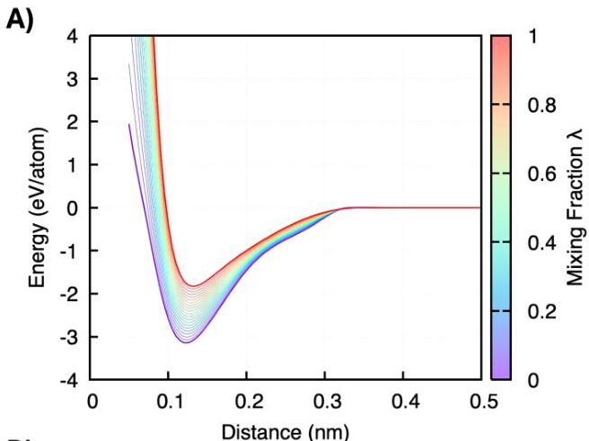

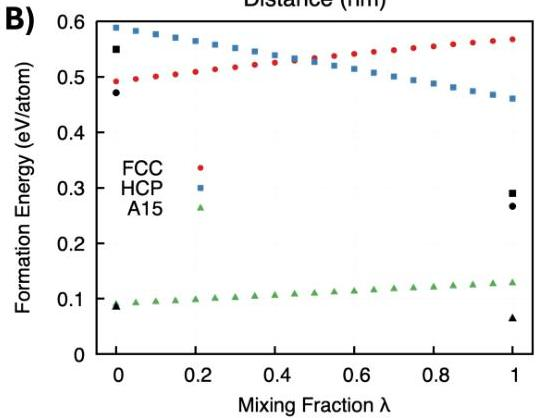
Figure 2. A) Diatom binding curves for developed ACE MLIAP shown as thicker lines. Thinner lines between are linearly mixed between limiting IAP to show the continuum of states that capture the temperature dependence of the training sets. B) Formation energy of simple crystals relative to the BCC ground-state as a function of mixing parameter  $\lambda$  showing smooth variation of properties on the constructed two-state Sommerfeld potential. DFT predicted values shown in black symbol matched points.

perturbing the electronic state away from what would be expected under thermal equilibrium. While time dependent DFT is the appropriate tool to simulate the dynamics while this excited state is present, predicting the subsequent damage requires an atom count and timescale far beyond TDDFT capability. We thus adopt the approximation that the local atomic temperature of the ions  $(T_{i})$  signifies which proportion of the atomic forces will be taken from  $\mathcal{U}_{gs}$  or  $\mathcal{U}_{ht}$ . The mathematical form we adopt for this is a sigmoid  $\lambda_{i} = 1 / (1 + e^{-(T_{i} - T^{*}) / \sigma})$  that depends on a switching temperature  $(T^{*})$  and width  $(\sigma)$ . Note  $T^{*}$  is not equivalent to  $T_{c}$  the smearing temperature used to generate the training set and should be treated parametrically for the observations of interest. Other researchers have adopted a constant friction force for fast moving particles, but this is not dependent on the local atomic environment as our two-state Sommerfeld potentials are.

Local atomic temperatures are calculated within LAMMPS using a 5.28Å cutoff, where center of mass velocity of this collection of atoms is subtracted, see Figure 10 in the Appendix for atomic temperature distributions at various cutoff values. In a perfect crystal of W, statistics of Frenkel pairs generated over the neutron recoil spectrum (14.1 MeV D+T fusion source) are gathered as a function of $T^{*}$ and a constant $\sigma=T^{*}/14$ in the switching function between $\mathcal{U}_{gs}$ and $\mathcal{U}_{ht}$. Figure 3 A) captures the atomic temperature distribution of a representative 20keV cascade at the end of adaptive time stepping($t_{0}$) while panel B) displays the set of switching functions tested. We see that at the lowest $T^{*}$ of 0.5eV, only 1.4 % of atoms have forces that primarily come from $\mathcal{U}_{ht}$ where this population drops to zero near $T^{*}=1.25$eV. Through subsequent collisions and heat conduction to the thermostatted regions, atoms quickly transition wholly back to $\mathcal{U}_{gs}$, this is reflected in Figure 3 B) for data labeled $t_{0}+20ps$. Beyond the definition of the switching function parameters, there is no user intervention to the dynamics and the decay times back to the ground state proceed naturally.

An example visual of the thermal spike and definition of these local atomic temperatures is given in Figure 4 to show where dynamic switching between $\mathcal{U}_{gs}$ and $\mathcal{U}_{ht}$ is occurring in the material. Atoms defined as BCC from OVITO’s Polyhedral Template Matching are removed from the rendered image, leaving only the disordered hot material in the core of the thermal spike. The time origin of Fig. 4 is set to the initial collision of a neutron with a single lattice atom, where the right-most panel captures where peak atom velocities have reduced significantly and LAMMPS designates a 0.5fs timestep to continue integrating upon. At the time shown in the right-most panel is when volume of the thermal spike region is measured. Vectors are drawn on atoms that exceed 50 Å/ps velocity, and are color matched to the calculated atomic temperature. For this 50keV recoil energy within 100fs of the primary elastic collision, the thermal spike is nearly 10nm wide with the periphery atoms being the hottest in the region. Note the ballistic nature of recoiled atoms designates an artificially high temperature, many in excess of $10^{6}$K. Temperature as an observable is only well defined in the ergodic limit, which is why we treat the single time snapshot of a small ($\sim 50$) ensemble of atoms as an approximate temperature and parametrically study this Sommerfeld potential construction.

As one may expect higher recoil energies will utilize $\mathcal{U}_{ht}$ more for the dynamics of atoms in the thermal spike. At any instant in time the instantaneous excitation in the simulation cell is the sum over all per-atom $\lambda_{i}$, with many atoms contributing zero;

$\eta(t^{\prime})=\sum_{i}^{N_{atoms}}\lambda_{i}(t^{\prime})$ (6)

The quantity $\eta$ evolves in time by spiking during high energy collisions and relaxing back to zero as energy is thermal spike. Figure 3. A) Histogram of atomic temperatures during a 20keV elastic neutron collisions with the W lattice. Here $t_{0}$ is the last frame of adaptive time stepping and corresponds to the peak of damage (see last panel of Figure 4. For a few switching functions $T^{*}$ values the fraction above $T^{*}$ is given. B) Sigmoid functional form of $\lambda$ is chosen for its’ derivative continuity and so that equilibrium fluctuations of atomic temperatures will not spontaneously toggle atoms onto the excited state IAP, unless atom temperatures are within $T^{*}/14$ of $T^{*}$.

A) Histogram of atomic temperatures. A) 10^{2} $\eta(t^{\prime})$ $dt^{\prime}$ (7)

A) 10^{1} $\eta(t^{\prime})$ $dt^{\prime}$ (8)

A) 10^{0} $\eta(t^{\prime})$ $dt^{\prime}$ (9)

B) 10^{1} $\eta(t^{\prime})$ $dt^{\prime}$ (10)

A) 10^{2} $\eta(t^{\prime})$ $dt^{\prime}$ (11)

A) 10^{3} $\eta(t^{\prime})$ $dt^{\prime}$ (11)

B) 10^{4} $\eta(t^{\prime})$ $dt^{\prime}$ (12)

A) 10^{5} $\eta(t^{\prime})$ $dt^{\prime}$ (13)

A) 10^{6} $\eta(t^{\prime})$ $dt^{\prime}$ (14)

A) 10^{7} $\eta(t^{\prime})$ $dt^{\prime}$ (15)

B) 10^{8} $\eta(t^{\prime})$ $dt^{\prime}$ (16)

B) 10^{9} $\eta(t^{\prime})$ $dt^{\prime}$ (17)

B) 10^{10} $\eta(t^{\prime})$ $dt^{\prime}$ (18)

B) 10^{11} $\eta(t^{\prime})$ $dt^{\prime}$ (19)

B) 10^{12} $\eta(t^{\prime})$ $dt^{\prime}$ (20)

B) 10^{13} $\eta(t^{\prime})$ $dt^{\prime}$ (21)

B) 10^{14} $\eta(t^{\prime})$ $dt^{\prime}$ (22)

B) 10^{15} $\eta(t^{\prime})$ $dt^{\prime}$ (23)

B) 10^{16} $\eta(t^{\prime})$ $dt^{\prime}$ (24)

B) 10^{17} $\eta(t^{\prime})$ $dt^{\prime}$ (25)

B) 10^{18} $\eta(t^{\prime})$ $dt^{\prime}$ (26)

B) 10^{19} $\eta(t^{\prime})$ $dt^{\prime}$ (27)

B) 10^{20} $\eta(t^{\prime})$ $dt^{\prime}$ (28)

B) 10^{21} $\eta(t^{\prime})$ $dt^{\prime}$ (29)

B) 10^{22} $\eta(t^{\prime})$ $dt^{\prime}$ (30)

B) 10^{23} $\eta(t^{\prime})$ $dt^{\prime}$ (31)

B) 10^{24} $\eta(t^{\prime})$ $dt^{\prime}$ (32)

B) 10^{25} $\eta(t^{\prime})$ $dt^{\prime}$ (33)

B) 10^{26} $\eta(t^{\prime})$ $dt^{\prime}$ (34)

B) 10^{27} $\eta(t^{\prime})$ $dt^{\prime}$ (35)

B) 10^{28} $\eta(t^{\prime})$ $dt^{\prime}$ (36)

B) 10^{29} $\eta(t^{\prime})$ $dt^{\prime}$ (37)

B) 10^{30} $\eta(t^{\prime})$ $dt^{\prime}$ (38)

B) 10^{31} $\eta(t^{\prime})$ $dt^{\prime}$ (39)

B) 10^{32} $\eta(t^{\prime})$ $dt^{\prime}$ (40)

B) 10^{33} $\eta(t^{\prime})$ $dt^{\prime}$ (41)

B) 10^{34} $\eta(t^{\prime})$ $dt^{\prime}$ (42)

B) 10^{35} $\eta(t^{\prime})$ $dt^{\prime}$ (43)

B) 10^{36} $\eta(t^{\prime})$ $dt^{\prime}$ (44)

B) 10^{37} $\eta(t^{\prime})$ $dt^{\prime}$ (45)

B) 10^{38} $\eta(t^{\prime})$ $dt^{\prime}$ (46)

B) 10^{39}

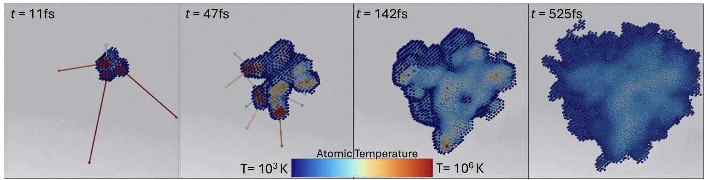
Figure 4. Rendered images of a  $50\mathrm{keV}$  elastic recoil in W showing the development of the thermal spike. Atoms are colored by their local temperature on a logarithmic scale between  $10^{3}\mathrm{K}$  and  $10^{6}\mathrm{K}$ , with velocities above  $50\AA/\mathrm{ps}$  drawn as vectors. Sample is cut in the (110) plane to show the interior of the thermal spike. Right-most panel  $(t = 525\mathrm{fs})$  corresponds to where adaptive time stepping is complete and the system transitions to the canonical ensemble at  $1000\mathrm{K}$ .

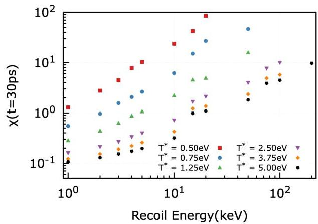
Figure 5. Quantified sampling of  $\mathcal{U}_{ht}$  for each of the  $\lambda$  switching functions.  $\chi$  carries units of atoms\*time and is the sum of all per-atom  $\lambda$  up to the designated time of  $t$ . Data shows how one can modulate the extent a simulation will sample the excited state potential.

observed that are caused by long residency times on  $\mathcal{U}_{ht}$ . This is an artifact of the method to switch between IAP, as there is no time dependence of the electronic excitation captured by classical MD. For each  $T^{*}$  in Figure 5 the data series is terminated when  $&gt;25\%$  of the PKA repetitions result in an increasing thermal spike volume after adaptive time stepping. Which is why the highest recoil energy studied for  $T^{*} = 0.50\mathrm{eV}$  is  $15\mathrm{keV}$ , while up to  $200\mathrm{keV}$  recoil energies are possible for  $T^{*} = 5.0\mathrm{eV}$ . An example LAMMPS input script for primary radiation damage using two-state Sommerfeld potentials is provided in the Supplemental Information.

# B. Equilibrium Observables

With the residency time on the excited state potential quantified for each  $\lambda (T^{*})$  shown in Figure 3B), we now transition to quantify the cumulative effect of the dynamic potential switching. There are two key competing factors that lead to an accurate prediction of the number of Frenkel pairs generated. First is the peak damage resulting from the energy deposition, most often quantified as volume of the thermal spike. Second is the thermal conductivity of the bulk material as this sets an effective cooling rate of the damaged volume. Rapid cooling of the amorphous damage volume will allow for any character of defect (interstitials, vacancy, substitutions, etc.) given the large excess of energy imparted by the PKA. Therefore, the transient excitations onto  $\mathcal{U}_{ht}$  are now important to predict the final defect densities as these will be 'frozen' in given the rapid cooling. Bulk thermal conduction only relies on  $\mathcal{U}_{gs}$  so we focus on quantifying the thermal spike size and net defect counts as it reflects the Sommerfeld dynamics of interest.

As there is no clear way to measure the number or character of lattice defects (vacancies, interstitials, substitutions, etc) for warm dense matter that is largely amorphous, we opt to measure the peak volume of material marked as non-crystalline by OVITO. This is done by a combination of analysis tools, first is Polyhedral Template Matching to identify structure types of each atom, then constructing a surface mesh around clustered defect regions. This is the same method that allows clear identification of the thermal spike shown in Figure 4. While the measured volume depends on the probe sphere radius that forms a surface mesh, we report data on defect volumes with  $R_{probe} = 1\mathrm{nm}$ . Figure 6 gathers data of peak damage volume versus  $\chi(t)$  where the integration limit of  $t$  is set to be the end of that adaptive time stepping after which the system cools to a uniform 1000K background temperature. The breakout of sub-cascades at high recoil energies ( $\geq 200\mathrm{keV}$ ) creates challenges in defining the thermal spike volume as the proximity of

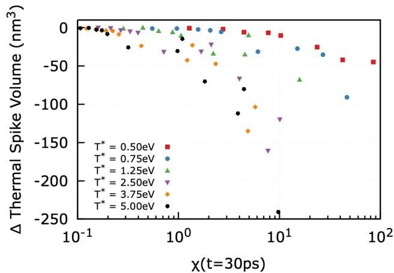
Figure 6. Peak thermal spike volume is measured by constructing a surface mesh around disordered atoms surrounding the PKA. Difference is measured as Sommerfeld dynamics less the purely ground state dynamics prediction, showing a smaller thermal spike volume for all switching function parameters.

adjacent defect clusters will cause significant changes to measured volumes. We focus on the recoil energy range of [1-200]keV for this reason.

As the system cools following the PKA event, equilibrium dynamics  $(\lambda = 0)$  of defect motion and annihilation progresses in the canonical ensemble with  $\mathrm{T} = 1000\mathrm{K}$ . We have high confidence these equilibrium dynamics are captured at DFT accuracy given the properties highlighted in Table I. After 30ps the count of Frenkel pairs is tallied and averaged over all repetitions for each recoil energy. Figure 7 also compares this collection of data to damage cascades using an Embedded Atom Model (EAM) IAP from Marinica et. al. $^{70}$ . The same simulation protocol and analysis is carried out for these EAM runs as is done for the layered Sommerfeld potentials. Defect counts span multiple orders of magnitude over the [1-200]keV recoil energies tested here where significant differences between EAM and the  $\mathcal{U}_{gs}$  data manifest at  $&gt;15\mathrm{keV}$ . For all recoil energies tested, use of the excited state potential has the net effect to decrease the number of defects that survive after the primary neutron damage. To isolate the effect of the Sommerfeld dynamics, Figure 8 translates the raw defect counts into a change in observed defect statistics (referenced on the  $\mathcal{U}_{gs}$  prediction) that depends on  $\chi$  for given recoil energy and  $\lambda(T^{*})$ . The data show that radiation damage events simulated using Sommerfeld potentials, as we argue is the correct physical representation given the high energy density conditions, result in a decreased thermal spike volume and a decreased number of Frenkel pairs generated. Figures 6 and 8 show a clear trend of increased sampling of the excited state (increasing values of  $\chi$ ) resulting in a decrease in both properties that are of critical importance to reduced order models of damage accumulation such as

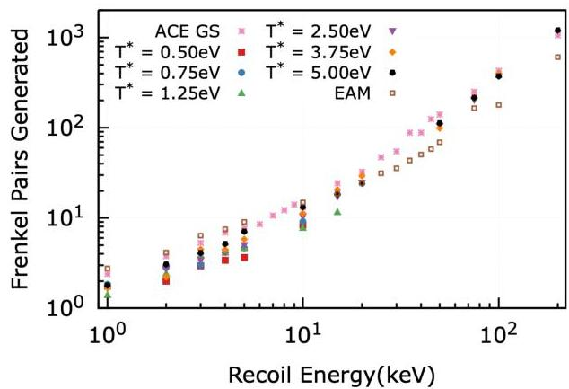
Figure 7. Observed defect counts averaged over 25 independent runs at each recoil energy. In the absence of defect sinks, interstitial W atoms and vacancies remain in equal amounts. Data labeled  $ACE$  GS utilize only  $\mathcal{U}_{gs}$  detailed in Table I, EAM potential used here is from Ref [70].

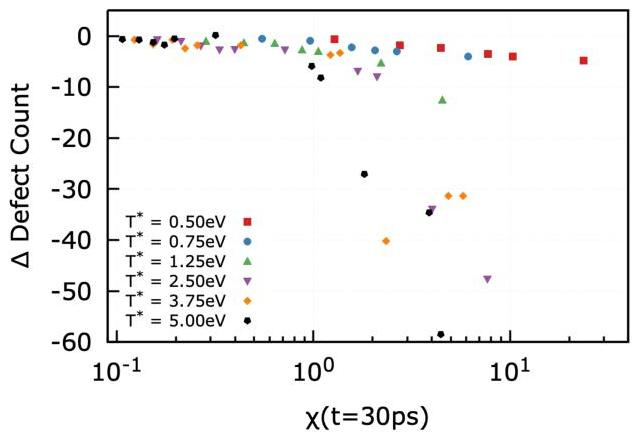
Figure 8. Change in defect counts (Sommerfeld dynamics less ground state values) that result from sampling the excited state potential, quantified by values of  $\chi$  taken after 30ps of annealing at  $1000\mathrm{K}$ . Larger changes in defect counts are observed when trajectories utilize  $\mathcal{U}_{ht}$  more.

# NRT- and CRC-DPA $^{41,71,72}$ .

Again, we stress that our predictions here of primary radiation damage utilizing a layered Sommerfeld potential construction are made by adopting approximations of how electronic excited states can be represented on linear scaling interatomic potentials. Observations of decreased defect counts and thermal spike volume lead us to conclude that the excited state dynamics act to dissipate energy from the primary recoil, the amount of this effect depends on the details of the switching function. We trace this back to the calculation of the local atomic temperatures results in the effective heating of

stationary particles if they are nearby fast moving ones. This is due to the center of mass velocity correction that sets the local atom environment at rest in the laboratory frame of reference. Activation of atoms near swift ions onto  $\mathcal{U}_{ht}$  produces the observed dissipation, which is aligned with the drag force (non-elastic dissipation) these fast moving particles experience as they move through a charged medium. By constructing a potential energy surface model form that is capable of dynamically sampling ground- and excited-states during a non-equilibrium MD simulation, we are able to recover this well known physical effect.

Direct experimental comparisons of these predictions is obscured by the many orders of magnitude gap  $(&gt;&gt;\mathrm{ms})$  in time that allows radiation induced defects to diffuse, react, and combine necessitating a multi-scale modeling paradigm that is adopted by many researchers of plasma-facing materials[73]. Even state of the art positron annihilation and TEM characterization[74] only quantify defect densities that are from immobile vacancy clusters and dislocation loops, not the precursor point defects highlighted here. This also assumes that outside influences of microstructure (grain-boundaries and surfaces acting as defect sinks) can be mitigated to make comparisons between experiments and theory. We note that parametric models that translate MD damage predictions to experimental damage observations is an active area of research[71].

# C. Extrapolation Mitigation of MLIAP

The remaining discussion will demonstrate generalizations of the dynamic potential switching that underpin the Sommerfeld potentials shown previously which will be useful to a broader audience than practitioners of radiation damage MD simulations. When training a ML-IAP it is pertinent to plan training data that directly captures all of the possible atom environments that will be present when used for a large-scale production MD simulations. Of course this is advanced/complete knowledge is impossible to obtain prior to performing regression on the model, though a metric of extrapolation can be calculated as a simulation progresses. With a ML-IAP that constructs rotation, translation, and permutation invariant input descriptors (ie. MTP $^{75}$ , ACE $^{76}$ , SNAP $^{77,78}$ ) one can detect extrapolations when atoms in the MD simulation exceed the bounds of the training set, as captured by a distance in the basis set of descriptors.

Methods such as ACE extrapolation grade $^{79}$  in LAMMPS provide a distance to the convex hull of trained descriptor values, where the interpretation is simply larger values should incur more scrutiny on the simulated results. Where significant extrapolations are made the possibility for simulations to become unstable and predict spurious physics increases dramatically. This is especially true for high dimensional ML-IAP where small changes in descriptor values can result in large changes

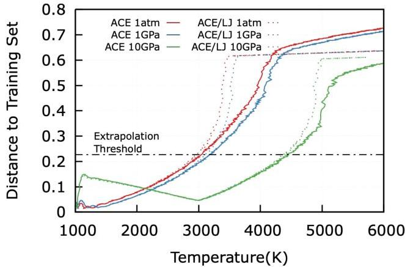
Figure 9. Layering of ACE and LJ potentials to mitigate extrapolations is carried out while melting a single crystal of BCC W. Distance is calculated for the whole simulation cell to the mean of the training set descriptors, a sigmoid function on this distance toggles atoms to the LJ IAP near the designated threshold.

in energy/force. Using the methods proposed here that translate discrete potentials into continuous potential energy surfaces connected through some auxiliary variable, extrapolations can be mitigated by migrating atoms to a secondary (or more) IAP that is suitable for the full range of physical responses present in the simulation. For example, shock compression of materials offers a unique window into solid-solid phase transitions that is challenging to experiments but well-suited for  $\mathrm{MD}^{14}$ . A well trained ML-IAP will have the capability to capture the solid phases well, but as the system approaches the liquidus these states are more challenging to directly train for as size restrictions of DFT force spatial correlations that wouldn't otherwise be present. A mitigation strategy is then to transition to a simpler IAP where limiting behavior (low-density dispersion, or short ranged core repulsion interactions) is known and can temper a simulation away from unstable dynamics.

To demonstrate this method, we calculate the distance to the mean descriptor values of the training set of  $\mathcal{U}_{gs}$  and use this metric to toggle to an Lennard-Jones (LJ) IAP $^{80}$  when the distance becomes large. The mean descriptor values of the training set is unsurprisingly close to the values of BCC Tungsten. However, ACE descriptors are density projections of neighboring atoms $^{81}$ , which will result in training groups of surface structures and volumetric deformation (Equation of State) being noticeably different due to their coordination and density changes. Computing the distance of all training configurations to the mean point reveals that  $90\%$  of the training data is contained within a normalized distance of 0.23. As with the choice of  $\lambda(T^{*})$  we parametrically choose a distance of 0.46 to transition to the LJ IAP. The melting temperature at various levels of compression is used to

show when extrapolations from the training set can be mitigated.

Starting in a state that is well represented in the training set, a cube of BCC W is set to 1000K and a pressure of either 1atm, 1GPa, or 10GPa. Subsequently, the sample is heated at a constant rate of 5K/ps up to 6000K while the starting pressure is maintained with a Nose-Hoover barostat. Figure 9 shows the ACE $\mathcal{U}_{gs}$ melting temperature at $>4200$K as solid lines for each studied pressure, the change in curvature and slope indicates a structural change from BCC to a liquid. Contrast to this baseline behavior, the dynamic potential switching (ACE to LJ) simulation is uniformly transitioned as it approaches and exceeds the designated extrapolation threshold($\simeq 3000$K), placing the observed melting temperature below the ACE prediction due to the weakly bonded LJ IAP.

We see two key applications of such extrapolation mitigation methods (i) tempering simulations against crashes due to unstable IAP and (ii) making active learning protocols more robust. The first use case is advantageous in large-scale or long-time MD calculations as pitfalls in potentials are rapidly found as each atom samples its own descriptor environment, updated at each timestep. Extrapolations resulting in large atomic forces will quickly amplify, causing a runaway crash that would ultimately ruin the prediction. Active learning (AL) has rapidly become common practice for the development of ML-IAP [82; 83; 84] as is ensures targeted training to an application of interest in MD. Most of these AL protocols operate on a run-till-failure mode where a MD simulation using the nascent ML-IAP continues until a user defined extrapolation metric (or simulation crash) triggers re-training of the model. An efficient advancement can be integrated into these AL codes using the dynamic IAP approach presented here where a mixture of a ’backbone’ IAP (i.e. EAM or LJ) and the ML-IAP produce diverse training configurations by extending simulation times by not requiring a re-trained potential to progress further.

## IV Conclusion

The present work demonstrates a new frontier of molecular dynamics research enabled by clever construction and usage of MLIAP. Through a layering of IAP, one can achieve insight into physical processes that have been inaccessible due to the base approximations with classical MD. It was shown that temperature-dependent (Sommerfeld) dynamics strongly affect the outcomes of neutron damage, which should complement stopping power calculations to provide deeper insight into radiation tolerance of materials. These are timely advancements as the global push for viable fusion power plants is a top scientific challenge of our age. Furthermore, the layered potential approach coupled through an auxiliary variable (which was atomic temperature for Sommerfeld potentials) was demonstrated to mitigate erroneous extrapolations of a MLIAP. Before closing, we would like to draw attention to additional usages of this approach for applications that are beyond the pair shown here, highlighting what auxiliary variable would enable new insight. Each of these applications necessitate larger scale (size, time, or both) simulations than a full first principles approach would permit, thereby motivating the layered potential approximation.

Dynamic Coarse Graining Recent efforts by Zhang et. al. [85] showed how to construct MLIAP with additional input features that capture the degree of coarse graining(CG) a molecule. This approach can be extended and applicable to any CG method by attaching an auxiliary variable that calculates a local/global property such as pH or solvent for proteins and biomolecules. Potentials trained with and without solvent interactions can then be sampled dynamically without the need of an explicit solvent or ion solute species. Fermi-Level Tuning An auxiliary variable that represents the Fermi level, a critical parameter in determining the electronic properties of materials, would enable defect dynamics MD simulations that evolve on a defect-state informed IAP without fully resolving the electronic structure. DFT calculations of electronic structure are cost prohibitive for complex materials and large-scale systems, often including supercell model sizes necessary to capture (i) experimental defect concentrations and (ii) compensation mechanisms unobstructed by residual interactions between neighboring point defects. [86; 87; 88] A multi-potential method with an auxiliary fermi level tuning parameter would account for semi-classical phenomena involved in defect dynamics, enabling quantum-accuracy large-scale MD simulations of defect migration, compensation mechanisms, and doping concentrations inaccessible by first principles methods. Moreover, potentials of this type are straightforward to train using state constrained, or $\Delta$-SCF methods. [89; 90; 91] Charge State In a similar training context as the previous example, MLIAP can be constructed for individual charge states of transition metals, alleviating the necessity for dynamic charge updating [92] in MD. Even cutting edge dynamic charge MD [93] methods struggle to address the integer charge state constraints that are needed to capture transition metal oxides. Layering potentials with dynamic switching through an auxiliary variable representing excess charge would enable efficient (yet approximate) predictions of corrosion and other oxidation reduction problems in catalysis. Structural changes due to a metals’ oxidation state can thus be recovered in a computationally efficient manner by utilizing this approximation. High Pressure Physics It is known that electron entropy plays a large role in stabilizing high-pressure phases of metal-hydrides [94], and other complex materials [95]. Large and discontinuous changes in the electronic structure at high pressure phase boundaries are inaccessible to traditional IAP, though one could parametrize models with the appropriate phase stability energetics without properly accounting for this lost electron entropy contribution to the total free energy. Con

versely, a separable MLIAP construction can be sought that modifies the functional form (i.e. additional basis functions used in the descriptors) through an auxiliary variable of local density or crystalline structure. For metal hydrides, this would enable large scale calculations of hydride mobilities as they interact with realistic microstructure features and other defects.

We encourage readers to identify the technical gaps that are present when moving between a first principles and a classical representation as is done when training interatomic potentials. By definition developing interatomic potentials is a multi-scale modeling linkage, which we propose new approximations to forward quantum degrees of freedom that are traditionally lost.

## Supplementary Material

See Supporting Information for additional analysis of local temperature calculation, quantification of instantaneous excitations during neutron damage, and optimization parameters that yield the developed ACE IAP used. Additionally an example LAMMPS input script demonstrating Sommerfeld dynamics is included along with parameter sets of finalized ACE potentials.

## Acknowledgments

This material is based upon work supported by the U.S. Department of Energy, Office of Science, Office of Fusion Energy Sciences, under Award Number 25-028331 (DOE Early Career Research Program).This research used resources of the Oak Ridge Leadership Computing Facility at the Oak Ridge National Laboratory, which is supported by the Office of Science of the U.S. Department of Energy under Contract No. DE-AC05-00OR22725. This article has been authored by an employee of National Technology & Engineering Solutions of Sandia, LLC under Contract No. DE-NA0003525 with the U.S. Department of Energy (DOE). The employee owns all right, title and interest in and to the article and is solely responsible for its contents. The United States Government retains and the publisher, by accepting the article for publication, acknowledges that the United States Government retains a non-exclusive, paid-up, irrevocable, world-wide license to publish or reproduce the published form of this article or allow others to do so, for United States Government purposes.

## Author Declaration

### Conflict of Interest

The authors have no conflicts to disclose.

### Author Contributions

All authors contributed to the idea, data collection, and writing.

### Data Availability

Interatomic potentials and LAMMPS input scripts used in this work are supplied as attachments for reproducibility. The DOE will provide public access to these results of federally sponsored research in accordance with the DOE Public Access Plan https://www.energy.gov/downloads/doe-public-access-plan.

### Code Availability

Open source codes used in this work LAMMPS (https://github.com/lammps/lammps) and FitSNAP (https://github.com/FitSNAP/FitSNAP) are available on their respective code repositories. DFT calculations using VASP are possible with a license to the code which is not managed by the authors.

## References

- (1) G. E. Box, “Science and statistics,” Journal of the American Statistical Association 71, 791–799 (1976).
- (2) T. E. Wainwright, Molecular dynamics computations for the hard sphere system (University of California Radiation Laboratory, 1958).
- (3) B. J. Alder and T. E. Wainwright, “Studies in molecular dynamics. i. general method,” The Journal of Chemical Physics 31, 459–466 (1959).
- (4) B. J. Alder and T. E. Wainwright, “Studies in molecular dynamics. ii. behavior of a small number of elastic spheres,” The Journal of Chemical Physics 33, 1439–1451 (1960).
- (5) Y. P. Varshni, “Comparative study of potential energy functions for diatomic molecules,” Reviews of Modern Physics 29, 664 (1957).
- (6) I. Torrens, Interatomic potentials (Elsevier, 2012).
- (7) R. Jacobs, D. Morgan, S. Attarian, J. Meng, C. Shen, Z. Wu, C. Y. Xie, J. H. Yang, N. Artrith, B. Blaiszik, et al., “A practical guide to machine learning interatomic potentials–status and future,” Current Opinion in Solid State and Materials Science 35, 101214 (2025).
- (8) Y. Zuo, C. Chen, X. Li, Z. Deng, Y. Chen, J. Behler, G. Csányi, A. V. Shapeev, A. P. Thompson, M. A. Wood, et al., “Performance and cost assessment of machine learning interatomic potentials,” The Journal of Physical Chemistry A 124, 731–745 (2020).
- (9) S. J. Plimpton and A. P. Thompson, “Computational aspects of many-body potentials,” Mat. Res. Soc. Bulletin 37, 513 (2012).
- (10) T. P. Senftle, S. Hong, M. M. Islam, S. B. Kylasa, Y. Zheng, Y. K. Shin, C. Junkermeier, R. Engel-Herbert, M. J. Janik, H. M. Aktulga, et al., “The reaxff reactive force-field: development, applications and future directions,” npj Computational Materials 2, 1–14 (2016).
- (11) Y. Han, D. Jiang, J. Zhang, W. Li, Z. Gan, and J. Gu, “Development, applications and challenges of reaxff reactive force field

in molecular simulations,” Frontiers of Chemical Science and Engineering 10, 16–38 (2016).
- (12) T. W. Ko, J. A. Finkler, S. Goedecker, and J. Behler, “Accurate fourth-generation machine learning potentials by electrostatic embedding,” Journal of chemical theory and computation 19, 3567–3579 (2023).
- (13) J. Tranchida, S. J. Plimpton, P. Thibaudeau, and A. P. Thompson, “Massively parallel symplectic algorithm for coupled magnetic spin dynamics and molecular dynamics,” Journal of Computational Physics 372, 406–425 (2018).
- (14) S. Nikolov, K. Ramakrishna, A. Rohskopf, M. Lokamani, J. Tranchida, J. Carpenter, A. Cangi, and M. A. Wood, “Probing iron in earth’s core with molecular-spin dynamics,” Proceedings of the National Academy of Sciences 121, e2408897121 (2024).
- (15) V. Eyert, J. Wormald, W. A. Curtin, and E. Wimmer, “Machine-learned interatomic potentials: Recent developments and prospective applications,” Journal of Materials Research 38, 5079–5094 (2023).
- (16) A. P. Thompson, H. M. Aktulga, R. Berger, D. S. Bolintineanu, W. M. Brown, P. S. Crozier, P. J. in’t Veld, A. Kohlmeyer, S. G. Moore, T. D. Nguyen, et al., “Lammps-a flexible simulation tool for particle-based materials modeling at the atomic, meso, and continuum scales,” Computer Physics Communications 271, 108171 (2022).
- (17) D. A. Case, T. E. Cheatham III, T. Darden, H. Gohlke, R. Luo, K. M. Merz Jr, A. Onufriev, C. Simmerling, B. Wang, and R. J. Woods, “The amber biomolecular simulation programs,” Journal of computational chemistry 26, 1668–1688 (2005).
- (18) Y. Lysogorskiy, A. Bochkarev, and R. Drautz, “Graph atomic cluster expansion for foundational machine learning interatomic potentials,” npj Computational Materials (2026).
- (19) M. U. Maruf, S. Kim, and Z. Ahmad, “Learning long-range interactions in equivariant machine learning interatomic potentials via electronic degrees of freedom,” The Journal of Physical Chemistry Letters 16, 9078–9087 (2025).
- (20) T. R. Nelson, A. J. White, J. A. Bjorgaard, A. E. Sifain, Y. Zhang, B. Nebgen, S. Fernandez-Alberti, D. Mozyrsky, A. E. Roitberg, and S. Tretiak, “Non-adiabatic excited-state molecular dynamics: Theory and applications for modeling photophysics in extended molecular materials,” Chemical reviews 120, 2215–2287 (2020).
- (21) Y. Zhang, T. Nelson, and S. Tretiak, “Non-adiabatic molecular dynamics of molecules in the presence of strong light-matter interactions,” The Journal of Chemical Physics 151 (2019).
- (22) M. Baer, “Introduction to the theory of electronic non-adiabatic coupling terms in molecular systems,” Physics Reports 358, 75–142 (2002).
- (23) R. Crespo-Otero and M. Barbatti, “Recent advances and perspectives on nonadiabatic mixed quantum–classical dynamics,” Chemical Reviews 118, 7026–7068 (2018).
- (24) E. Tapavicza, I. Tavernelli, and U. Rothlisberger, “Trajectory surface hopping within linear response time-dependent density-functional theory,” Physical review letters 98, 023001 (2007).
- (25) X. Li, J. C. Tully, H. B. Schlegel, and M. J. Frisch, “Ab initio ehrenfest dynamics,” The Journal of chemical physics 123, 084106 (2005).
- (26) W. Dou and J. E. Subotnik, “Nonadiabatic molecular dynamics at metal surfaces,” The Journal of Physical Chemistry A 124, 757–771 (2020).
- (27) W. Dou, A. Nitzan, and J. E. Subotnik, “Frictional effects near a metal surface,” The Journal of chemical physics 143 (2015).
- (28) J. Westermayr and P. Marquetand, “Machine learning for electronically excited states of molecules,” Chemical Reviews 121, 9873–9926 (2020).
- (29) J. Westermayr, M. Gastegger, and P. Marquetand, “Combining schnet and sharc: The schnarc machine learning approach for excited-state dynamics,” The journal of physical chemistry letters 11, 3828–3834 (2020).
- (30) F. Häse, C. Kreisbeck, and A. Aspuru-Guzik, “Machine learning for quantum dynamics: deep learning of excitation energy transfer properties,” Chemical science 8, 8419–8426 (2017).
- (31) P. O. Dral, M. Barbatti, and W. Thiel, “Nonadiabatic excited-state dynamics with machine learning,” The journal of physical chemistry letters 9, 5660–5663 (2018).
- (32) D. Duffy and A. Rutherford, “Including the effects of electronic stopping and electron–ion interactions in radiation damage simulations,” Journal of Physics: Condensed Matter 19, 016207 (2006).
- (33) H. Guo and D. R. Yarkony, “Accurate nonadiabatic dynamics,” Physical Chemistry Chemical Physics 18, 26335–26352 (2016).
- (34) S. Preuss, A. Demchuk, and M. Stuke, “Sub-picosecond uv laser ablation of metals,” Applied physics A 61, 33–37 (1995).
- (35) Y. Zhang and W. J. Weber, “Ion irradiation and modification: The role of coupled electronic and nuclear energy dissipation and subsequent nonequilibrium processes in materials,” Applied Physics Reviews 7, 041307 (2020).
- (36) L. J. Stanek, R. C. Clay III, M. Dharma-Wardana, M. A. Wood, K. R. Beckwith, and M. S. Murillo, “Efficacy of the radial pair potential approximation for molecular dynamics simulations of dense plasmas,” Physics of Plasmas 28, 032706 (2021).
- (37) A. Rutherford and D. Duffy, “The effect of electron–ion interactions on radiation damage simulations,” Journal of Physics: Condensed Matter 19, 496201 (2007).
- (38) S. Galitskiy, D. S. Ivanov, and A. M. Dongare, “Dynamic evolution of microstructure during laser shock loading and spall failure of single crystal al at the atomic scales,” Journal of Applied Physics 124 (2018).
- (39) G. Ackland, “Temperature dependence in interatomic potentials and an improved potential for ti,” in Journal of Physics: Conference Series, Vol. 402 (IOP Publishing, 2012) p. 012001.
- (40) A. Caro and M. Victoria, “Ion-electron interaction in molecular-dynamics cascades,” Physical Review A 40, 2287–2291 (1989).
- (41) J. F. Ziegler, M. D. Ziegler, and J. P. Biersack, “Srim–the stopping and range of ions in matter (2010),” Nuclear Instruments and Methods in Physics Research Section B: Beam Interactions with Materials and Atoms 268, 1818–1823 (2010).
- (42) E. E. Zhurkin and A. S. Kolesnikov, “Atomic scale modelling of al and ni (111) surface erosion under cluster impact,” Nuclear Instruments and Methods in Physics Research Section B: Beam Interactions with Materials and Atoms 202, 269–277 (2003).
- (43) M. A. Wood, M. A. Cusentino, B. D. Wirth, and A. P. Thompson, “Data-driven material models for atomistic simulation,” Physical Review B 99, 184305 (2019).
- (44) J. P. Perdew, K. Burke, and M. Ernzerhof, “Generalized gradient approximation made simple,” Physical Review Letters 77, 3865 (1996).
- (45) G. Kresse and D. Joubert, “From ultrasoft pseudopotentials to the projector augmented-wave method,” Physical Review B 59, 1758 (1999).
- (46) G. Kresse and J. Furthmüller, “Efficient iterative schemes for ab initio total-energy calculations using a plane-wave basis set,” Physical Review B 54, 11169 (1996).
- (47) G. Kresse and J. Hafner, “Ab initio molecular dynamics for liquid metals,” Physical Review B 47, 558 (1993).
- (48) J. M. Goff, C. Sievers, M. A. Wood, and A. P. Thompson, “Permutation-adapted complete and independent basis for atomic cluster expansion descriptors,” arXiv preprint arXiv:2208.01756 (2022).
- (49) B. M. Adams, W. Bohnhoff, K. Dalbey, J. Eddy, M. Eldred, D. Gay, K. Haskell, P. D. Hough, and L. P. Swiler, “Dakota, a multilevel parallel object-oriented framework for design optimization, parameter estimation, uncertainty quantification, and sensitivity analysis: version 5.0 user’s manual,” Sandia National Laboratories, Tech. Rep. SAND2010-2183 (2009).
- (50) E. Sikorski, M. Cusentino, M. McCarthy, J. Tranchida, M. Wood, and A. Thompson, “Machine learned interatomic potential for dispersion strengthened plasma facing components,” The Journal of Chemical Physics 158, 114101 (2023).
- (51) D. Csiba and P. Richtárik, “Importance sampling for mini-batches,” Journal of Machine Learning Research 19, 1–21 (2018).

- (52) A. Rohskopf, C. Sievers, N. Lubbers, M. Cusentino, J. Goff, J. Janssen, M. McCarthy, D. M. O. de Zapiain, S. Nikolov, K. Sargsyan, et al., “Fitsnap: Atomistic machine learning with lammps,” Journal of Open Source Software 8, 5118 (2023).
- (53) D. R. Jones, M. Schonlau, and W. J. Welch, “Efficient global optimization of expensive black-box functions,” Journal of Global optimization 13, 455–492 (1998).
- (54) D. Immel, R. Drautz, and G. Sutmann, “Adaptive-precision potentials for large-scale atomistic simulations,” The Journal of Chemical Physics 162, 114119 (2025), https://pubs.aip.org/aip/jcp/article-pdf/doi/10.1063/5.0245877/20447042/11411915.0245877.pdf.
- (55) Hybrid, “LAMMPS User Manual, pair_style hybrid command,” WWW site: docs.lammps.org/pair_hybrid.html.
- (56) A. Johansson, E. Weinberg, C. Trott, M. McCarthy, and S. Moore, “LAMMPS-KOKKOS: Performance portable molecular dynamics across exascale architectures,” in Proceedings of the SC ’25 Workshops of the International Conference for High Performance Computing, Networking, Storage and Analysis (2025) p. 1217–1232.
- (57) APIP, “LAMMPS User Manual, Section 10.5.13, Adaptive-precision interatomic potentials (APIP),” WWW site: docs.lammps.org/Howtoapip.html.
- (58) M. Cusentino, M. Wood, and R. Dingreville, “Compositional and structural origins of radiation damage mitigation in high-entropy alloys,” Journal of Applied Physics 128 (2020).
- (59) M. Parrinello and A. Rahman, “Polymorphic transitions in single crystals: A new molecular dynamics method,” Journal of Applied physics 52, 7182–7190 (1981).
- (60) M. E. Tuckerman, J. Alejandre, R. López-Rendón, A. L. Jochim, and G. J. Martyna, “A liouville-operator derived measure-preserving integrator for molecular dynamics simulations in the isothermal–isobaric ensemble,” Journal of Physics A: Mathematical and General 39, 5629–5651 (2006).
- (61) J. Knaster, A. Moeslang, and T. Muroga, “Materials research for fusion,” Nature Physics 12, 424–434 (2016).
- (62) J. Marian, C. S. Becquart, C. Domain, S. L. Dudarev, M. R. Gilbert, R. J. Kurtz, D. R. Mason, K. Nordlund, A. E. Sand, L. L. Snead, et al., “Recent advances in modeling and simulation of the exposure and response of tungsten to fusion energy conditions,” Nuclear Fusion 57, 092008 (2017).
- (63) A. P. Thompson and C. R. Trott, “A brief description of the kokkos implementation of the snap potential in examinind.” Tech. Rep. (Sandia National Lab.(SNL-NM), Albuquerque, NM (United States), 2017).
- (64) A. Stukowski, “Visualization and analysis of atomistic simulation data with ovito–the open visualization tool,” Modelling and Simulation in Materials Science and Engineering 18, 015012 (2009).
- (65) A. Stukowski and A. Arsenlis, “On the elastic–plastic decomposition of crystal deformation at the atomic scale,” Modelling and Simulation in Materials Science and Engineering 20, 035012 (2012).
- (66) E. Zarkadoula, D. M. Duffy, K. Nordlund, M. A. Seaton, I. T. Todorov, W. J. Weber, and K. Trachenko, “Electronic effects in high-energy radiation damage in tungsten,” Journal of Physics: Condensed Matter 27, 135401 (2015).
- (67) N. A. of Sciences Engineering and Medicine, Bringing Fusion to the US Grid (2021).
- (68) F. E. S. A. Committee, Opportunities for Fusion Materials Science and Technology Research Now and During the ITER Era (2012).
- (69) D. of Energy Office of Science, “Basic research needs workshop on inertial fusion energy,” (2022).
- (70) M.-C. Marinica, L. Venteloo, M. R. Gilbert, L. Proville, S. L. Dudarev, J. Marian, G. Bencteux, and F. Willaime, “Interatomic potentials for modelling radiation defects and dislocations in tungsten,” Journal of Physics: Condensed Matter 25, 395502 (2013).
- (71) S. Zinkle and R. Stoller, “Quantifying defect production in solids at finite temperatures: Thermally-activated correlated defect recombination corrections to dpa (crc-dpa),” Journal of Nuclear Materials 577, 154292 (2023).
- (72) M. T. Robinson and I. M. Torrens, “Computer simulation of atomic-displacement cascades in solids in the binary-collision approximation,” Physical Review B 9, 5008 (1974).
- (73) K. Nordlund, C. Björkas, T. Ahlgren, A. Lasa, and A. E. Sand, “Multiscale modelling of plasma–wall interactions in fusion reactor conditions,” Journal of Physics D: Applied Physics 47, 224018 (2014).
- (74) X. Hu, T. Koyanagi, M. Fukuda, Y. Katoh, L. L. Snead, and B. D. Wirth, “Defect evolution in single crystalline tungsten following low temperature and low dose neutron irradiation,” Journal of Nuclear Materials 470, 278–289 (2016).
- (75) A. V. Shapeev, “Moment tensor potentials: A class of systematically improvable interatomic potentials,” Multiscale Modeling &amp; Simulation 14, 1153–1173 (2016).
- (76) R. Drautz, “Atomic cluster expansion for accurate and transferable interatomic potentials,” Physical Review B 99, 014104 (2019).
- (77) A. P. Thompson, L. P. Swiler, C. R. Trott, S. M. Foiles, and G. J. Tucker, “Spectral neighbor analysis method for automated generation of quantum-accurate interatomic potentials,” Journal of Computational Physics 285, 316–330 (2015).
- (78) M. A. Wood and A. P. Thompson, “Extending the accuracy of the snap interatomic potential form,” The Journal of Chemical Physics 148, 241721 (2018).
- (79) Y. Lysogorskiy, A. Bochkarev, M. Mrovec, and R. Drautz, “Active learning strategies for atomic cluster expansion models,” Physical Review Materials 7, 043801 (2023).
- (80) T. D. Cuong and A. D. Phan, “High-temperature physical properties of tungsten: implications for near-field thermophotovoltaic energy conversion,” RSC advances 16, 7011–7021 (2026).
- (81) F. Musil, A. Grisafi, A. P. Bartók, C. Ortner, G. Csányi, and M. Ceriotti, “Physics-inspired structural representations for molecules and materials,” Chemical Reviews 121, 9759–9815 (2021).
- (82) D. E. Farache, J. C. Verduzco, Z. D. McClure, S. Desai, and A. Strachan, “Active learning and molecular dynamics simulations to find high melting temperature alloys,” Computational Materials Science 209, 111386 (2022).
- (83) J. Vandermause, S. B. Torrisi, S. Batzner, Y. Xie, L. Sun, A. M. Kolpak, and B. Kozinsky, “On-the-fly active learning of interpretable bayesian force fields for atomistic rare events,” npj Computational Materials 6, 20 (2020).
- (84) J. Vandermause, Y. Xie, J. S. Lim, C. J. Owen, and B. Kozinsky, “Active learning of reactive bayesian force fields applied to heterogeneous catalysis dynamics of h/pt,” Nature Communications 13, 5183 (2022).
- (85) M. Y. Zhang, S.-K. A. Lee, S. C. Glotzer, and R. K. Lindsey, “A generalized machine-learning framework for developing alchemical many-body interaction models for polymer-grafted nanoparticles,” Journal of Chemical Theory and Computation 21, 9853–9867 (2025).
- (86) C. Freysoldt, B. Grabowski, T. Hickel, J. Neugebauer, G. Kresse, A. Janotti, and C. G. Van de Walle, “First-principles calculations for point defects in solids,” Rev. Mod. Phys. 86, 253–305 (2014).
- (87) N. D. M. Hine, K. Frensch, W. M. C. Foulkes, and M. W. Finnis, “Supercell size scaling of density functional theory formation energies of charged defects,” Phys. Rev. B 79, 024112 (2009).
- (88) C. W. M. Castleton, A. Höglund, and S. Mirbt, “Density functional theory calculations of defect energies using supercells,” Modelling and Simulation in Materials Science and Engineering 17, 084003 (2009).
- (89) E. Pradhan, K. Sato, and A. V. Akimov, “Non-adiabatic molecular dynamics with $\delta$scf excited states,” Journal of Physics: Condensed Matter 30, 484002 (2018).
- (90) C. Ku and P. H.-L. Sit, “Oxidation-state constrained density functional theory for the study of electron-transfer reactions,” Journal of Chemical Theory and Computation 15, 4781–4789 (2019).

- (91) D. J. Tozer and N. C. Handy, “On the determination of excitation energies using density functional theory,” Physical Chemistry Chemical Physics 2, 2117–2121 (2000).
- (92) A. K. Rappe and W. A. Goddard III, “Charge equilibration for molecular dynamics simulations,” The Journal of Physical Chemistry 95, 3358–3363 (1991).
- (93) M. C. Kaymak, A. Rahnamoun, K. A. O’Hearn, A. C. Van Duin, K. M. Merz Jr, and H. M. Aktulga, “Jax-reaxff: A gradient-based framework for fast optimization of reactive force fields,” Journal of chemical theory and computation 18, 5181–5194 (2022).
- (94) V. A. Yartys, M. Lototskyy, V. Linkov, D. Grant, A. Stuart, J. Eriksen, R. Denys, and R. C. Bowman Jr, “Metal hydride hydrogen compression: recent advances and future prospects,” Applied Physics A 122, 415 (2016).
- (95) M. D. Knudson, M. P. Desjarlais, A. Becker, R. W. Lemke, K. Cochrane, M. E. Savage, D. E. Bliss, T. Mattsson, and R. Redmer, “Direct observation of an abrupt insulator-to-metal transition in dense liquid deuterium,” Science 348, 1455–1460 (2015).
- (96) J. Cui, Z. Zhou, B. Fu, and Q. Hou, “Assessing the influence of electronic effects on molecular dynamics simulations of primary radiation damage in tungsten,” Nuclear Instruments and Methods in Physics Research Section B: Beam Interactions with Materials and Atoms 471, 90–99 (2020).

# V. SUPPLEMENTAL INFORMATION

The auxiliary variable for the Sommerfeld dynamics is the local temperature calculated for each atom in the system. This is enabled by the LAMMPS compute ave/sphere/atom which requires one defined value for the radial cutoff. Figure 10 calculates these atomic temperatures for various values of this cutoff, highlighting the sensitivity of this calculation to the number of neighbor atoms included. The test here is performed on a single crystal of BCC W heated to  $1000\mathrm{K}$ , which is where one expects the atomic temperature histogram to be centered. Note that the two smallest cutoff values yield the same temperature distribution as there is no change in the number of neighbors. From this analysis, a cutoff value of  $5.28\AA$  is used throughout the paper.

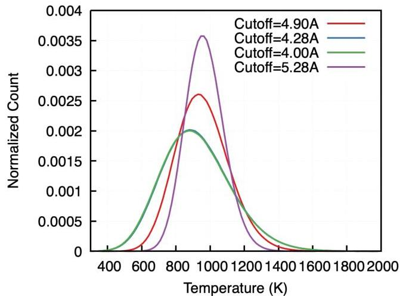
Figure 10. Atomic temperatures calculated with LAMMPS ave/sphere/atom compute, data taken during a  $1000\mathrm{K}$  microcanonical ensemble simulation. Increasing cutoff radii result in tighter distributions around the global temperature.

Fast moving ions from the PKA spike the local temperature for itself, and neighboring atoms. This results in a rapidly growing population of atoms that utilize  $\mathcal{U}_{ht}$ , which is measured by the instantaneous excitation  $\eta(t)$ . Figure 11 utilizes a temperature switching function with  $T^{*} = 5.0\mathrm{eV}$  to scale the energy and forces between the two bounding interatomic potentials as the recoil damage progresses. The data show how thousands of atoms (at  $\eta = 1$ ) or more (for  $0 &lt; \lambda \leq 1$ ) are toggled onto the excited state surface in the short times after initial collision ( $t = 0$ ). Stronger recoil energies spike to higher values, which reflects the data in Figure 5 where  $\chi$  is the integrand of  $\eta$  up to a designated time of 30ps after the initial recoil.

Alternate Simulation Protocol The simulation protocol utilized in the main body of this work involved a rapid quench to  $1000\mathrm{K}$  with a Langevin thermostat immediately following the primary damage stage. This mixed ensemble is used during our simulations only where

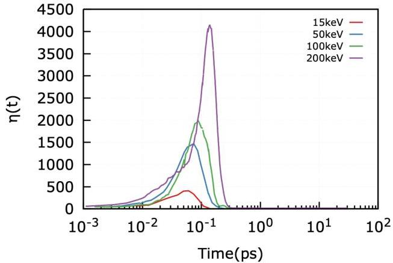
Figure 11. Instantaneous excitation  $\eta (t)$  during neutron recoil damage simulations with a sigmoid switching function to transition between ground and excited states set at  $T^{*} = 5.0eV$ . Stronger recoil events dramatically increase the number of atoms utilizing  $\mathcal{U}_{ht}$ .

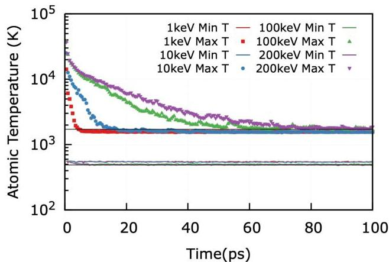
Figure 12. Atomic temperature minima (lines) and maxima (symbols) averaged over 25 independent neutron cascade simulations utilizing only  $\mathcal{U}_{gs}$ . Black horizontal lines are the min/max values taken from the same cutoff value  $(5.28\mathring{A})$  in Fig. 10. Thermal conduction of the recoil energy is active for 10-80ps for highest energy conditions.

the adaptive timestepping algorithm is in place. Atomic temperatures are still elevated relative to the bath at the end of the adaptive timestepping segment, see Figure 4, though this strongly depends on the initial PKA energy. To test whether this residual thermal spike energy plays a role in the defects generated, an additional set of simulations are run that strictly use thermal conductivity to determine the cooling rate of the thermal spike volume. Effective cooling rates are shown in Figure 12 as the minimum and maximum atomic temperature observed over time, where horizontal lines are taken from Fig.10 with

|  Group Name | NE | NF | σE | σF | RMSE E (meV/atom) | RMSE F (eV/Å)  |
| --- | --- | --- | --- | --- | --- | --- |
|  ACE Ugs |  |  |  |  |  |   |
|  Elastic Deformation | 1884 | 5652 | 2598.1 | 2095.1 | 46.39 | 0.0  |
|  Eq. of State | 112 | 3312 | 8441.7 | 7516.7 | 44.92 | 4.33·10-5  |
|  Interstitials | 15 | 5805 | 1289.2 | 8506.7 | 47.91 | 2.13·10-2  |
|  Vacancy | 420 | 71220 | 8153.1 | 231.0 | 45.07 | 1.06·10-1  |
|  Divacancy | 39 | 6084 | 2042.8 | 1782.1 | 39.71 | 9.16·10-2  |
|  Dislocations | 93 | 37665 | 8467.5 | 6133.3 | 44.00 | 1.31·10-1  |
|  Thermal | 60 | 23040 | 2418.1 | 5861.6 | 43.66 | 6.70·10-2  |
|  Disordered | 93 | 37665 | 5840.3 | 1725.6 | 45.95 | 2.86·10-1  |
|  Surfaces | 171 | 6156 | 115.1 | 4719.0 | 64.33 | 1.01·10-1  |
|  Objective Functions | 163 | 63444 | 6249.0 | 6058.6 | 52.17 | 1.19·100  |
|  ACE Uht |  |  |  |  |  |   |
|  Elastic Deformation | 1904 | 5712 | 313.5 | 229.7 | 19.28 | 0.0  |
|  Eq. of State | 125 | 3468 | 313.5 | 229.7 | 9.25 | 4.40·10-5  |
|  Vacancy | 417 | 70077 | 1.5 | 692.0 | 17.76 | 3.41·10-2  |
|  Divacancy | 39 | 6084 | 1.5 | 692.0 | 25.31 | 1.71·10-2  |
|  Dislocations | 93 | 37665 | 1.5 | 692.0 | 23.52 | 5.53·10-2  |
|  Thermal | 60 | 23040 | 1.5 | 692.0 | 6.28 | 2.48·10-2  |
|  Disordered | 93 | 37665 | 1.5 | 692.0 | 65.84 | 8.30·10-2  |
|  Surfaces | 145 | 5220 | 1.5 | 692.0 | 54.32 | 4.42·10-2  |
|  Objective Functions | 163 | 63444 | 54.2 | 994.0 | 125.86 | 4.22·10-2  |

Table II. Training groups used to construct the pair of ACE IAP, columns are denoted as number of Energy and Force  $(N_{E}, N_{F})$  training points, un-normalized weights applied to energy and force rows  $(\sigma_{E}, \sigma_{F})$ , and RMSE values for both energy and forces with respect to the DFT values. Normalization of group weights is given by  $1 / N_{E}$  and  $1 / N_{F}$  for energies and forces respectively. Radial cutoff  $(r_{cut})$  and radial basis dispersion term  $(\lambda_{s})$  are [4.276275664, 0.7075106628] for  $\mathcal{U}_{gs}$  and [4.682859196, 0.5128157065] for  $\mathcal{U}_{ht}$ .

the same cutoff value. Data reflects cascades that are run only using  $\mathcal{U}_{gs}$ , averaged over 25 independent runs restarted from the original simulations shown in Figure 7. Meaning the simulation trajectory is exactly the same through the primary damage stage, and only branches to a quench or conductivity driven cooling once adaptive timestepping is completed.

It is seen that low-energy collisions ( $&lt; 100\mathrm{keV}$ ) are in thermal equilibrium (atomic temperatures matching uniform  $1000\mathrm{K}$  distribution) within 30ps after the simulation resumes a nominal timestep (0.5fs). In contrast, high energy cascades such as  $200\mathrm{keV}$  take up to 80ps to relax back to equilibrium. Frenkel pair defect counts over this relaxation period are shown in Figure 13, with additional points showing where the quench to  $1000\mathrm{K}$  compares. No significant change in measured defect counts is observed between these two simulation protocols which is reflective of the quench to  $1000\mathrm{K}$  not inhibiting vacancy-interstitial recombination.

It was shown in Figure 8 that excursions onto the excited state potential,  $\mathcal{U}_{ht}$ , result in significant changes in the observed defect counts. Note that higher  $T^{*}$  thresholds in the switching function bias  $\mathcal{U}_{gs}$  to only the fastest moving atoms during the primary damage stage, where lower  $T^{*}$  will include more atoms present in the thermal spike. Allowing the thermal spike to cool via conduction will result in more atoms utilizing  $\mathcal{U}_{ht}$  over time, as measured by  $\eta(t)$  shown in Figure 14 and 11, with solid

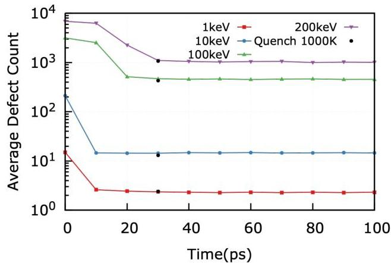
Figure 13. Frenkel pair counts thru time predicted from  $\mathcal{U}_{gs}$ . Data is compared to protocol of a rapid quench to  $1000\mathrm{K}$ , shown as black circles. Given high defect mobility at  $1000\mathrm{K}$ , counts are unperturbed relative to cooling rate dictated by thermal conduction.

lines corresponding to a quench to  $1000\mathrm{K}$  and dashed for lattice conduction cooled. Increased  $\eta$  for conduction cooled samples shows that some atoms still sample  $\mathcal{U}_{ht}$  while the system cools. The saturation point for all data series is variable due to the system size, normaliz

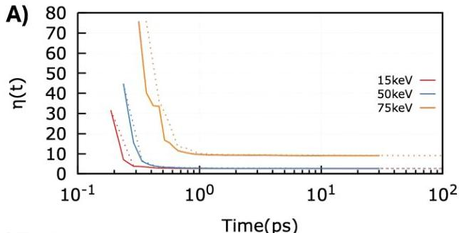
Figure 15. Maximum atomic temperatures observed during the relaxation of the thermal spike utilizing layered potentials. Horizontal lines are the maximum and minimum atomic temperatures from an ensemble of equilibrium calculations at  $1000\mathrm{K}$ .

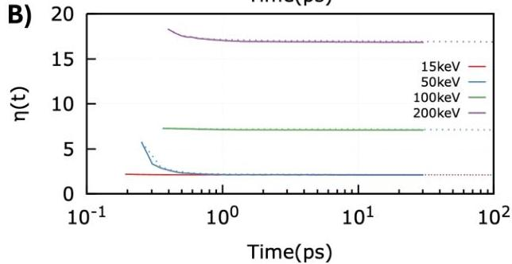
Figure 14. Instantaneous excitation  $\eta(t)$  during the relaxation of the thermal spike utilizing layered potentials with A)  $T^{*} = 2.5\mathrm{eV}$  and B)  $T^{*} = 5.0\mathrm{eV}$ . Solid lines are quenched to  $1000\mathrm{K}$  immediately after adaptive timestepping ends, while dashed lines allow for thermal conduction to cool the sample over time to  $1000\mathrm{K}$ .

ing by total atom count will collapse all data onto one another but make interpretation more challenging. Differences between  $\eta$  for the two simulation protocols is most noticeable where a lowered switching temperature is used, Supplemental Figure 14 Similarly, the minimum and maximum atomic temperatures for neutron damage cascades utilizing a switching function between  $\mathcal{U}_{gs}$  and  $\mathcal{U}_{ht}$  set at  $T^{*} = 5.0\mathrm{eV}$  or  $T^{*} = 5.0\mathrm{eV}$  are shown in Figure 15. Much like the ground state potential predictions, slow relaxation of the temperature is only seen for the highest energy cascades. Lastly, Frenkel pair counts for this alternate simulation protocol are given through time that also contrast the quench method at a lower  $T^{*}$  value in Figure 16. We find that the simulation protocol has a weak effect on the retained defects, and does not rise to the level to perturb the results relative to the choices of  $\mathcal{U}_{ht}$  and  $T^{*}$ .

It is common in the literature to impose a friction force to fast moving ions to approximate the inelastic scattering while moving through a lattice, this is known as electronic stopping in LAMMPS. Using the detailed parameter set from Cui et. al.[96] data for the defects generated following neutron collisions is shown in Supplemental Figure 17. A quench to  $1000\mathrm{K}$  follows the adaptive

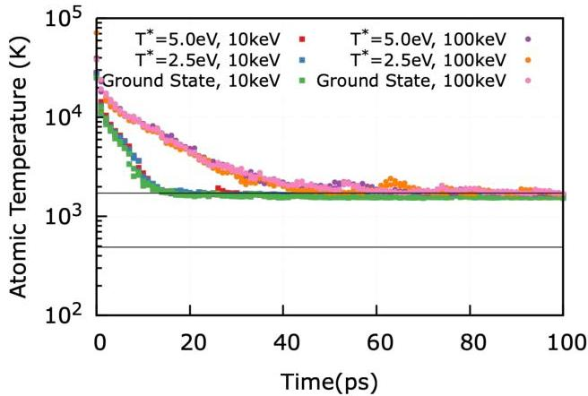

timestepping stage for these electronic stopping simulations, the same protocol as the results shown in Figure 7. As such Supplemental Figure 17 shows the change in average defect count relative to the quench method without electronic stopping. The same process is applied to defect counts that simply use lattice conduction to cool the thermal spike. It is observed that quenching to  $1000\mathrm{K}$  or allowing the system to thermally conduct energy away from the thermal spike results in largely the same defect counts with significant scatter over the 25 runs at  $\geq 100\mathrm{keV}$ . Where electronic stopping is used, a general trend of reduced defect counts are seen as recoil energy increases. This is consistent with the layered potential approach, without the need for users to rely on pre-existing stopping power calculations

Electron Temperature Interpolations To test the ability to interpolate to electron temperatures between the trained values of  $T_{e} = 0.001$  and  $T_{e} = 0.5\mathrm{eV}$ , an additional training set was generated at  $T_{e} = 0.1\mathrm{eV}$ . This intermediate training set utilizes all of the configurations that were also used to train  $\mathcal{U}_{gs}$  and  $\mathcal{U}_{ht}$ . Using a fixed  $\lambda$ , the energies and forces predicted by the two trained potentials are compared to the values in the intermediate set and is shown in Supplemental Figure 18. The minimum values on either vertical axis are set to RMSE E,F of  $\mathcal{U}_{ht}$  shown in Table I, indicating that the interpolated values are between the accuracy of either potential developed and used for this study. One would expect that the ideal mixing fraction is 0.2 based on the distance between the training set (0.1eV) and either limiting potential; 0.001eV for  $\mathcal{U}_{gs}$ , and 0.5eV for  $\mathcal{U}_{ht}$ . What we observe is that this is true for predicted energies, but the RMSE for forces lie closer to  $\lambda = 0.35$ . This indicates that the potential energy surfaces do not monotonically distort as a function of  $T_{e}$ , which motivates future study

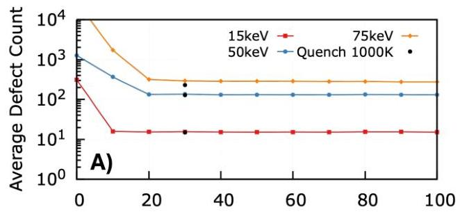

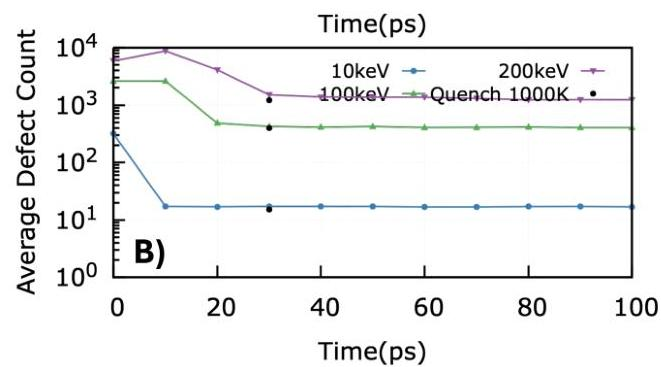
Figure 16. Frenkel pair counts thru time predicted from  $\mathcal{U}_{ht}$  using either A)  $T^{*} = 2.5\mathrm{eV}$  or B)  $T^{*} = 5.0\mathrm{eV}$ . Data is compared to protocol of a rapid quench to  $1000\mathrm{K}$ , shown as black circles. Given high defect mobility at  $1000\mathrm{K}$ , counts are unperturbed relative to cooling rate dictated by thermal conduction.

to prescribe the functional form that maps these changes more closely.

Energy conservation As noted in Section II, the temperature-dependent potential introduced in this work acts on the forces rather than the potential energy. This raises the question of how large are the deviations from perfect energy conservation compared to the pure ground state and pure excited state potentials. We examine this by sampling the total energy in a 2,000 atom representative PKA simulation run under adaptive timestepping NVE dynamics. No thermostatting or other external constraint is applied. In Fig. 19 we compare results from a temperature-dependent potential simulation for  $T^{*} = 0.5\mathrm{eV}$ , as well as the corresponding simulations for the ground state and high temperature potentials. We observe that while transient energy fluctuations are significantly larger for the temperature-dependent simulation, the maximum deviation is  $0.02\mathrm{eV / atom}$ , which is negligibly small compared to the  $1000\mathrm{eV}$  energy of the PKA atom.

# Additional files in Supplemental Information:

in.ACE_Sommerfeld_PKA : LAMMPS input file to run Sommerfeld dynamics during a neutron damage event. Requires an input data file that is equilibrated at

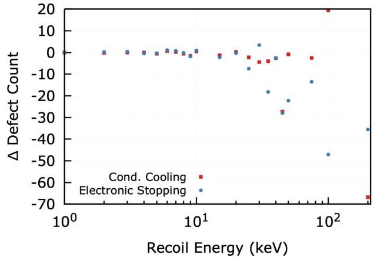
Figure 17. Measured Frenkel pairs from  $\mathcal{U}_{gs}$  neutron cascades with varying modifications to the simulation protocol. Where the simulation is extended to 100ps in the microcanonical ensemble (Cond. Cooling) and where a velocity based friction force is added to fast moving ions (Electronic Stopping). Data are shown as relative defect counts to the quench to 1000K method shown in Figure 7.

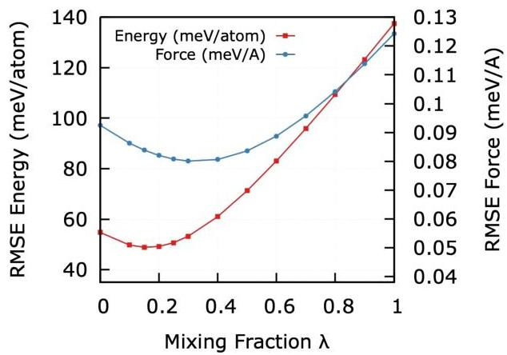
Figure 18. Energy and Force errors on a DFT training set where  $T_{e} = 0.1\mathrm{eV}$  utilizing  $\mathcal{U}_{gs}$  ( $T_{e} = 0.001\mathrm{eV}$ ) and  $\mathcal{U}_{ht}$  ( $T_{e} = 0.5\mathrm{eV}$ ). Minima in predicted energies occurs near the expected value of  $\lambda = 0.2$  with lower bounds on either vertical axis set to the minima of E,F errors shown in Table I.

the desired temperature and pressure.

README: SLURM submission script for Frontier. Requires a GPU-enabled KOKKOS compiled version of LAMMPS.

W POT_T0.0.*: Trained ACE potential for ground state. See LAMMPS documentation for usage.

W POT_T0.5.*: Trained ACE potential for high temperature state. See LAMMPS documentation for usage.

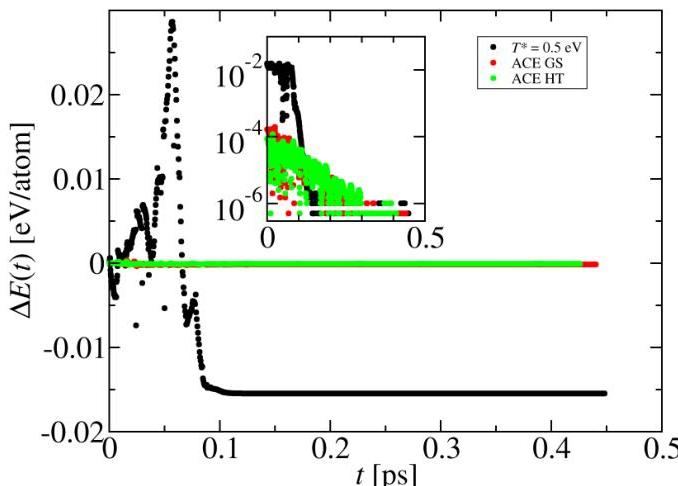
Figure 19. Comparison of total energy conservation in a representative PKA simulation for three different potentials: ground state potential (red); high temperature potential (green); locally-averaged temperature-dependent potential with  $T^{*} = 0.5\mathrm{eV}$ . All three simulations were run with a variable timestepping NVE dynamics protocol, with initial PKA kinetic energy set to  $1\mathrm{keV}$ . Inset: Absolute deviation from final total energy plotted on a logarithmic scale.

## VI Response to Reviewer Comments

### VI.1 Reviewer 1

The manuscript describes a data-driven approach to treating interatomic potentials in molecular dynamics simulations where non-adiabatic processes are relevant yet transient. The proposed approach, involving dynamically switching between potentials trained on DFT data with different levels of smearing, is demonstrated through a parametric study for radiation damage simulations in tungsten. The approach overcomes some of the limitations of existing implementations of high temperature potentials for dynamic processes, albeit suffering from instabilities that have not been resolved. As such, this constitutes an opening towards a novel and potentially fruitful method relevant for a range of topical applications.

- Author Response: Thank you for the time taken on this review, we hope the responses and changes to the manuscript satisfy your remaining concerns.

My only major concern, which should be addressed before publication, is in regards to the demonstration of the impact of this approach on observables of neutron-induced damage. The only such result presented here is the number of defects in the final damage for a range of PKA energies. However, the neutron damage cascade simulation method describes applying a thermostat on the whole system once the adaptive time stepping recovers the nominal (in this case 0.5fs) time step. This stage in the cascade development, when high velocity atoms cease to exist and the time step no longer needs to be shortened, generally marks the beginning of the thermal spike phase, rather than the end. At this stage, the atomic system still retains a local temperature of as much as 10000K, and takes up to 10 picoseconds to cool to around 1000K [2015 J. Phys.: Condens. Matter 27 135401]. For the initial lattice temperature of 1000K used in the current work, this would take even longer. Thus, the heat spike in the reported simulations is quenched by a thermostat rather than evolving by the natural dissipative processes of the lattice. This can potentially affect the results, artificially quenching in damage that might otherwise recombine. Rapid artificial quenching is also indicated by the rather short simulation time of around 30.5ps, which is not enough to allow a heat spike from a $>$100keV PKA in W to properly cool and recrystallize, particularly at the quite high temperature of 1000K. This raises the question of whether the effects that are demonstrated might in fact not appear if the system is allowed to dissipate the heat spike energy without the thermostat, in which case the proposed approach would be of negligible consequence for this particular application. For the demonstrated results to be convincing, the cascades should be allowed to evolve until defect numbers stabilize before an external thermostat is applied.
- Author Response: We appreciate the detailed insight of the reviewer on the simulation details in connection to the literature reported methods. We agree that the quench to 1000K after adaptive timestepping may perturb the dynamics of the thermal spike for high recoil energies. To compare with Zarkadoula et al. (2015 J. Phys.: Condens. Matter 27 135401) a new series of simulations were initiated to mirror their method where the microcanonical (NVE) ensemble used during primary recoil is preserved in the center volume with a thermal bath (NVT) set to 1000K only applied to the edges. This is the same set of simulation conditions that were run at the initial stage of our cascades, now extended for 100ps to allow defects count to emerge naturally.

The results of these runs are captured in Supplemental Figures 12 through 16. First, atomic temperatures over time are shown in 12 and 15 for $\mathcal{U}_{gs}$ confirming your appraisal that high energy recoils will have local temperatures relaxing on longer timescales. However when plotting the defect counts over time, predictions from $\mathcal{U}_{gs}$ or $\mathcal{U}_{ht}$ show no significant change at 30ps with this modified simulation protocol, and defect counts at 100ps with this slower cooling rate of the thermal spike also showing a null result. Data are averaged over 25 independent runs that each use restart files taken from the original cascades that went into Figure 6 (now Fig 7).

Regarding the layered potential approach, simulations that allowed for natural cooling of the thermal spike were repeated for $T^{*}=5.0$eV and $T^{*}=2.5$eV. Data of minimum and maximum atomic temperatures are shown in Supplemental Figure 15, average defect counts in Supp. Fig. 16, and $\eta(t)$ that compares the two simulation protocols shown in Supp. Fig. 14. We do not see a significant change in the observables where system cools over a longer period of time, even where a layered potential is used. This is due to the fact that $\eta$, the sum of all atoms’ $\lambda$ sampling the excited state potential, rapidly approaches zero within the first few ps post PKA event. This is true for even the highest energy recoils. In addition to the data now shown in the supplemental material, the methods section has been augmented to draw the readers to the supplemental material for the direct comparisons to the Zarkadoula et. al. protocol. “At very high recoil energies ($\geq$ 100keV) the thermal spike will dissipate via thermal conduction for up to 100ps [66], which may require an alternate simulation protocol to the thermal quench to 1000K used here. Supplemental Figures 12-16 employ the method of Ref [ [66]] and compare to the protocol used here, no significant change is observed due to the high mobility of defects at 1000K which preserved the recombination rates seen for natural cooling rates of the

thermal spike.”

Other minor comments:

1. It appears that for higher PKA energies, the effect of the activation of $U_{ht}$ goes from lowering the defect count (at 50 keV) to raising the defect count (at 200 keV) wrt the ground state potential predictions. Can the authors comment on this?

- Author Response: At these very high energies, some of the initial recoil velocities result in sub-cascades, giving rise to a higher scatter of measured defects. Additionally, there were runs upon closer inspection that failed to complete, giving an artificially higher defect count for $T^{*}=5.0$eV, this has been corrected in Figure 7. It is still observed that the layered potential approach with $T^{*}=5.0$eV has a slightly higher mean defect count (1203.4) than the ground state prediction (1062.76). It is possible that these higher energies need to be averaged over more repetitions than the uniform 25 used here.

2. On page 2: “We will demonstrate this by constructing a pair of discrete potentials linked through an axillary variable”. Should be “an auxiliary variable”.

- Author Response: Fixed.

3. On page 3: something is missing in the sentence “From a first principles perspective these fast moving ions feel a drag force due to the background density of electrons they pass through and locally disrupt the electronic state than what is expected in thermal equilibrium.”

- Author Response: Rephrased to “From a first-principles standpoint, these rapidly moving ions experience a drag force from the background electron density they traverse, locally perturbing the electronic state away from what would be expected under thermal equilibrium.”

4. Figure 3 caption: The sentence structure should be revised: “Last panel corresponds where adaptive time stepping is complete”

- Author Response: Revised to “Right-most panel ($t=$525fs) corresponds to where adaptive time stepping…”

5. Figure 6: markers are very difficult to differentiate, it would be helpful if different shapes were used similarly to figures 4 and 5.

- Author Response: Point size increased and marker/color formatting now matches other figures that display the same data series labels.

6. On page 7: something wrong in the sentence: “though training groups such as surfaces and equation of state are set are noticeably different.”

- Author Response: Rephrased to “The mean descriptor values of the training set is unsurprisingly close to the values of BCC Tungsten. However, ACE descriptors are density projections of neighboring atoms [81], which will result in training groups of surface structures and volumetric deformation (Equation of State) being noticeably different due to their coordination and density changes.”

### VI.2 Reviewer 2

This study identifies and focuses on a timely and interesting topic. The authors ingeniously construct and utilize the Machine learned interatomic potentials (MLIAP) for molecular dynamics (MD) simulations. By adjusting the training protocol of MLIAP, the quantum degrees of freedom lost in classical MD simulations are resolved. Furthermore, the high-energy neutron damage events in plasma-facing materials are investigated using the developed interatomic potential. Taking tungsten as an example, the study demonstrates that the introduction of temperature-dependent potential can reduce the peak and residual damage in tungsten, showing that the newly developed potential can describe the inelastic scattering of ions. MLIAP solve the trade-off between accuracy and computational cost faced by electronic structure methods. However, handling ion systems with dynamic evolution of electronic excited states requires solving the time-dependent Schrödinger equation. This work alternatively reconstructs a continuous potential energy surface that captures electronic excited states by constructing a pair of discrete potentials correlated through auxiliary variables.

- Author Response: Thank you for the time taken on this review, we have addressed each point and feel the modifications made amplify the strong conclusions you summarized.

In principle, this research could have been of interest to the readers of this journal, but the current manuscript has not met this standard. Nevertheless, I believe there are problems in the novelty and reliability of the method, which prevents me from recommending publication.

- Author Response: We appreciate the reviewer’s constructive comments on our work. We respectfully note an apparent discrepancy between positive acknowledgments and concerns raised around the novelty of this paper. Specifically, the reviewer highlights that the study “identifies and focuses on a timely and interesting topic” and “ingeniously constructs and utilizes the machine-learned interatomic potentials.” Regarding reliability: we will use the response to review to highlight changes made to improve on this weakness.

First, I suggest that the authors start by drawing a workflow to clearly illustrate the connection and process

between the theoretical methods and computational simulations. This would be of great help for readers to understand and apply the new methods proposed in this study.

- Author Response: In conjunction with the next review comment, we agree that the original ordering of the sections inhibited a complete understanding of the linkage between the theory and deployed methods. In the interest of clarity, we have moved the Methods Section to immediately follow the Introduction. To maintain the manuscript’s conciseness, we are resistant to include an additional figure. We hope the existing description in the Methods section offers sufficient detail. However, we would be happy to provide a graphical abstract or cover art to illustrate the workflow at the editors’ request.

Second, the structure of the article hinders readers’ in-depth understanding of the method. For example, the parameters mentioned at the beginning of the results section are not detailed until later in the subsequent methods section. Providing a brief introduction of the method framework and the significance of parameters before presenting the application results does not conflict with providing detailed derivations later, but it facilitates the reader’s understanding and learning.

- Author Response: We agree with the reviewer that this being a methods driven contribution the article should bring a discussion of the new methods before presenting the results. This has been modified by moving the Methods Section (formerly Sec. 4) to immediately follow the Introduction. This changed the order of the figures, but for all response comments we will refer to their original (as submitted) numbering order.

Third, the comparison and explanation of the layered potential method coupled with auxiliary variables (i.e., atomic temperature for the Sommerfeld potential) with the results of ab initio excited-state dynamics simulations are necessary information, which would allow for a more intuitive understanding of the new method’s accuracy and advancement.

- Author Response: Thank you for this comment, it re-enforces our decision to move the methods to Section 2. Furthermore, direct comparison to ab initio MD with excited state dynamics at present is not computationally tractable. It is a central tenet of this work to seek out efficient (linear scaling) simulation methods because these neutron recoil events require orders of magnitude more atoms and time than possible with a full fidelity method as you suggest. The introduction contains a lengthy discussion of first principles non-adiabatic and mixed quantum-classical methods that leads into the core hypothesis. We aim to build upon this method with training sets of higher fidelity and compare other observables such as stopping power that can be computed from time dependent DFT. Including them in this first contribution would require too much space than the journal would permit.

Fourth, without comparisons and interpretations of the simulation results with experimental data, it is difficult to demonstrate the reliability of the method.

- Author Response: For the purpose of this response, we are interpreting the reviewers’ use of ’reliability’ as the accuracy of the method with respect to ground truth observations given from experiments. We appreciate the scrutiny the reviewer is providing to the new method being presented here, and agree that where possible comparisons to experiment are the ideal way to justify the approach. However, there is no equivalent experimental method to investigate the outcomes of single neutron strikes, let alone at the timescales needed to capture point defect generation (sub-ns) before significant re-combination and transformation. For example, state of the art positron annihilation and TEM experimental methods will only capture defect densities that result from immobile vacancy clusters and dislocation loops (https://doi.org/10.1016/j.jnucmat.2015.12.040).
These defect types are arrived at after many decades ($>>$ms) longer time evolution that what is possible from MD simulations, necessitating a multi-scale modeling paradigm that is adopted by many researchers of plasma-facing materials (e.g. DOI:10.1088/0022-3727/47/22/224018). This also assumes that outside influences of microstructure (grain-boundaries and surfaces acting as defect sinks) can be mitigated to make comparisons between experiments and theory. We note that parametric models that translate MD damage predictions to experimental damage observations is an active area of research (https://doi.org/10.1016/j.jnucmat.2023.154292), but extending our predictions in this manner would not constitute proof of the new method. To continue this work through (at least) kinetic monte carlo simulations that are built from the new dynamic potential method here would involve additional research effort that is beyond the scope of this contribution. Additions have been made to the Discussion section to reflect the challenges of direct experimental comparison that motivate follow-on multi-scale modeling work.

In addition, the average error with respect to DFT in Figure 9 is concentrated between 50% and 100%; how can this prove the accuracy or approximation degree of the method?

- Author Response: Apologies for the confusion surrounding Figure 9 (now figure 1), data of the

accuracy of MLIAP with respect to DFT is shown without expending exorbitant computing resources to fully optimize all free parameters in the presently developed ACE MLIAP. The data for $N_{max}=2,3,4$ are obtained by only changing the basis set hyperparameters ($N_{max},l_{max}^{N},r_{max}^{N}$) while all other free parameters (i.e. $r_{cut}$ and $\lambda_{s}$) are held constant. The Methods section explains this through the following discussion: “Rather than optimize over all free parameters (28 in total) and all possible basis set combinations, we initially constrain $r_{cut}=5.5$Å, $\lambda_{s}=0.45$, and group weights to 1 and 10 for energies and forces. Sampling different combinations of $N_{max},l_{max}^{N},r_{max}^{N}$ we construct a Pareto front between objective function accuracy and compute speed in LAMMPS; data is displayed in Figure 1. A fully optimized potential increases in accuracy significantly, as shown with arrow connection from a $N_{max}=4$ point to the lone black marker.” Furthermore, caption for Figure 9 (now Figure 1) now reads “…Accuracy measure is an average over properties listed in Table 1, and is shown for un-optimized potentials, as demonstrated by arrow indicating the refining of a single potential from $\sim 25\%$ to $<2\%$ error with respect to DFT.” The purpose of showing un-optimized potentials is to guide the reader through the steps to define the developed ACE model. There are a large number of free parameters that need to be constrained, and the Pareto optimal parameters of the basis set are determined by evaluating the (rough) accuracy versus computational cost.

### VI.3 Reviewer 3

This work proposes a two-layered interatomic potential framework to incorporate electronic excitation effects into classical molecular dynamics, beyond the Born-Oppenheimer approximation. While the concept of electronic temperature-dependent potentials is not new, this work provides a novel and practical implementation of molecular dynamics coupled with such Sommerfeld-potentials of two layers that are dynamically mixed via a physically motivated auxiliary variable (local atomic temperature). This framework is also computationally efficient, enabling large-scale simulation of the radiation damage of materials. The proposed method is demonstrated on neutron damage cascades in tungsten, showing that excited-state dynamics reduce peak damage and Frenkel pair production. However, the theoretical framework lacks necessary justification and validation. Several key modeling choices appear ad hoc (e.g., the selection of electronic temperature and switching parameters). I therefore cannot recommend its publication unless the authors can address my following concerns.

- Author Response: We appreciate the detailed review and hope to have satisfied all concerns you had with the theoretical support and model parameter choices. The majority of the changes are reflected as additional supplemental content, specific changes are called out in the point-by-point responses.

Major Comments 1. If I understood correctly, the proposed force mixing is non-conservative, which raises concerns about the physical interpretation of the resulting dynamics. In addition, several key parameters appear to be introduced in an ad hoc manner. For example, the width parameter $\sigma$ in the switching function($\sigma$ = T*/14) lacks clear physical justification and directly controls the fraction of atoms sampling the high-temperature potential. Similarly, the choice of a fixed electronic temperature (e.g., 0.5 eV) for constructing the high-temperature potential is not clearly connected to the underlying physical conditions. These empirical choices may significantly influence the results, yet no systematic sensitivity analysis is provided. The authors need to better justify the theoretical basis of the model, clarify the physical meaning of these parameters, and discuss the limitations associated with such approximations.

- Author Response: We completely agree with the reviewer that these motivations for, and choices of parametric terms were lacking in their discussion. The methods section (now following the introduction) contains further detail on the switching function and comparisons to common literature choices on the matter, quoted below for completeness. Now the training set construction strikes a balance of the physics we wanted reflected in the potential energy surface (occupation of higher lying bands) and the computational cost to run this ensemble of calculations. While not discussed in the paper, training sets of many electronic temperatures above and below the chosen $T_{e}=0.5$eV were carried out. Below 0.5eV, minimal changes to the physical properties shown in Table 1 were observed, and $T_{e}$ values well above 0.5eV resulted in many DFT calculations failures due to lack of SCF convergence, even where a large number of additional bands were added. In conjunction with your fourth comment, one of these intermediate $T_{e}$ training sets is invoked.

“The chosen functional form of $\lambda$ here reflects the physics of electronic stopping power in solids [40], which is commonly implemented as a velocity threshold to apply anti-parallel forces to the fast moving ions. As with the electronic stopping implemented in LAMMPS based on binary collision data from SRIM [41], rules of thumb around a velocity threshold of twice the cohesive energy [42] should be treated as parametric that directly influence observables, as is done here with simplifying choices of the sigmoid width ($\sigma=T^{*}/14$) and switching temperature ($T^{*}$). A full sweep of $\sigma$ is not carried out as this width is approximately the FWHM of the atomic temperature distribution, Supplemental

Figure 10, representing the nominal fluctuations in the system at a given temperature. Minimum $T^{*}$ values are chosen such that a system held at 1000K, our chosen thermal equilibrium, will have no atoms sampling $\mathcal{U}_{ht}$.”
- Author Response: We have addressed the question of the non-conservative nature of the temperature dependent potential by running some additional tests that have been added to the Supplemental Material (see Supplemental Figure 19). We have also included the following text:

“Energy conservation As noted in Section II, the temperature-dependent potential introduced in this work acts on the forces rather than the potential energy. This raises the question of how large are the deviations from perfect energy conservation compared to the pure ground state and pure excited state potentials. We examine this by sampling the total energy in a 2,000 atom representative PKA simulation run under adaptive timestepping NVE dynamics. No thermostatting or other external constraint is applied. In Fig. 19 we compare results from a temperature-dependent potential simulation for $T^{*}=0.5$eV, as well as the corresponding simulations for the ground state and high temperature potentials. We observe that while transient energy fluctuations are significantly larger for the temperature-dependent simulation, the maximum deviation is is 0.02 eV/atom, which is negligibly small compared to the 1000 eV energy of the PKA atom.”

2. The finite-temperature DFT used to construct the “high-temperature” potential ($\mathcal{U}_{ht}$) corresponds to an ensemble-averaged electronic state, rather than a well-defined excited-state surface. In this sense, $\mathcal{U}_{ht}$ already represents an averaged free-energy landscape. The subsequent mixing between $\mathcal{U}_{gs}$ and $\mathcal{U}_{ht}$ during the MD simulation effectively introduces an additional average. This “double average” may obscure the physical interpretation of the resulting dynamics. While a fully state-resolved description is not feasible at the investigated system and conditions, it would be helpful for the authors to clarify the implications of this approximation.

- Author Response: We agree that mixing forces from the ground state and high temperature potentials in a completely ad hoc manner could result in unphysical dynamics. The mixing formulation introduced in this work makes this unlikely in two ways. First, we employ a simple interpolation on the ground state and high temperature potential energy surfaces. Both of these surfaces have well-defined physical meaning, resulting from the ensemble average over electronic state occupancies at the respective temperatures. Second, we implement the averaging in a numerically stable and consistent manner. At short atomic distances ACE descriptors are smoothed to zero with an inner cutoff ($0.2\AA$) term on the radial basis. Isolated atoms are designated to zero potential energy by subtracting the ACE descriptor values of an empty neighbor list everywhere as part of the model form construction. Lastly, each $T_{e}$ training set has the total energy values from DFT shifted such that the minimum energy structure exactly matches the cohesive energy. With these constraints applied the concerns regarding double-averaging the total energy from overlapping potentials are minimized because each PES has its energy referenced in the same manner. Additionally, as was discussed in other responses, emphasis on the proper mixing of the atomic forces outweighs the concerns about the total energy of the system.
3. The proposed method captures the ionic change due to electronic excitation but does not include velocity-dependent electronic stopping (drag). In radiation damage, both effects matter: fast ions lose energy to electron-hole pair excitation (stopping power) and move on a modified PES. Indeed, there is an electronic friction theory that requires the ground state PES only plus a frictional force in a form of Langevin dynamics to capture this part of dissipation directly. The frictional constant can be easily approximated for metallic systems like tungsten in this work. The authors can compare the performance of the two theories.

- Author Response: A new set of simulations were launched to address velocity-dependent drag force using the electronic stopping fix in LAMMPS, and following Cui et. al. *Cui et al. (2016)* choices of stopping power and other parameters. These new results are shown in Supplemental Figure 17, which confirms that fewer defects are generated when applying these dissipative forces. The reduction in defects is relatively the same as a properly applied switching function to $\mathcal{U}_{ht}$, and a connection to these results is now contained in the methods and results sections. Our main result shown in Figure 8 is the analog to these combined dissipative effects, but the construction of layered potentials has applications beyond radiation damage where these drag force theories are best suited.
4. The two ACE potentials are trained on DFT data with specific smearing temperatures ($T_{e}=0.001$ eV for $\mathcal{U}_{gs}$ and $T_{e}=0.5$ eV for $\mathcal{U}_{ht}$). It is not shown whether these potentials are accurate for intermediate Te values or for atomic environments not present in the training set (e.g., high-energy collision cascades with short inter-atomic distances).

- Author Response: A new figure and corresponding discussion has been added to the Supplemental Information that shows the ability of both $\mathcal{U}_{gs}$ and $\mathcal{U}_{ht}$ to represent the energies and forces of DFT data at $T_{e}=0.1$eV. This intermediate smearing temperature was evaluated on all of the

training configurations that are common to both $T_{e}=0.001$eV and $T_{e}=0.5$eV training sets. What is seen in Supplemental Figure 17 is that a properly chosen mixing fraction ($\lambda$) that is the distance between the temperatures of the two potentials results in the best agreement to this training set. Regarding atomic configurations that are extrapolations regardless of smearing temperature, we are actively employing the methods of Goff et. al. (DOI 10.1088/1361-648X/ad9791) to invert the large scale MD simulations of radiation damage into DFT acceptable sizes of training configurations to test these ideas. As this involves significant effort and compute resources to do, we are unable to quantify the correctness of the generated ML-IAP to these states as part of this present study, though results are forthcoming in a subsequent publication.

5. To be suitable for publication in Nature Communications—a multidisciplinary journal—the authors may wish to discuss the broader potential of the proposed approach beyond its application to radiation damage, particularly given its unique advantage in capturing electronic effects within a molecular dynamics framework.

- Author Response: We agree that the readership would benefit from a discussion of broader usage. The Conclusions section contains four additional examples where dynamic potential switching through an auxiliary variable that either represents an electronic degree of freedom lost with Born-Oppenheimer interatomic potentials, or where an simulations efforts would benefit from the ability to modulate the fidelity of the interatomic potential in real-time. These examples are i) Dynamic Coarse Graining ii) Fermi-Level Tuning iii) Charge State and iv) High Pressure Physics. We look forward to the community engagement with the method proposed here for use cases beyond those discussed here.

Minor points: The reference numbering is confusing. In principle, each reference should be labeled according to its first citation in the main text. This is not the case in the manuscript.

- Author Response: Fixed.