PNAS

RESEARCH ARTICLE

PSYCHOLOGICAL AND COGNITIVE SCIENCEMS

Check for updates

# The non-Riemannian nature of perceptual color space

Roxana Bujack $^{a,b}$ , Emily Teti $^{a,b}$ , Jonah Miller $^{a}$ , Elektra Caffrey $^{a,c}$ , and Terece L. Turton $^{a}$

Edited by Brian Wandell, Stanford University, Stanford, CA; received October 28, 2021; accepted March 13, 2022

The scientific community generally agrees on the theory, introduced by Riemann and furthered by Helmholtz and Schrödinger, that perceived color space is not Euclidean but rather, a three-dimensional Riemannian space. We show that the principle of diminishing returns applies to human color perception. This means that large color differences cannot be derived by adding a series of small steps, and therefore, perceptual color space cannot be described by a Riemannian geometry. This finding is inconsistent with the current approaches to modeling perceptual color space. Therefore, the assumed shape of color space requires a paradigm shift. Consequences of this apply to color metrics that are currently used in image and video processing, color mapping, and the paint and textile industries. These metrics are valid only for small differences. Rethinking them outside of a Riemannian setting could provide a path to extending them to large differences. This finding further hints at the existence of a second-order Weber-Fechner law describing perceived differences.

color space | Riemann | cognition | metric | diminishing returns

Color spaces are specific organizations of colors. Since humans have three cones to perceive color, color spaces are usually three-dimensional (3D). Color spaces can be directly related to the three cones: red, green, and blue, such as CIE RGB. However, most color spaces are mathematical constructs or models, such as CIE XYZ and CIE  $\mathrm{L}^{*}\mathrm{A}^{*}\mathrm{B}^{*}$ , with transformation formulas' converting one to another (1). Apart from assigning a unique coordinate to each color and arranging them in a sensible way, perceptual color spaces arrange colors in a way that the distance between two colors reflects how differently humans perceive them.

# Background and Theory

We show how the principle of diminishing returns contradicts the paradigm of a Riemannian color space, illustrated in Figs. 1 and 2. The key idea is that for a space to be Riemannian, distances  $\Delta E$  between stimuli  $A, B, C$  along a geodesic must satisfy additivity: that is,

$$
\Delta E (A, B) + \Delta E (B, C) = \Delta E (A, C), \tag {1}
$$

while diminishing returns require the strict inequality of this relation (Eq. 4).

Riemannian Geometry and Color. In his visionary lecture where he introduced a geometry that generalizes the notions of angle, curvature, and length to curved spaces, Riemann (2) himself suggested that color forms a multidimensional manifold. This was probably the largest step toward mathematical modeling of color since its description by means of a vector space by Grassmann (3), which was rigorously formalized by Krantz (4). A Riemannian manifold is a smooth manifold  $M$  with a metric  $g$  smoothly varying over  $M$  that defines an inner product on the tangent space at point  $p \in M$ . For a fixed basis in 3D, we can express the metric at each point  $p$  as a matrix  $g_{p} \in \mathbb{R}^{3 \times 3}$  and the inner product of two vectors  $u, v \in \mathbb{R}^3$  at  $p$  as

$$
&lt;   u, v &gt; _ {p} = u ^ {T} g _ {p} v. \tag {2}
$$

In this setting, the length of a curve  $\gamma :[t_0,t_1]\subset \mathbb{R}\to M$

$$
L (\gamma) = \int_ {t _ {0}} ^ {t _ {1}} | \gamma^ {\prime} (t) | _ {\gamma (t)} d t = \int_ {t _ {0}} ^ {t _ {1}} \sqrt {\left\langle \frac {d \gamma (t)}{d t} , \frac {d \gamma (t)}{d t} \right\rangle_ {\gamma (t)}} d t, \tag {3}
$$

will be of central importance. The path between two points  $A, B$  that minimizes the length is called a geodesic, and its length is the distance  $\Delta(A, B)$  between these two points, illustrated in Fig. 2.

# Significance

For over 100 y, the scientific community has adhered to a paradigm, introduced by Riemann and furthered by Helmholtz and Schrodinger, where perceptual color space is a three-dimensional Riemannian space. This implies that the distance between two colors is the length of the shortest path that connects them. We show that a Riemannian metric overestimates the perception of large color differences because large color differences are perceived as less than the sum of small differences. This effect, called diminishing returns, cannot exist in a Riemannian geometry. Consequently, we need to adapt how we model color differences, as the current standard,  $\Delta E$ , recognized by the International Commission for Weights and Measures, does not account for diminishing returns in color difference perception.

Author affiliations: *Computer, Computational, and Statistical Sciences Division, Los Alamos National Laboratory, Los Alamos, NM 87545; †Department of Psychology, Florida Atlantic University, Boca Raton, FL 33431; and ‡Department of Computer Science, University of New Mexico, Albuquerque, NM 87106

Author contributions: R.B. designed research; E.C. and T.L.T. performed research; E.T. analyzed data; J.M. provided mathematical theory; E.C. provided assistance with experiments; and R.B., E.T., J.M., and T.L.T. wrote the paper.

The authors declare no competing interest.

This article is a PNAS Direct Submission.

Copyright © 2022 the Author(s). Published by PNAS. This article is distributed under Creative Commons Attribution-NonCommercial-NoDerivatives License 4.0 (CC BY-NC-ND).

To whom correspondence may be addressed. Email: bujack@lanl.gov.

Published April 29, 2022.

PNAS 2022 Vol. 119 No. 18 e2119753119

https://doi.org/10.1073/pnas.2119753119

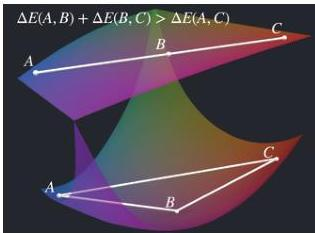
Fig. 1. Diminishing returns imply that large color differences appear less than the sum of their parts. This image is a purely figurative illustration of how this phenomenon could potentially occur, even though this specific geometry is not suggested in this paper. If an isoluminant plane through color space (Upper) would, for example, have the shape of a curved two-dimensional submanifold embedded in a 3D space (Lower), then the 3D Euclidean metric would produce the inequality of diminishing returns.

von Helmholtz (5) was the first to describe the distance between colors by means of a line element in a Riemannian manifold. He defines the shortest path in a color space to be the path for which the sum of its just noticeable differences is minimal. He bases his line element on the Weber-Fechner law (6).

Schrodinger (7) also assumes that color perception is Riemannian, but Schrodinger (7) strictly rejects Helmholtz's line element because it produces surfaces of isoluminance that are not orthogonal to the direction of intensity increase and suggests an alternative one.

These works are based primarily on geometry and mathematical reasoning and only partly on experiment. However, experimental evidence against a Euclidean color space was found, for example, in the Nickerson index of fading (8). Since then, many authors have argued that color perception is not Euclidean but rather,

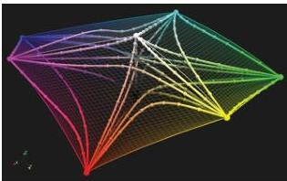
Fig. 2. Geodesics (shortest paths computed with the shooting method) between the corners of the sRGB cube in CIE LAB with its non-Euclidean metric  $\Delta E_{2000}^2$  (79) illustrate what has long been known for perceptual color spaces in general, namely that in contrast to a Euclidean setting (e.g.,  $\Delta E_{(x)y}$ ), the geodesics do not form straight lines. In this paper, we go one step further and show what CIE LAB does not capture: that in contrast to a Riemannian setting, their lengths do not even coincide with the distances between their endpoints.

Riemannian (9-16), with experiments undertaken to determine coefficients of a Riemannian metric describing the perceived differences of colors (11, 17-21).

Lastly, the interested reader should review Wyszecki and Stiles (1) for an introduction to color theory, Resnikoff (22) for an excellent summary of the historical development of the idea of color space, and Vos (23, 24) for superb visualizations of the different line elements of color perception and a historical account on their development.

The Principle of Diminishing Returns. The principle of diminishing returns in color refers to the phenomenon that large color differences are underestimated by human perception, as shown in Fig. 1. Even if a color  $B$  lies on the shortest path between  $A$  and  $C$ , the sum of the perceived lengths of the two segments exceeds the total perceived length:

$$
\Delta E (A, B) + \Delta E (B, C) &gt; \Delta E (A, C). \tag {4}
$$

Importantly, Eq. 4 holds even along geodesics, making it distinct from and stronger than the triangle inequality. The term "diminishing returns" was coined by Judd (13). He defines the concept of an ideal color space as "a tridimensional array of points, each representing a color, so located that the length of the straight line between any two points is proportional to the perceived size of the difference" (25). In his papers, he collects evidence from the literature that such an ideal color space cannot exist [e.g., referring to the experiments of Nickerson and Stultz (8) and MacAdam (20)]. The latter describes an experiment in which observers judged the perceived distances between neighboring colors in three concentric, equiluminous hexagons of different sizes in CIE xyY. He then determined the coefficients,  $H_{1}, g_{ij}$ ,  $p \in \mathbb{R}, i,j \in \{1,2\}$ , of the weighted adaptation to a Riemannian distance formula

$$
\dot {H} = H _ {1} \left(g _ {1 1} (\Delta x) ^ {2} + 2 g _ {1 2} \Delta x \Delta y + g _ {2 2} (\Delta y) ^ {2}\right) ^ {\frac {p}{2}} \tag {5}
$$

to best fit these perceived differences. He found that the exponent  $p$ , which makes the formula non-Riemannian if  $p \neq 1$ , is generally smaller than 1, indicating diminishing returns.

At approximately the same time, Helm (26) conducted experiments in which the observer estimated color distances and ratios between colors of constant luminance and saturation while varying hue. He then used multidimensional scaling (MDS) to estimate the dimensionality of the underlying space (27). For the ratio experiments, the result revealed a two-dimensional circle, but for the distances, the dimensionality was 12. Helm (26) argued that this was the consequence of the underestimation of large distances. A logarithmic transformation of the distances in CIE xyY resulted in the expected dimensionality of two and a strong correlation to the outcome of the ratio experiments. In the context of contrast constancy across frequencies of sinusoidal gratings, Cannon (28) studied the relation between physical and perceived contrast, with contrast defined as

$$
\left(L _ {m a x} - L _ {m i n}\right) / \left(L _ {m a x} + L _ {m i n}\right), \tag {6}
$$

where  $L$  is physical luminance. In suprathreshold conditions, he found a power law with an exponent of  $\sim 0.5$  to be a good fit, similar to the results of MacAdam (20). Despite these findings, the topic remains controversial. Using MDS, many researchers have found good agreement between color difference experiments and an additive 3D Euclidean space (29-33). Exceptions are Ekman (34), Helm (26), and Izmailov and Sokolov (35). The lattermost found that color space can be embedded into a 3D spherical submanifold of a four-dimensional Euclidean space in analogy to

https://doi.org/10.1073/pnas.2119753119

pnas.org

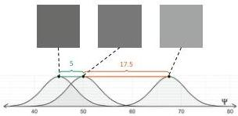

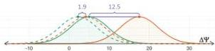

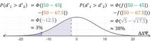
Fig. 3. Thurstonian distance perception (58) of a triad modeled with (solid) and without (dashed) additivity with an example scaling function  $f(\Delta \psi) = \sqrt{\Delta \psi}$ . If additivity is assumed and the gray-shaded Gaussians are appropriately centered, the difference between the means can be subtracted to give the perceived difference between the standard and either test (shown as the shaded green and orange triads). The difference between these means would be the perceived difference of differences, which can be plotted on a Gaussian centered at zero, as shown in Lower, to predict how often participants would be incorrect. However, if diminishing returns should exist, the means of the green and orange Gaussians should be scaled as demonstrated by the dashed distributions in the second row. The effect of the scaling function is an increased rate of predicted incorrect responses by more than an order of magnitude.

the setting in Fig. 3. They argue that the Euclidean distances  $C_{AB}$  between colors  $A$  and  $B$  in their high-dimensional embedding spaces provide the perceived differences and are related to the arclengths  $D_{AB}$  of the geodesics on the manifolds via

$$
C _ {A B} = 2 \sin \left(D _ {A B} / 2\right). \tag {7}
$$

They explicitly note the principle of diminishing returns: "that the integral of just noticeable differences between colors does not coincide with direct estimations of the subjective differences between the colors" (35).

Currently, there is no officially recognized color space that models the lack of additivity resulting from diminishing returns (36, 37). Summarizing existing literature, there is experimental evidence for diminishing returns (20, 26, 28, 35, 38, 39), anecdotal evidence for the opposite [i.e., large color differences are overestimated  $\Delta E(A,B) + \Delta E(B,C) &lt; \Delta E(A,C)]$  (40), and an overwhelming number of papers arguing against both (i.e., small differences add up to large ones along the shortest path) (Eq. 1) (29-33, 40-43). Proponents of diminishing returns suggest three forms; Helm (26) assumes a logarithmic function, MacAdam (20) assumes a polynomial function, and Izmailov and Sokolov (35) assume a sinusoidal function between just noticeable and large perceived color differences.

The Contradiction between Diminishing Returns and the Paradigm of Riemannian Color Space. The principle of diminishing returns has long served as an argument against the existence of a Euclidean color space that models perceived color differences (13, 25, 44, 45). So far, however, it has not been used as an argument to reject a Riemannian color space. A possible reason

might be that the idea of Riemannian geometry is thought of as the union of all geometries, including straight and curved spaces, instead of a specific geometry satisfying rigid axioms. However, we know with certainty that MacAdam (14) was aware of the possibility of color space not being Riemannian. He describes that the principle of hue superimporance as captured in the Nickerson index of fading (8) is in violation of Riemannian geometry in his work on Judd in 1979 (14). Most fascinatingly, MacAdam (14) summarizes that "there was no strong evidence that those conditions for representation by a Riemannian (non-Euclidean) space are violated," which indicates that his own findings from 1963 about diminishing returns (20) seem not to evoke skepticism of color space being Riemannian.

While arguments against a Euclidean color space are ubiquitous (8, 13, 25, 46) [e.g., Ennis and Zaidi (47) find that color perception is approximately an affine space], there are few instances in the literature that question the Riemannian nature of color space. Exceptions are Zeyen et al. (48), who suggest an interpolation algorithm for color maps that works in non-Riemannian geometry, and Griffin and Mylonas (49), who express doubt when they develop a Riemannian categorical metric from the probability distributions of a crowdsourced color-naming experiment.

Yet, the principle of diminishing returns contradicts the prevailing paradigm of a Riemannian color space. Assume that color space is Riemannian and that  $\gamma$  is a geodesic between the colors  $A = \gamma(t_0)$  and  $C = \gamma(t_2)$  containing the point  $B = \gamma(t_1)$  with  $t_0 &lt; t_1 &lt; t_2$ . Then, the part of  $\gamma$  between  $A$  and  $B$ ,  $\gamma_1 = \gamma|_{t_0, t_1}$ , is a geodesic, as is the part between  $B$  and  $C$ . Therefore, the distances between the three points in a Riemannian setting coincide with the lengths of the curve segments, and the contradiction with the principle of diminishing returns, Eq. 4, follows immediately from the additivity of integration boundaries via

$$
\begin{array}{l} \Delta (A, C) \stackrel {\text {E q .} 3} {=} \int_ {t _ {0}} ^ {t _ {2}} | \gamma^ {\prime} (t) | _ {\gamma (t)} d t \\ = \int_ {t _ {0}} ^ {t _ {1}} | \gamma^ {\prime} (t) | _ {\gamma (t)} d t + \int_ {t _ {1}} ^ {t _ {2}} | \gamma^ {\prime} (t) | _ {\gamma (t)} d t \tag {8} \\ \stackrel {\text {E q .} 3} {=} \Delta (A, B) + \Delta (B, C). \\ \end{array}
$$

In the remainder of this paper, we show that diminishing returns do exist in human color perception, and we provide an estimate of the shape through experiments on the neutral axis, which we assume to be a geodesic. This, in turn, proves that the current paradigm of Riemannian color space is incorrect.

Please note that it is sufficient to show one place in color space where additivity is violated to prove that the whole space is not Riemannian. We conduct our experiments on the neutral axis because it is the location with the highest probability of being a geodesic based on existing experiments and standards (36). We do not rule out that there are loci somewhere in color space that locally have a Riemannian structure, but the full 3D color space itself is not Riemannian if the neutral axis is not.

# Experiment

Ramsay (30) suggests that the principle of diminishing returns or its opposite may have been spuriously identified by other

PNAS 2022 Vol. 119 No. 18 e2119753119

https://doi.org/10.1073/pnas.2119753119

researchers (daringly including his PhD advisor, Helm) because of experimental procedures (successive intervals, paired comparisons) ill suited to the task. Indeed, open-ended and criterion-dependent tasks give less accurate measures of similarity because of individual factors (50) and the difficulty of the task (51). In particular, humans are not good at judging questions of the type "How big is the difference?" that form the basis for many large difference experiments (31, 34, 35).

Instead, we use a more reliable two-alternative forced choice (2AFC) task, where the participant simply answers the following question: "Which is more different?" Specifically, we use a triad arrangement of stimuli with the reference in the middle and one test on either side. Each of 320 triads covering the neutral axis was judged by at least 250 different participants in a crowdsourced study on Amazon Mechanical Turk (MTurk) (52).

Because of its reliability, this task has been previously used to study human color perception (27, 53-55). However, the analysis of this type of experiment requires more assumptions to derive a continuous scale from binary responses, compared with Likert-scale or open-ended tasks. As a consequence, in all existing models, additivity of small differences is inherent. Our analysis uses the underlying theory without requiring this additivity.

# Analysis

Regression to Investigate Diminishing Returns. We denote the differences in a triad  $(t_1, ref, t_2)$  by  $d_i := |L_{ref}^* - L_1^*|$ ,  $i = 1, 2$ . The existence of diminishing returns implies that as the average difference of the triad  $\bar{d} := 1/2(d_1 + d_2)$  increases, the proportion of selecting one test over the other should approach chance. To illustrate this, consider the two triads in Fig. 4, which were selected to have the same difference in differences  $\Delta d := ||d_1| - |d_2||$ . If the differences were additive, as Thurstone (56) suggests, participants should select  $t_2$  with the same frequency for both triads.

To test for the existence of diminishing returns, we consider the degree of consensus  $C$ ,

$$
C = \left| p _ {t _ {2}} - 0. 5 \right|, \tag {9}
$$

where  $p_{t_2}$  is the proportion that participants selected the lighter test. As participants respond more at chance level,  $C$  approaches

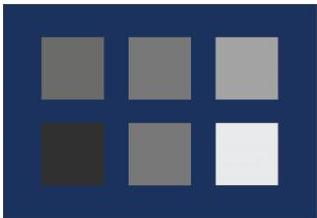
Fig. 4. Two triads with the same difference in differences  $\Delta d = 12.5$  in  $L^{*}$  units. (Upper)  $L^{*} = 45, 50, 67.5$ , respectively. (Bottom)  $L^{*} = 20, 50, 92.5$ , respectively.

zero. If diminishing returns exist, the degree of consensus should decrease with increased average difference in the triad. We can test this using least-squares regression,

$$
\widehat {C} = \beta_ {0} + \beta_ {\Delta d = 5} \times \delta_ {\Delta d = 5} + \beta_ {\Delta d = 1 0} \times \delta_ {\Delta d = 1 0} + \beta_ {\bar {d}} \times \bar {d}. \tag {10}
$$

Here,  $\Delta d$  is the difference in differences, and  $\bar{d}$  is the average difference. We use the differences in  $L^{*}$  for this first analysis, so  $\Delta d$  takes on three discrete values. We encode this variable as two dummy variables using the Kronecker  $\Delta$ ,

$$
\delta_ {\Delta d = 5} = \left\{ \begin{array}{l l} 1, &amp; \Delta d = 5, \\ 0, &amp; \Delta d \neq 5. \end{array} \right. \tag {11}
$$

Diminishing returns can be formalized as a negative coefficient for the average difference,  $\beta_{\bar{d}}$ , indicating responses approaching pure chance as the average difference in the triad increases.

Maximum Likelihood Estimation to Model Diminishing Returns. To transform binary responses from a 2AFC task into a perceptual scale, certain assumptions about the underlying process must be made. The most common analyses rely on Thurstone's theory of a Gaussian perceptual process (56). Here, the perception of any stimulus,  $x_{i}$ , is a normally distributed variable

$$
P e r c e p t \left(x _ {i}\right) \sim \mathcal {N} \left(\psi_ {i}, \sigma^ {2}\right) \tag {12}
$$

about its perceived strength (mean),  $\psi_{i}\in \mathbb{R}$  , with some discrim-. inal dispersion (SD)  $\sigma \in \mathbb{R}^{+}$  . The perception of the difference between stimuli  $x_{i}$  and  $x_{j}$  takes the form

$$
P e r c e p t \left(x _ {i} - x _ {j}\right) \sim \mathcal {N} \left(\psi_ {i} - \psi_ {j}, 2 \sigma^ {2}\right). \tag {13}
$$

This model revolutionized psychophysics because it explains how different observers can judge stimuli differently and even how one observer can judge them differently on different trials of an experiment (56).

It follows that the perception of the difference of differences in the triad is also a stochastic variable following a normal distribution. The frequency of selecting one test should adhere to the cumulative normal distribution where  $\mu = 0$ , as illustrated in Fig. 3(58). The 2AFC experiment provides the proportion of responses in which observers selected  $t_1$  as more different, compared with the reference, than  $t_2$  [i.e., the probability  $P(t_{1}|\psi_{ref},\psi_{t_{1}},\psi_{t_{2}},\sigma)]$ . This is shown as the shaded region in the Gaussian in Fig. 3, Lower. From that, the perceived strengths,  $\psi_{ref}$ ,  $\psi_{t_1}$ , and  $\psi_{t_2}$ , can be estimated using the inverse of the cumulative normal distribution,  $\Phi$ , or essentially by transforming the proportions of selecting  $t_1$  over  $t_2$  into  $z$  scores to represent interpoint distances

$$
\begin{array}{l} P \left(t _ {1} \mid \psi_ {r e f}, \psi_ {t _ {1}}, \psi_ {t _ {2}}, 4 \sigma^ {2}\right) \tag {14} \\ = \Phi_ {4 \sigma^ {2}} \left(\left| \psi_ {r e f} - \psi_ {t _ {1}} \right| - \left| \psi_ {r e f} - \psi_ {t _ {2}} \right|\right). \\ \end{array}
$$

There exist two suitable methods for this estimation. Torgerson (27) detailed how to solve MDS using these  $z$  scores. This approach has been widely implemented using a variety of algorithms to perform the matrix algebra (27, 41, 42, 55, 59). More recently, maximum likelihood estimation (MLE) has been used to construct a unidimensional perceptual scale from 2AFC data using Thurstone's theory (53, 57, 60). MLE estimates the set of parameters, in our case  $\psi_{i}$  and  $\sigma$ , of a stochastic process, Eq. 14, that is most likely to produce a given set of observations (here, the

https://doi.org/10.1073/pnas.2119753119

pnas.org

responses from the 2AFC experiment). If the likelihood function can be differentiated with respect to the parameters, MLE can be performed analytically. Here, however, the parameters are discrete, so MLE must be performed numerically. Both of these approaches (MDS and MLE) directly rely on the additivity of normally distributed variables, which implies that smaller differences can be added to get larger differences (i.e., the absence of diminishing returns).

If larger differences are overestimated when summing small differences, the sum of small differences needs to be scaled. This can be achieved using a more flexible MLE approach that directly models the differences  $\Delta(i,j) = f(|\psi_i - \psi_j|)$  between stimuli through a monotonic scaling function  $f: \mathbb{R} \to \mathbb{R}$  rather than individual stimulus strengths. To do this, we replace Eq. 14, describing the probability that  $t_1$  is selected as closer to the reference, by

$$
\begin{array}{l} P \left(t _ {1} \mid \psi_ {r e f}, \psi_ {t _ {1}}, \psi_ {t _ {2}}, 2 \sigma^ {2}, f\right) \\ = \Phi_ {2 \sigma} \left(f \left(\left| \psi_ {r e f} - \psi_ {t _ {1}} \right|\right) - f \left(\left| \psi_ {r e f} - \psi_ {t _ {2}} \right|\right)\right) \tag {15} \\ = \frac {1}{2 \sigma \sqrt {2 \pi}} \int_ {- \infty} ^ {f (| \psi_ {r e f} - \psi_ {t _ {1}} |) - f (| \psi_ {r e f} - \psi_ {t _ {2}} |)} e ^ {- \frac {x ^ {2}}{4 \sigma^ {2}}} d x. \\ \end{array}
$$

This probability can be used as the likelihood of  $f$  given a single response:

$$
L (f \mid t _ {1}, \psi_ {r e f}, \psi_ {t _ {1}}, \psi_ {t _ {2}}, 2 \sigma^ {2}) = P \left(t _ {1} \mid \psi_ {r e f}, \psi_ {t _ {1}}, \psi_ {t _ {2}}, 2 \sigma^ {2}, f\right). \tag {16}
$$

The likelihood of the dataset is the joint probability of all responses given the parameter space. In practice, the logarithm is taken for the individual likelihoods to be summed rather than multiplied. This log likelihood is maximized through MLE to find the optimal parameters, here the shape of  $f$ .

The model, adapted from existing methods validated through simulations (57, 60), does not assume the existence of additivity or diminishing returns. Rather, the shape of  $f$  will reveal one or the other. A concave  $f$  [i.e.,  $f(\Delta \psi_i) + f(\Delta \psi_j) &gt; f(\Delta \psi_i + \Delta \psi_j)$ ] would indicate that diminishing returns exist. Alternatively, a linear  $f$  [i.e.,  $f(\Delta \psi_i) + f(\Delta \psi_j) = f(\Delta \psi_i + \Delta \psi_j)$ ] would indicate that differences are additive and that diminishing returns do not exist.

Our implementation uses a monotonic cubic spline function as the structure for  $f$ , which makes no assumptions about the concavity. For comparison, we have included MLE models of a baseline case, which linearly scales the  $L^{*}$  values, and a case where the perceptual scale,  $g(L^{*}) = \psi$ , is estimated using a monotonic cubic spline. When modeling the difference scaling function  $f$ , we use the  $\psi$ -values determined by  $g$ . In addition to the spline function for  $f$ , we can also use MLE to estimate a difference scaling function using three previously proposed functions: logarithmic, polynomial, and sinusoidal.

Using MLE to model a potential scaling function is an analysis developed for responses to a 2AFC task that does not make the assumption of additivity. As such, it is now possible to test the existence of diminishing returns in color difference perception.

# Results

Regression. The best-fit regression line produces the coefficients in Table 1. The coefficient of interest is significantly negative  $(\beta_{\bar{d}} = -0.005, p &lt; 0.001)$ , supporting the existence of diminishing returns. This coefficient indicates that the frequency that participants select a given test approaches chance when differences are larger. This effect can be seen in Fig. 5, showing how participants' responses are closer to chance with increased average

Table 1. Coefficients of the regression line

|  Coefficient | Estimate | t statistic | Significance  |
| --- | --- | --- | --- |
|  β0 | 0.161 | t(60) = 8.894 | < 0.001  |
|  βΔd=5 | 0.048 | t(60) = 2.815 | 0.010  |
|  βΔd=10 | 0.119 | t(60) = 6.632 | < 0.001  |
|  βd | -0.005 | t(60) = -5.566 | < 0.001  |

The regression model produced a good fit to the experimental data:  $R^2 = 0.556$ ,  $F(3,60) = 25.00$ ,  $P &lt; 0.001$ . The  $\beta$ -coefficients are unstandardized for interpretability.

difference,  $\bar{d}$ , despite the value for the difference of differences,  $\Delta d$ , being the same. This suggests the existence of diminishing returns; however, it relies on the  $L^{*}$  axis being nearly perceptually uniform. This assumption may not be appropriate, so we interpret the negativity of the  $\beta_{\bar{d}}$  as weakly supporting our claim of nonadditivity and as motivation to carry out further analysis.

MLE. To assess the validity and stability of the MLE-approximated scaling function, we used a combination of cross-validation and bootstrapping. We used 10 different test/train splits where each test set included a random selection of 50 responses per triad, leaving between 199 and 254 responses per triad in the training set. The training set contained a total of 75,896 trials. To obtain CIs around the learned scaling function, we used 100 bootstrapped samples of size 48,000 or  $\sim 150$  responses per triad from each training set.

For each training set, a function  $g: \mathbb{R} \to \mathbb{R}$  mapping from  $L^*$  to perceived strength and a function  $f: \mathbb{R} \to \mathbb{R}$  mapping from the difference in perceived strengths to the perceived difference were estimated. Their concatenation then provides the perceived difference to two stimuli  $x_i$ ,  $x_j$  via

$$
f \left(\left| g \left(x _ {i}\right) - g \left(x _ {j}\right) \right|\right). \tag {17}
$$

This approach was introduced by Krantz (61) in 1967 but abandoned because of the large number of parameters to estimate. We first estimate the perceptual function  $g$  to transform the  $L^{*}$

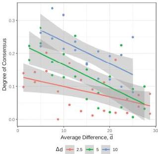
Fig. 5. Degree of consensus is the absolute value of selecting a given test minus  $50\%$ . The negative slope of the lines indicates that participants' responses tend toward chance with increasing average difference in the triad, despite the difference of differences remaining constant. A  $95\%$  CI around each line is shown in gray.

PNAS 2022 Vol.119 No.18 e2119753119

https://doi.org/10.1073/pnas.2119753119

values to perceived strengths $\psi$ and then, use the difference in $\psi$ to estimate the difference scaling function $f$.

The perceptual function $g$ is modeled using a monotonic spline with four nonzero control points. The values of these points are estimated in the optimization. These control points, along with the point $(0, 0)$, completely determine the spline function. The SD was set to $\sigma = 1$. After the estimation, $g$ was rescaled to fit the original domain $[0, 100]$ since a new SD will be used to estimate the scaling function.

Four functional forms of the difference scaling function $f$ are used in the MLE. The first is a spline of the same form used to approximate $g$. The remaining three are parameterized forms of the hypothesized functions previously suggested to account for diminishing returns. For these functions, the differences in $\psi$ were first scaled to fall in $[0, 1]$. In each of these functions, the polynomial (20), the logarithm (26), and the sine (35), there is a parameter to determine the shape, $a$, and a parameter to determine the range, $b$:

$$
\begin{array}{l}
f_{poly}(\Delta \psi) = b \Delta \psi^{a}, \\
f_{\log}(\Delta \psi) = b \frac{\log(a \Delta \psi + 1)}{\log(a + 1)}, \tag{18} \\
f_{sin}(\Delta \psi) = b \frac{\sin\left(\frac{\Delta \psi \pi}{2a + 1}\right)}{\sin\left(\frac{\pi}{2a + 1}\right)}.
\end{array}
$$

The optimal values of these parameters were found by the MLE. In all functional forms of $f$, the SD was set to one.

All models, including the case of modeling only $g$ and a baseline case where the $L^{*}$ values are scaled linearly to the optimal range for an SD of one, were evaluated based on their ability to predict participant responses in the test set. The average accuracy of these models and error bars are the $95\%$ confidence level is shown in Fig. 6. Models were trained using data from all triads; however, accuracy is visualized across the five levels of the standard. We see here that the baseline accuracy is much lower for triads with darker standards.

The most accurate models are the ones that include both $g$ and $f$, specifically when $f$ takes the spline form (green line) or the log

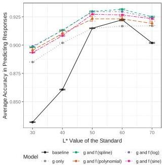
Fig. 6. Accuracy of optimal models.

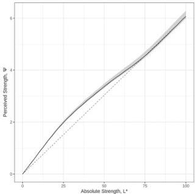
Fig. 7. Optimal perceptual function $g$ from Eq. 17 mapping $L^{*}$ values to perceived grayness, $\psi$. The shaded region indicates the middle $95\%$ of all learned models across test sets and bootstrapped training sets.

(purple line). The models using the polynomial and sine for $f$ have a larger spread and are not significantly higher than when using only the $g$ transformation.

The average perceptual function $g$ and a $95\%$ CI are shown in Fig. 7. The dashed line represents what would have been learned if the $L^{*}$ axis perfectly described the data. The deviation from the dashed line occurs near the $L^{*}$ of the background, suggesting that this may be due to the crispening effect (62).

The average learned scaling function $f$ using the flexible spline form is shown in Fig. 8. The dashed black line indicates the function that would have been learned if there was no evidence of diminishing returns.

The average scaling functions using the parameterized hypothesized forms of $f$ are shown in Fig. 9, with the spline function shown in black for comparison. The parameterized logarithm falls closest to the spline, which is in accordance with their similar and high accuracies in Fig. 6.

## Limitations and Mitigations

There are two assumptions that we make throughout our work that could limit the generality of our results. We discuss them here and explain the design and verification choices that we made to mitigate them.

Influence of the Background. The background can have a strong influence on the way colors are perceived (63). We, therefore, keep the background constant across all experiments.

The crispening effect causes colors in the vicinity of the background to appear more different from its neighbors than those far away (64, 65). This effect could potentially interfere with the measurement of diminishing returns. Schonfelder's law suggests that the crispening effect is strongest at the exact location of the background color (63). We chose the background to be dark blue, approximately equivalent to that used by Krantz (54). By using a hue, the background is not in the direct vicinity of any stimulus presented, and the crispening effect is significantly reduced (62). Still, even a small crispening effect could violate the assumption of

https://doi.org/10.1073/pnas.2119753119

pnas.org

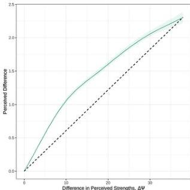
Fig. 8. Optimal difference scaling function  $f$  from Eq. 17 using the spline with four control points. The shaded region indicates the middle  $95\%$  of all learned models across test sets and bootstrapped training sets.

$L^{*}$  being a reasonable proxy for a perceptual scale. We, therefore, model the transform  $g$  from  $L^{*}$  to an actual perceptual scale  $\Psi$  before estimating the effect of diminishing returns  $f$ . The shape of our modeled  $g$  shows the expected compensation for the crispening effect around the luminance of our background of  $L^{*} = 20$  (Fig. 7).

Apart from crispening, it has been observed that increments in the lightness of the background can be perceived differently than decrements (62, 66). To see if this effect could potentially explain the measured nonadditivity, we performed experiments around five different centers on the neutral axis, some closer and

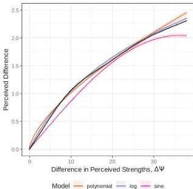
Fig. 9. Optimal difference scaling functions using the hypothesized functions. The shaded region indicates the middle  $95\%$  of all learned models across test sets and bootstrapped training sets.

some farther from the background and some involving stimuli exclusively brighter than the background ( $L^{*} = 50, 60, 70$ ).

We compared the increase in predictive power due to accounting for the size of the differences using the scaling function across each center individually. At each center, there was a significant increase in predictive power when using both the  $g$  and  $f$  transformations compared with using only  $g$  alone, as seen in Fig. 6. While there is less of an increase at the centers with increments only ( $L^{*} = 50, 60, 70$ ), the increase remains significant. This leads us to the conclusion that the effect of diminishing returns is robust to some degree against the influence of the background.

The Neutral Axis as a Geodesic. It is not trivial to verify whether any given path through color space is a geodesic. We chose the neutral axis because it is the one path on which all available data agree that it is indeed a geodesic. For example, the neutral axis is a geodesic in the commonly used color space CIE  $\mathrm{L}^{*}\mathrm{A}^{*}\mathrm{B}^{*}$  for its 1976, 1994, and 2000 metrics. It is also a geodesic in the Euclidean color spaces CIE CAM, CIE RGB, CIE XYZ, CIE LUV, DIN99, Adobe RGB, and sRGB, where it is always a straight line (the interested reader is directed to ref. 37 for a discussion of the various color spaces). It is also a geodesic in the Euclidean spaces CIE CAM, CIE RGB, CIE XYZ, CIE LUV, DIN99, Adobe RGB, and sRGB, where it is always a straight line. It is also a geodesic in Schrödinger's theory of luminance, hue, and saturation, in which he expects that paths of constant ratios of the primaries form geodesics (7), and the theory that paths of constant hue and saturation that differ only in luminance form geodesics, even though these two theories do not generally agree everywhere in color space because of the Bezold-Brucke effect (1). Still, we acknowledge that there is no guarantee that the neutral axis is indeed perceived as a geodesic in our experiment. It is possible, for example, that the background could change the path of a geodesic. Our findings rely on these theories and models to hold at least approximately.

Since the measured effect of diminishing returns was significant, we expect a small deviation from a geodesic not to invalidate our overall findings. The following Gedankenexperiment provides a coarse estimate of how far from neutral the perception of the grays would have to be so that the measured effect could be explained through the triangle inequality instead of through diminishing returns. To this end, we chose one example of measured perceived distances from our experiments. These three gray stimuli are spaced with  $\Delta_{L^*}$  of 15, for which we measured perceived distances of 1.36. For the  $\Delta_{L^*}$  distance of 30 between the two outer stimuli, we measured a perceived distance of 2.06 (compare with Fig. 8). Now, assume that this effect would be produced because they do not lie on a geodesic but on an actual triangle. The sides of the triangle depicted here ( $\triangle$ ) have the same ratio as these measured perceived distances. We find a perturbation of the perception of the neutral axis of this magnitude hard to imagine.

# Example

To illustrate that the impact of changing from an additive to a nonadditive metric can be significant, we use the simple example of computing the mean of a black-and-white photograph. In a non-Euclidean setting, the mean cannot be computed by adding the values. Zérai and Triki (15) suggest the use of the intrinsic mean  $\bar{x} \in M$  of a set of points  $x_{i} \in M$  in a manifold  $M$ ,

$$
\bar {x} = \operatorname {a r g m i n} _ {x \in M} \sum_ {i = 1} ^ {n} \Delta E \left(x, x _ {i}\right) ^ {2}, \tag {19}
$$

PNAS 2022 Vol.119 No.18 e2119753119

https://doi.org/10.1073/pnas.2119753119

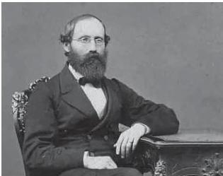
Fig. 10. Photograph of Bernhard Riemann used to illustrate the impact of the non-Riemannianness for the computation of the intrinsic mean.

in the context of image quality measures in non-Euclidean color spaces. Even though their work is intended for Riemannian spaces, this formula does not require the assumption of additivity and trivially generalizes to general metric spaces. We compute the intrinsic mean of the photograph of Bernhard Riemann shown in Fig. 10. The additive distance $\Delta L$ results in a mean of $\bar{x}_{\Delta L} = 42$, while the nonadditive formula generated by the highest likelihood logarithmic curve from Eq. 18 with the parameters $a = 5.34$, $b = 2.34$ (Fig. 9) results in $\bar{x}_{f_{\mathrm{eq}}} = 54$.

# Discussion

The concavity of the scaling function $f$ in Fig. 9 is significant, demonstrating the hypothesized existence of diminishing returns in color difference perception. This reveals the non-Riemannian structure of perceptual color space, contradicting the current scientific paradigm.

It is particularly interesting that the best fit suggests a logarithmic relationship between perceived differences and absolute differences, supporting Helm (26), because this is the known relation between perceived strengths of stimuli and their corresponding physical strengths as described by the Weber-Fechner law (6). Our findings hint at the potential existence of a second-order Weber-Fechner law stating that the perceived differences, or their derivatives as the case may be, grow logarithmically with the physical differences of the stimuli as well. More research must go into the validation of this conjecture, however, because the measurement of the absolute differences allows for some degree of freedom other than the $L^{*}$ units and because other areas of color space and other areas of sensation might behave significantly differently. Until more research is conducted, we will need to mathematically describe perceptual color space as the general concept of a path-connected metric space.

Color metrics and measures in computer graphics, visualization, image and video processing, color mapping, and quality control in the paint and textile industries are based on and meant for small color differences. Diminishing returns provide an explanation of why they cannot be concatenated to faithfully represent large differences (67). If a mathematical relation between small and large color differences can be found to hold not just along the neutral axis but across the whole color space, an extension of

the current metrics from small to large differences would become possible. More experiments should be performed to cover the whole color space to achieve this overarching goal in the future.

# Materials and Methods

In this section, we describe our experimental design in full detail. Participants were asked to judge two differences using a triad arrangement of stimuli, as shown in Fig. 4. Differences in the triad ranged from small, barely perceptible differences to large, obvious differences. The triads were constructed from stimuli described by CIE LAB coordinates, where $a^*$, $b^* = 0$ and $L^*$ is variable. These triads are determined by the differences between the reference and the two tests,

$$
d _ {1} := \left| L _ {a f} ^ {*} - L _ {i} ^ {*} \right|, \quad d _ {2} := \left| L _ {a f} ^ {*} - L _ {i j} ^ {*} \right|, \tag {20}
$$

and the difference of differences,

$$
\Delta d := d _ {1} - d _ {2}. \tag {21}
$$

The differences take on values between 0 and 30 in increments of 2.5, and $\Delta d$ takes on values of $\pm 2.5, \pm 5, \pm 10$. This gives a total of 64 triads. A summary of the experimental design is shown in Fig. 11, where each of the 64 points represents a combination of differences $d_{1}$ and $d_{2}$. For each pair of differences, five triads are constructed using five values for the reference $L_{af}^{*} = 30, 40, 50, 60, 70$.

A sample size of 250 evaluations for each triad was found to produce high agreement between the MLE and a true underlying relationship based on Monte Carlo simulations. The large number of stimuli and responses needed, coupled with the COVID-19 pandemic restrictions, made in-person studies infeasible during the course of this research. Instead, the experiment employed the crowdsourced platform MTurk (52) and used the survey software Qualtrics (68) to implement and present the studies. Crowdsourced studies have been shown to be a reliable method for conducting perception studies; known results in visualization have been replicated using this approach (69-71), and over the last two decades, the crowdsourced approach has become increasingly popular (72-75). In particular, Turton et al. (71) probed the specific concern about using MTurk for perceptual studies in color. A review of the use of crowdsourcing for visualization is in Borgo et al. (76).

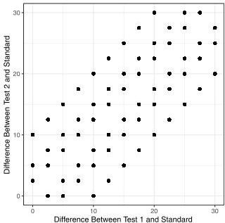
Fig. 11. Representation of the triads used for simulations and experimental study. Each point represents five distinct experimental triads, each with a different $L^{*}$ value for the standard. The values for the tests are calculated using the $x$ and $y$ values.

8 of 10 https://doi.org/10.1073/pnas.2119753119

pnas.org

Participants. Only MTurk users located in the United States were recruited. Participants were instructed that they could not participate in the study if they had a color vision deficiency (CVD). An initial screening question rejected any participants who stated that they had CVD. Additionally, a Ishihara color plate CVD test preceded the study, and those with two or more incorrect answers were removed before analysis (77).

A total of 1,498 participants completed the study, of which 62 (4%) were excluded on the basis of a failed CVD test. Each participant responded to between 42 and 75 triads, where no participant responded to the same triad more than once. Participants' ages ranged from 18 to 80 (mean = 39.5, SD = 12.3). Participants identified as 53.3% male, 45.4% female, and under 1% nonbinary/other or declining to answer. Of the participants, 48.1% had at least an undergraduate degree (BS, BA, etc.), with another 20.5% having some college experience or an associate degree and 22.1% having educational levels beyond an undergraduate degree. Less than 10% had only a high school diploma (or equivalent) or declined to answer. Participants were compensated at the rate of at least the federal hourly minimum wage for the median participant time. Los Alamos National Laboratory's Human Subjects Research Review Board (comparable with an academic institutional review board) approved this study. All participants provided informed consent.

### Stimuli.

Participants were shown triads with the reference in the middle and one test each to the left and the right. All stimuli in the triad were gray patches with a^{+}, b^{+} = 0 and variable L^{+} values as defined in CIE LAB. The L^{+} value of the standard was constrained to fall between the values of the two tests to ensure that participants compared each test with the standard rather than the two tests with each other. The three stimuli in the triad were presented as an in-line row, as shown in Fig. 4. The left/right position of the lighter test was randomized, as was the order in which the triads were presented. The background was a dark blue approximately equivalent to that used by Krantz (54).

### Task.

Participants were required to complete this study using a computer. A Qualtrics-based check was used to reject participants using a tablet or mobile device to avoid skew induced by insufficient screen space. Participants were asked which of the right and left tests was more different from the middle gray and to respond using the “q” (for left) or “p” (for right) key. Participants had an average of three training rounds to get acclimated to the task. To increase participant engagement during the experimental trials, participants were informed whether they made the correct choice based on the differences on the L^{+} axis. The effect of training (i.e. practice and feedback) over time was not statistically significant. Even if there was increased accuracy due to learning the task, the randomization of the order of triads would control for that.

### Data Availability.

Observer responses and source code of analysis framework are publicly available in the GitHub repository (https://github.com/lanl/color). The data are described in the Abstract found in the Gray Experiment, Data folder and are contained in the comma separated values file (78).

Research presented in this article was supported by Laboratory Directed Research and Development Program of Los Alamos National Laboratory Project 20200512ECR and is published as LA-UR-21-24630. We thank Kei Davis for his feedback and the anonymous reviewers for pointing out the significance of the difference between the L^{+} axis and the perceptual scale.

## References

- (1) G. Wyszecki, W. S. Stiles, Color Science (Wiley, New York, NY, 1982), vol. 8.
- (2) B. Niemann, Über die hypothesen, welche der geometrie zu grunde liegen. Königliche Gesellschaft der Wissenschaften und der Georg-Augustus-Universität Göttingen 13, 1867 (1854).
- (3) H. Grassmann, Zur theorie der farbenmischung. Ann. Phys. 165, 69-84 (1853).
- (4) D. H. Krantz, Color measurement and color theory. I. Representation theorem for Grassmann structures. J. Math. Psychol. 12, 283-303 (1975).
- (5) H. von Helmholtz, Wissenschaftliche Abhandlungen (JA Barth, 1883), vol. 2.
- (6) G. T. Fechner, W. M. Wundt, Elemente der Psychophysik. Erster Theil (Breitkopf & Hartel, 1889).
- (7) E. Schrödinger, Grundlinien einer theorie der farbenmetrik im tagessehen. Ann. Phys. 368, 481-520 (1920).
- (8) D. Nickerson, K. F. Stultz, Color tolerance specification. JOSA 34, 550-570 (1944).
- (9) L. Silberstein, Investigations on the intrinsic properties of the color domain. JOSA 28, 63-85 (1938).
- (10) L. Silberstein, Investigations on the intrinsic properties of the color domain. II. JOSA 33, 1-10 (1943).
- (11) W. Stiles, A modified Helmholtz line-element in brightness-colour space. Proc. Phys. Soc. 58, 41 (1946).
- (12) J. J. Vos, P. L. Walraven, An analytical description of the line element in the zone-fluctuation model of colour vision. I. Basic concepts. Vision Res. 12, 1327-1344 (1972).
- (13) D. B. Judd, Contributions to Color Science (Department of Commerce, National Bureau of Standards, 1979), vol. 545.
- (14) D. L. MacAdam, Judd's contributions to color metrics and evaluation of color differences. Color Res. Appl. 4, 177-193 (1979).
- (15) M. Zéssi, O. Triki, “A differential-geometrical framework for color image quality measures” in Advances in Visual Computing. ISVC 2010. Lecture Notes in Computer Science, G. Bebis et al. Eds. (Springer, Berlin, Germany, 2010), vol. 6455, pp. 544-553.
- (16) D. Raj Pant, I. Farup, Riemannian formulation and comparison of color difference formulas. Color Res. Appl. 37, 429-440 (2012).
- (17) K. D. Chickering, Optimization of the MacAdam-modified 1965 Friele color-difference formula. J. Opt. Soc. Am. 57, 537-541 (1967).
- (18) L. Friele, Analysis of the Brown and Brown-MacAdam colour discrimination data. Farbe 10, 193-224 (1961).
- (19) L. Friele, Further analysis of color discrimination data. JOSA 55, 1314-1319 (1965).
- (20) D. L. MacAdam, Nonlinear relations of psychometric scale values to chromaticity differences. JOSA 53, 754-757 (1963).
- (21) D. L. MacAdam, Smoothed versions of friele's 1965 approximations for color metric coefficients. JOSA 56, 1784-1785 (1966).
- (22) H. L. Resnikoff, Differential geometry and color perception. J. Math. Biol. 1, 97-131 (1974).
- (23) J. Vos, Line elements and physiological models of color vision. Color Res. Appl. 4, 208-216 (1979).
- (24) J. J. Vos, From lower to higher colour metrics: A historical account. Clin. Exp. Optom. 89, 348-360 (2006).
- (25) D. B. Judd, Ideal color space: Curvature of color space and its implications for industrial color tolerances. Palette 29, 4-25 (1968).
- (26) C. E. Helm, Multidimensional ratio scaling analysis of perceived color relations. J. Opt. Soc. Am. 54, 256-262 (1964).
- (27) W. S. Torgerson, Multidimensional scaling. I. Theory and method. Psychometrika 17, 401-419 (1952).
- (28) M. W. Cannon Jr., Perceived contrast in the fovea and periphery. J. Opt. Soc. Am. A 2, 1760-1768 (1985).
- (29) T. Indow, Global color metrics and color-appearance systems. Color Res. Appl. 5, 5-12 (1980).
- (30) J. O. Ramsay, Economical method of analyzing perceived color differences. J. Opt. Soc. Am. 58, 19-22 (1968).
- (31) R. N. Shepard, The analysis of proximities: Multidimensional scaling with an unknown distance function. II. Psychometrika 27, 219-246 (1962).
- (32) W. S. Torgerson, A theoretical and empirical investigation of multidimensional scaling. ETS Res. Bull. Ser. 1951, i-123 (1951).
- (33) H. Wright, Precision of color differences derived from a multidimensional scaling experiment. JOSA 55, 1650-1655 (1965).
- (34) G. Ekman, Dimensions of color vision. J. Psychol. 38, 467-474 (1954).
- (35) C. A. Izmailov, E. Sokolov, Spherical model of color and brightness discrimination. Psychol. Sci. 2, 249-260 (1991).
- (36) IC on Illumination, “Colonimetry” (Rep. CIE 015-2004, Commission internationale de l’Eclaviage, CIE Central Bureau, Vienna, Austria, 2004).
- (37) Bureau International des Poids et Mesures, Agreement between the international commission on illumination and the international commission for weights and measures (2007). https://www.bipm.org/en/liaison-partners/ce. Accessed 4 January 2022.
- (38) C. Helm, “A successive intervals analysis of color differences” (Office of Naval Research Tech. Rep., Princeton University, Princeton, NJ, 1960).
- (39) D. B. Judd, Interval scales, ratio scales, and additive scales for the sizes of differences perceived between members of a geodesic series of colors. JOSA 57, 380-386 (1967).
- (40) T. Indow, K. Kanazawa, Multidimensional mapping of Munsell colors varying in hue, chroma, and value. J. Exp. Psychol. 59, 330-336 (1960).
- (41) T. Indow, T. Shiese, An application of the method of multi-dimensional scaling to perception of similarity or difference in colors. Jpn. Psychol. Res. 1956, 45-64 (1956).
- (42) T. Indow, T. Uchizono, Multidimensional mapping of Munsell colors varying in hue and chroma. J. Exp. Psychol. 59, 321-329 (1960).
- (43) R. N. Shepard, “Parametric representation of nonlinear data structures” in Multivariate Analysis: Proceedings of an International Symposium Held in Dayton, Ohio, P. R. Krishnaiah, Ed. (Academic Press, New York, NY, 1966), pp. 561-592.
- (44) I. Lissner, P. Urban, Toward a unified color space for perception-based image processing. IEEE Trans. Image Process. 21, 1153-1168 (2012).
- (45) P. Urban, M. R. Rosen, R. S. Berns, D. Schleicher, Embedding non-Euclidean color spaces into Euclidean color spaces with minimal isometric disagreement. J. Opt. Soc. Am. A Opt. Image Sci. Vis. 24, 1516-1528 (2007).
- (46) S. M. Wuerger, L. T. Maloney, J. Krauskopf, Proximity judgments in color space: Tests of a Euclidean color geometry. Vision Res. 35, 827-835 (1995).
- (47) R. J. Ennis, Q. Zaidi, Geometrical structure of perceptual color space: Mental representations and adaptation invariance. J. Vis. 19, 1 (2019).
- (48) M. Zeyen et al., “Color interpolation for non-Euclidean color spaces” in IEEE Scientific Visualization Conference (ScViv) (IEEE, New York, NY, 2018), pp. 11-15.
- (49) L. D. Griffin, D. Mylonas, Categorical colour geometry. PLoS One 14, e0216296 (2019).
- (50) F. A. A. Kingdom, N. Prins, Psychophysics: A Practical Introduction (Academic Press, ed. 2, 2010).
- (51) J. K. Holden, E. M. Francisco, Z. Zhang, C. Baric, M. Tommerdahl, An undergraduate laboratory exercise to study Weber's law. J. Undergrad. Neurosci. Educ. 9, A71-A74 (2011).
- (52) Amazon Mechanical Turk, Amazon Mechanical Turk. https://www.mturk.com/. Accessed 2 February 2021.
- (53) V. Bonnardel et al., Perceptual color spacing derived from maximum likelihood multidimensional scaling. J. Opt. Soc. Am. A Opt. Image Sci. Vis. 33, A30-A36 (2016).
- (54) D. H. Krantz, Small-step and large-step color differences for monochromatic stimuli of constant brightness. J. Opt. Soc. Am. 57, 1304-1316 (1967).
- (55) W. S. Torgerson, Theory and Methods of Scaling (APA PsycInfo, 1958).
- (56) L. L. Thurstone, Psychophysical analysis. Am. J. Psychol. 38, 368-389 (1927).
- (57) L. T. Maloney, J. N. Yang, Maximum likelihood difference scaling. J. Vis. 3, 573-585 (2003).
- (58) L. L. Thurstone, A law of comparative judgment. Psychol. Rev. 34, 273 (1927).

Downloaded from https://www.pnas.org by 73.40.187.118 on May 5, 2026 from IP address 73.40.187.118.

59. S.J. Messick, The perception of attitude relationships: A multidimensional scaling approach to the structuring of social attitudes. *ETS Res. Bull. Ser.* **1954**, i-231 (1954).
60. K. Kndelauch et al., MLDS: Maximum likelihood difference scaling in R. J. Stat. Softw. **25**, 1-26 (2008).
61. D. H. Krantz, Rational distance functions for multidimensional scaling. *J. Math. Psychol.* **4**, 226-245 (1967).
62. P. Whittle, Brightness, discriminability and the "crispening effect". *Vision Res.* **32**, 1493-1507 (1992).
63. W. Schonfelder, Der Einfluss des Umfeldes auf die Sicherheit der Einstellung von Farbengleichungen. *Zeitschrift für Sinnesphysiologie* **63**, 228-251 (1933).
64. H. Takasaki, Lightness change of grays induced by change in reflectance of gray background. *J. Opt. Soc. Am.* **56**, 504-509 (1966).
65. T. Kaneko, A reconsideration of the Cobb-Judd lightness function. *Acta Chromatica* **1**, 103-110 (1964).
66. P. Whittle, Increments and decrements: Luminance discrimination. *Vision Res.* **26**, 1677-1691 (1986).
67. S. Abasi, M. Amani Tehran, M. D. Fairchild, Distance metrics for very large color differences. *Color Res. Appl.* **45**, 208-223 (2020).
68. Qualtrics, Introducing XM Discover. https://www.qualtrics.com/. Accessed 2 February 2021.
69. L. Harrison, F. Yang, S. Franconeri, R. Chang, Ranking visualizations of correlation using Weber's law. *IEEE Trans. Vis. Comput. Graph.* **20**, 1943-1952 (2014).
70. J. Heer, M. Bostock, "Crowdsourcing graphical perception: Using Mechanical Turk to assess visualization design" in *Proceedings of the SIGCHI Conference on Human Factors in Computing Systems*, S. Hudson, G. Fitzpatrick, Eds. (Association for Computing Machinery, New York, NY, (2010), pp. 203-212.

71. T. L. Turton, C. Ware, F. Samsel, D. H. Rogers, "A crowdsourced approach to colormap assessment" in *EuroVis Workshop on Reproducibility, Verification, and Validation in Visualization (EuroRV3)*, K. Lawonn, N. Smit, D. Cunningham, Eds. (The Eurographics Association, 2017), pp. 1-5.
72. N. Moroney, G. Beretta, "The world wide 'gamma'" in *Color and Imaging Conference* N. Bonnier, P. Urban, Eds. (Curran Associates, Inc., Red Hook, NY, 2010), vol. 2010, pp. 1-4.
73. T. L. Turton, A. S. Berres, D. H. Rogers, J. Ahrens, "ETK: An evaluation toolkit for visualization user studies" in *EuroVis 2017 - Short Papers*, B. Kozlikova, T. Schreck, T. Wischgoll, Eds. (The Eurographics Association, 2017), pp. 43-47.
74. J. Vuong et al., Versus-a tool for evaluating visualizations and image quality using a 2afc methodology. *Vis. Informatics* **2**, 225-234 (2018).
75. C. Ware et al., Measuring and modeling the feature detection threshold functions of colormaps. *IEEE Trans. Vis. Comput. Graph.* **25**, 2777-2790 (2019).
76. R. Borgo, L. Micallef, B. Bach, F. McGee, B. Lee, "Information visualization evaluation using crowdsourcing" in *Computer Graphics Forum*, J. Heer, H. Leitte, T. Ropinski, Eds. (Wiley Online Library, 2018), vol. 37, pp. 573-595.
77. J. Clark, The Ishihara test for color blindness. *Am. J. Physiol. Opt.* **5**, 269-276 (1924).
78. R. Bujack, E. Teti, J. Miller, E. Caffrey, T. Turton, Empirical data from judgments of achromatic color differences. *GitHub*. https://github.com/lanl/color/blob/main/Gray_Experiment/data/gray_complete_data_release.csv. Deposited 28 January 2022.
79. M. R. Luo, G. Cui, B. Rigg, The development of the CIE 2000 colour-difference formula: Ciede2000. *Color Res. Appl.* **26**, 340-350 (2001).

10 of 10 https://doi.org/10.1073/pnas.2119753119

pnas.org